# Resolución de problemas mediante algoritmos

En este apartado encontrarás teoría y ejercicios, con sus respectivas posibles soluciones, sobre la **resolución de problemas mediante algoritmos**.

A la hora de escribir los algoritmos utilizaré la sintaxis propuesta en el programa [PSeInt](http://pseint.sourceforge.net/).

**José Ramón Jiménez Reyes**

 >  @JRJimenezReyes

 >  joseramon.jimenez@iesalandalus.org

## Contenidos
- [Algoritmo](#algoritmo)
- [Estructura de un algoritmo en pseudocódigo](#estructura-de-un-algoritmo-en-pseudocódigo)
- [Variables](#variables)
- [Tipos de datos](#tipos-de-datos)
- [Operadores](#operadores)
- [Funciones](#funciones)
- [Sentencias secuenciales](#sentencias-secuenciales)
- [Sentencias condicionales](#sentencias-condicionales)
- [Sentencias repetitivas](#sentencias-repetitivas)
- [Ejercicios](#ejercicios)

## Algoritmo
Un algoritmo no es más que un conjunto finito de instrucciones, expresado en un lenguaje bien definido que nos permite llegar a la solución de un problema dado.

Para expresar un algoritmo podemos utilizar diferentes lenguajes o gráficos. Nosotros nos centraremos en la sintaxis del pseudocódigo utilizado por el programa didáctico [PSeInt](http://pseint.sourceforge.net/) que además también permite ver el diagrama de flujo para un algoritmo escrito utilizando su sintaxis.

Dicho programa permite expresar un algoritmo en pseudocódigo utilizando diferentes variantes dependiendo de la sintaxis escogida, aunque nosotros utilizaremos su configuración por defecto y siempre intentaremos asemejar la sintaxis de nuestros algoritmos a la utilizada por java, en la medida de lo posible.

## Estructura de un algoritmo en pseudocódigo

Todo algoritmo en pseudocódigo tiene la siguiente estructura general:
~~~
     Algoritmo SinTitulo
          instruccion 1;
          insturccion 1;
               .
               .
               .
          instruccion n;
     FinAlgoritmo
~~~
- El algoritmo comienza con la palabra clave `Algoritmo` seguida del nombre del mismo.
- Le sigue una secuencia de instrucciones.
- Finaliza con la palabra `FinAlgoritmo`.

## Variables
Una variable en un algoritmo es un identificador en el que podemos almacenar información. El valor almacenado en una variable puede ir variando a medida que el algoritmo avanza.

El nombre o identificador de la variable debe comenzar con letras, y puede contener solo letras, números y el guión bajo.

- Para acostumbrarnos, debe empezar en minúscula y si queremos utilizar varias palabras para nombrarla, las pondremos juntas y la segunda y restantes comenzarán en mayúscula: `numero`, `numCifras`, `fechaNacimiento`...
- No debe coincidir con una palabra reservada o función del lenguaje, para no generar ambigüedad.
- El nombre de una variable debe ser lo más explicativo posible y así nos ayudará a comprender su cometido.
- Toda variable tiene un tipo de dato asociado y sólo podrá contener datos de ese tipo (aunque en algunos lenguajes de programación esta afirmación no es cierta).
- Aunque en PSeInt no es obligatorio, debemos acostumbrarnos a definir la variable antes de utilizarla:

  `numero Es Entero`

  `numero, numCifra Son Enteros`

## Tipos de datos

 Nosotros utilizaremos tres tipos de datos básicos (aunque en PSeInt y en cualquier lenguaje de programación existen más):

 - **Numérico**: números, tanto enteros como reales. Para separar decimales se utiliza el punto. Ejemplos: `21` `453` `0` `-3.6` `3.14`
 - **Lógico**: solo puede tomar dos valores: `VERDADERO` o `FALSO`.
 - **Carácter**: caracteres o cadenas de caracteres encerrados entre comillas (pueden ser dobles o simples, aunque nos acostumbraremos a utilizar las dobles por su semejanza con java). Ejemplos `"hola"` `"hola mundo"` `"José Ramón"`

## Operadores

El lenguaje utilizado por PSeInt dispone de un conjunto básico de operadores que pueden ser utilizados para la construcción de expresiones más o menos complejas los cuáles se muestran en las siguientes tablas:

**Operadores relacionales**

Operador|Significado|Ejemplo
------------|--------------|------------
\> | Mayor que|3>2
<| Menor que |'Hola'<'hola'
=| Igual que|4=3
<=| Menor o igual que| 2<=2
\>=| Mayor o igual que|  4>=5
<>| Distinto que| 7<>8

**Operadores Lógicos**

Operador|Significado|Ejemplo
------------|--------------|------------
& ó Y| Conjunción (y) |(8>5) & (5=3) //falso
\| ó O | Disyunción (o)| (8>5 \| 5=3) //verdadero
~ ó NO| Negación (no)| 	  ~(8>5) //verdadero

**Operadores Algebraicos**

Operador|Significado|Ejemplo
------------|--------------|------------
\+| Suma| suma <- op1 + op2
\- |Resta| dif <- op1 - op2
\*|Multiplicación|mult <- numero * 5
/| División|porc <- 100 * parte / total  
^|Potenciación| sup <- 3.41 * radio ^ 2
% ó MOD| Módulo (resto de la división entera) | resto <- num MOD div

   La precedencia de los operadores matemáticos es igual a la del álgebra, aunque puede alterarse mediante el uso de paréntesis.

## Funciones

Las funciones en pseudocódigo son parecidas a las que se utilizan en el álgebra, por ejemplo para hallar el seno de un ángulo, aunque su sintaxis es algo diferente ya que los parámetros se encierran entre paréntesis. Se coloca su nombre seguido de los argumentos para la misma encerrados entre paréntesis (por ejemplo `sen(x)`). Se pueden utilizar dentro de cualquier expresión, y cuando se evalúe la misma, se reemplazará por el resultado correspondiente. Actualmente, todas la funciones disponibles en **PSeInt** son matemáticas o de cadena. A continuación se listan las funciones integradas en **PSeInt** disponibles:

Función|Significado
-------|-----------
`RAIZ(X)`|Raíz Cuadrada de X
`ABS(X)`|Valor Absoluto de X
`LN(X)`|Logaritmo Natural de X
`EXP(X)`|Función Exponencial de X
`SEN(X)`|Seno de X
`COS(X)`|Coseno de X
`TAN(X)`|Tangente de X
`ASEN(X)`|Arcoseno de X
`ACOS(X)`|Arcocoseno de X
`ATAN(X)`|Arcotangente de X
`TRUNC(X)`|Parte entera de X
`REDON(X)`|Entero más cercano a X
`AZAR(X)`|Entero aleatorio en el rango [0;x-1]
`ALEATORIO(A,B)`|Entero aleatorio en el rango [A;B]
`LONGITUD(S)`|Cantidad de caracteres de la cadena S
`MAYUSCULAS(S)`|Devuelve una copia de la cadena S con todos sus caracteres en mayúsculas
`MINUSCULAS(S)`|Devuelve una copia de la cadena S con todos sus caracteres en minúsculas
`SUBCADENA(S,X,Y)`|Devuelve una nueva cadena que consiste en la parte de la cadena S que va desde la posición X hasta la posición Y (incluyendo ambos extremos). Las posiciones utilizan la misma base que los arreglos, por lo que la primer letra será la 0 o la 1 de acuerdo al perfil del lenguaje utilizado.
`CONCATENAR(S1,S2)`|Devuelve una nueva cadena resultado de unir las cadenas S1 y S2.
`CONVERTIRANUMERO(X)`|Recibe una cadena de caracteres que contiene un número y devuelve una variable numérica con el mismo.
`CONVERTIRATEXTO(S)`|Recibe un real y devuelve una variable numérica con la representación como cadena de caracteres de dicho real.

## Sentencias secuenciales

En PSeInt podemos encontrarnos con 3 tipos de sentencias secuenciales (que se ejecutan una detrás de otra):

- **Asignación**: Como su nombre indica sirve para asignar valores a una variable. Utiliza el operador de asignación, que en PSeInt es el símbolo `<-` (aunque también permite otros, nosotros nos quedaremos con este).

  Para realizar la asignación, primero se evalua la expresión de la derecha y luego se asigna el resultado.

  Nos debemos acostrumbrar a utilizar variables que ya estén definidas.

  `num <- 10`

  `suma <- operador1 + operador2`

- **Lectura** Esta sentencia permite leer valores por teclado y asignarlos a variables.

  `Leer num`

  `Leer operador1, operador2`

- **Escritura** Sentencia que muestra información por pantalla al usuario.

  `Escribir "La suma es: ", suma`

  `Escribir Sin Saltar "Introduce un número: "`

## Sentencias condicionales
Son sentencias que permiten alterar el flujo del algoritmo y ejecutar unas sentencias u otras dependiendo del valor de una condición.

- **Condicional** Permite evaluar una condición y ejecutar una serie de sentencias si dicha condición es verdadera u otras si es falsa.

  ~~~
  Si <condicion> Entonces
    <instruccionesV>
  SiNo
    <instruccionesF>
  FinSi
  ~~~

  Evalúa la condición y si es verdadera ejecutará `<sentenciasV>` y si es falsa ejecuturá `<sentenciasF>`

  El bloque `SiNo` no es obligatorio y en ese caso (la condición es falsa) no se ejecuta ninguna sentencia y se continúa por la sentencia después del `FinSi`

- **Selección múltiple** En este caso nos permite seleccionar las instrucciones a ejecutar dependiendo del valor de una variable numérica.

  ~~~
  Segun <variable> Hacer
    <número1>:
      <instrucciones1>
    <número2>,<número3>:
      <instrucciones23>
    <...>
    De Otro Modo:
      <instrucciones>
  FinSegun
  ~~~

  Al ejecutarse, se evalúa el contenido de la variable y se ejecuta la secuencia de instrucciones asociada con dicho valor.

  Si una opción incluye varios números, la secuencia de instrucciones asociada se debe ejecutar cuando el valor de la variable es uno de esos números.

  Opcionalmente, se puede agregar una opción final, denominada `De Otro Modo`, cuya secuencia de instrucciones asociada se ejecutará sólo si el valor almacenado en la variable no coincide con ninguna de las opciones anteriores.

## Sentencias repetitivas
Son secuencias que también alteran el flujo del algoritmo, permitiendo repetir una secuencia de instrucciones mientras se de alguna condición. También son conocidas como bucles.

- **Mientras** Esta instrucción ejecuta una secuencia de instrucciones mientras se cumpla una condición.

  ~~~
  Mientras <condicion> Hacer
    <instrucciones>
  FinMientras
  ~~~

  Se evalúa la condición y si es verdadera se ejecuta la secuencia de sentencias. En cada paso se vuelve a repetir el proceso.

  La secuencia de instrucciones no tiene por qué ejecutarse ni una sola vez, si al principio la condición es falsa.

  Si la condición siempre es verdadera entraremos en un bucle infinito debido a que la secuencia de instrucciones no hace que la condición llegue a ser falsa.

- **Repetir** Esta sentencia ejecuta un conjunto de instrucciones también mientras una condición sea verdadera, pero esta condición se evalúa al final del bucle. PSeInt tiene otras sentencias `Repetir` pero nosotros utilizaremos la siguiente por su similitud con java.

  ~~~
  Repetir
    <instrucciones>
  Mientras Que <condicion>
  ~~~

  La secuencia de instrucciones siempre se ejecuta al menos una vez, al contrario que en el bucle anterior.

  También debemos modificar las variables que afectan a la condición en la secuencia de instrucciones del cuerpo del bucle o de lo contrario se puede entrar en un bucle infinito.

- **Para** Este tipo de bucles se utiliza para repetir una secuencia de instrucciones un número determinado de veces.

  ~~~
  Para <variable> <- <inicial> Hasta <final> Con Paso <paso> Hacer
    <instrucciones>
  FinPara
  ~~~

  La variable toma el valor `<inicial>` y se ejecuta la secuencia de intrucciones. Se incrementa la variable el valor de `<paso>` y se comprueba si la variable ha superado el valor `<final>`. Si no lo ha superado, se vuelve a ejecutar la secuencia de sentencias y se repite el proceso hasta que la variable supera el valor `<final>`.

  La claúsula `Con Paso` se puede obviar, en cuyo caso el incremento será de 1.

## Ejercicios

###### Sentencias secuenciales

- **Asignar valor a una variable y mostrarlo**

  Diseñar un algoritmo que le asigne un valor cualquiera a una variable entera y lo muestre por pantalla.

  - 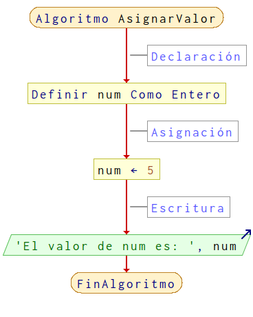
    ~~~
    Algoritmo AsignarValor

    	//Declaración
    	num Es Entero

    	//Asignación
    	num <- 5

    	//Escritura
    	Escribir "El valor de num es: ", num

    FinAlgoritmo
    ~~~

    [Descargar posible solución para el algoritmo **AsignarValor**](ejercicios/AsignarValor.psc)

- **Lectura/Escritura de un número**

  Diseñar un algoritmo que lea un número por teclado y nos lo muestre por pantalla.

  - 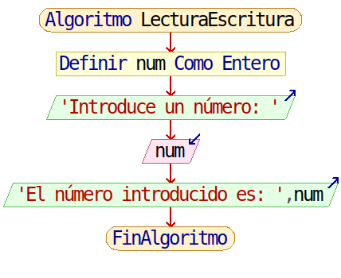
    ~~~
    Algoritmo LecturaEscritura

    	//Declaración
    	num Es Entero

    	//Lectura
    	Escribir Sin Saltar "Introduce un número: "
    	Leer num

    	//Escritura
    	Escribir "El número introducido es: ", num

    FinAlgoritmo
    ~~~

    [Descargar posible solución para el algoritmo **LecturaEscritura**](ejercicios/LecturaEscritura.psc)

- **Lectura/Escritura de una cadena**

  Diseñar un algoritmo que lea tu nombre por teclado y te salude por pantalla.

  - 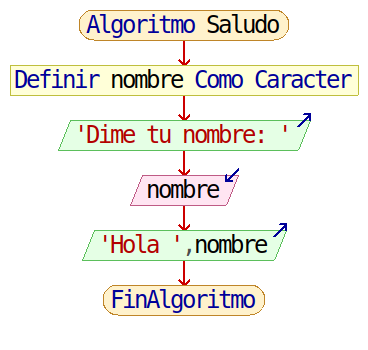
    ~~~
    Algoritmo Saludo

    	//Declaración
    	nombre Es Caracter

    	//Entrada
    	Escribir Sin Saltar "Dime tu nombre: "
    	Leer nombre

    	//Salida
    	Escribir "Hola " nombre

    FinAlgoritmo
    ~~~

    [Descargar posible solución para el algoritmo **Saludo**](ejercicios/Saludo.psc)

- **Mostrar el doble de un número**

  Diseñar un algoritmo que lea un número entero por teclado y muestre el doble del mismo por pantalla.

  - 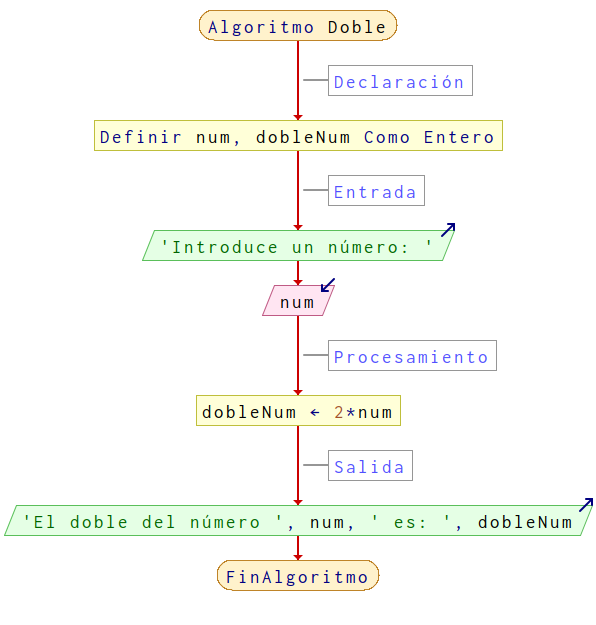
    ~~~
    Algoritmo Doble

    	// Declaración
    	Definir num,dobleNum Como Entero

    	// Entrada
    	Escribir 'Introduce un número: ' Sin Saltar
    	Leer num

    	// Procesamiento
    	dobleNum <- 2*num

    	// Salida
    	Escribir 'El doble del número ',num,' es: ',dobleNum

    FinAlgoritmo
    ~~~

    [Descargar posible solución para el algoritmo **Doble**](ejercicios/Doble.psc)

- **Mostrar el cuadrado de un número**

  Diseñar un algoritmo que lea un número entero por teclado y muestre el cuadrado del mismo por pantalla.

  - 
    ~~~
    Algoritmo Cuadrado

    	//Declaracion
    	num, cuadradoNum Son Enteros

    	//Lectura
    	Escribir Sin Saltar "Introduce un número: "
    	Leer num

    	//Procesamiento
    	cuadradoNum <- num*num

    	//Salida
    	Escribir "El cuadrado de " num " es: " cuadradoNum

    FinAlgoritmo
    ~~~

    [Descargar posible solución para el algoritmo **Cuadrado**](ejercicios/Cuadrado.psc)

- **Hallar el perímetro de un rectángulo**

  Diseñar un algoritmo que lea la base y la altura de un rectángulo por teclado y muestre el perímetro del mismo por pantalla.

  - 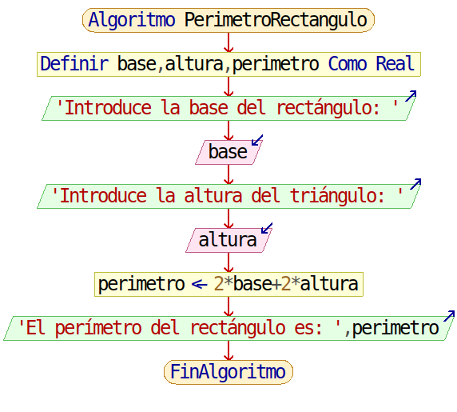
    ~~~
    Algoritmo PerimetroRectangulo

    	//Declaración
    	base, altura, perimetro Son Reales

    	//Entrada
    	Escribir Sin Saltar "Introduce la base del rectángulo: "
    	Leer base
    	Escribir Sin Saltar "Introduce la altura del triángulo: "
    	Leer altura

    	//Procesamiento
    	perimetro <- 2 * base + 2 * altura

    	//Salida
    	Escribir "El perímetro del rectángulo es: " perimetro

    FinAlgoritmo
    ~~~

    [Descargar posible solución para el algoritmo **PerimetroRectangulo**](ejercicios/PerimetroRectangulo.psc)

- **Calcular el área de un círculo**

  Diseñar un algoritmo que lea el radio de un círculo por teclado y muestre el área del mismo por pantalla.

  - 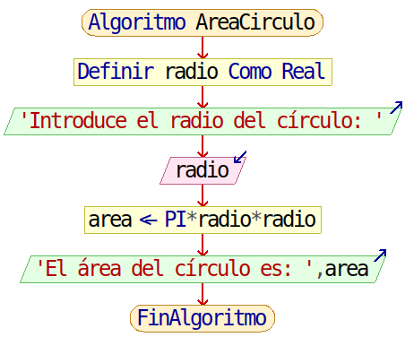
    ~~~
    Algoritmo AreaCirculo

    	//Declaración
    	radio Es Real

    	//Entrada
    	Escribir Sin Saltar "Introduce el radio del círculo: "
    	Leer radio

    	//Procesamiento
    	area <- PI * radio * radio

    	//Salida
    	Escribir "El área del círculo es: " area

    FinAlgoritmo
    ~~~

    [Descargar posible solución para el algoritmo **AreaCirculo**](ejercicios/AreaCirculo.psc)

###### Sentencias condicionales

- **Valor absoluto de un número**

  Diseñar un algoritmo que lea un número por teclado y muestre el cuadrado del mismo por pantalla.

  - 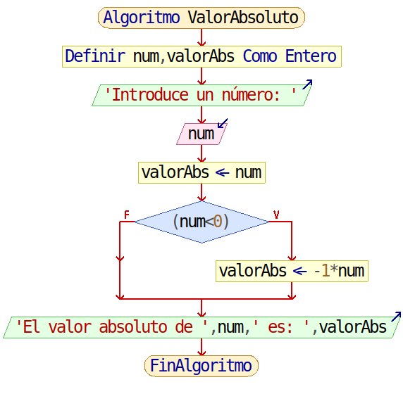
    ~~~
    Algoritmo ValorAbsoluto

    	//Declaración
    	num, valorAbs Son Enteros

    	//Lectura
    	Escribir Sin Saltar "Introduce un número: "
    	Leer num

    	//Procesamiento
    	valorAbs <- num
    	Si (num < 0) Entonces
    		valorAbs <- -1 * num
    	FinSi

    	//Salida
    	Escribir "El valor absoluto de " num " es: " valorAbs

    FinAlgoritmo
    ~~~

    [Descargar posible solución para el algoritmo **ValorAbsoluto**](ejercicios/ValorAbsoluto.psc)

- **Número par o impar**

	Diseñar un algoritmo que lea un número por teclado y nos indique si es par o impar.

  - 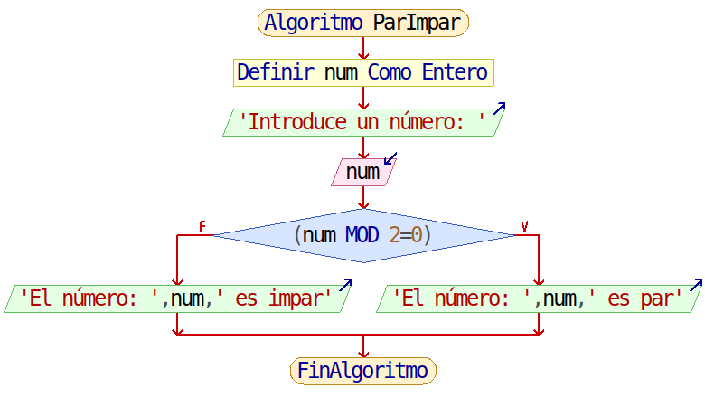
    ~~~
    Algoritmo ParImpar

    	//Declaración
    	num Es Entero

    	//Lectura
    	Escribir Sin Saltar "Introduce un número: "
    	Leer num

    	//Procesamiento y escritura
    	Si (num % 2 = 0)
    		Escribir "El número: " num " es par"
    	SiNo
    		Escribir "El número: " num " es impar"
    	FinSi

    FinAlgoritmo
    ~~~

  	[Descargar posible solución para el algoritmo **ParImpar**](ejercicios/ParImpar.psc)

- **Número positivo o negativo**

  Diseñar un algoritmo que lea un número por teclado y nos indique si es positivo o negativo.

  - 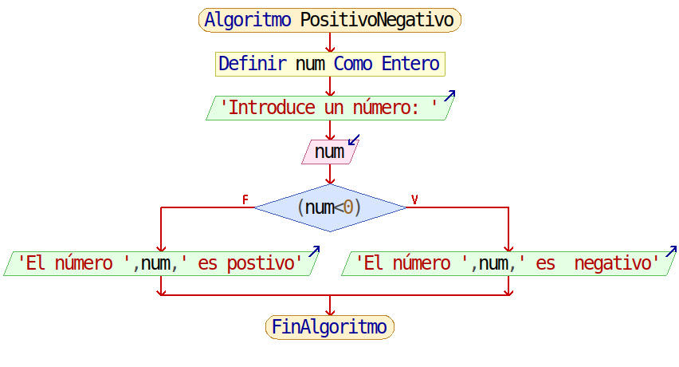
    ~~~
    Algoritmo PositivoNegativo

    	//Declaración
    	num Es Entero

    	//Entrada
    	Escribir Sin Saltar "Introduce un número: "
    	Leer num

    	//Procesamiento y Salida
    	Si (num < 0) Entonces
    		Escribir "El número " num " es  negativo"
    	SiNo
    		Escribir "El número " num " es postivo"
    	FinSi

    FinAlgoritmo
    ~~~

    [Descargar posible solución para el algoritmo **PositivoNegativo**](ejercicios/PositivoNegativo.psc)

- **Número entre 0 y 100**

  Diseñar un algoritmo que lea un número por teclado y nos indique si éste se encuentra entre 0 y 100 ambos inclusive.

  - 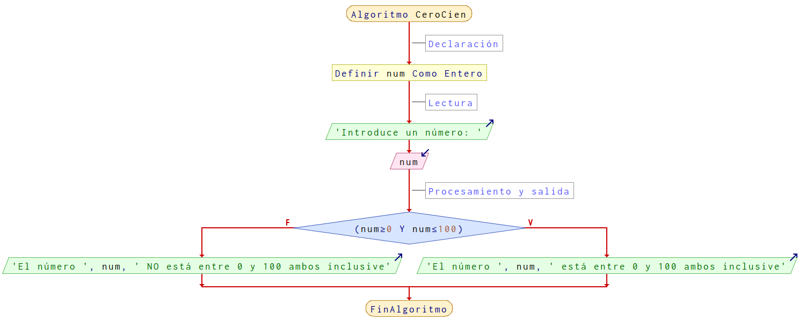
    ~~~
    Algoritmo CeroCien

    	//Declaración
    	num Es Entero

    	//Lectura
    	Escribir Sin Saltar "Introduce un número: "
    	Leer num

    	//Procesamiento y salida
    	Si (num >= 0 Y num <= 100) Entonces
    		Escribir "El número " num " está entre 0 y 100 ambos inclusive"
    	SiNo
    		Escribir "El número " num " NO está entre 0 y 100 ambos inclusive"
    	FinSi

    FinAlgoritmo
    ~~~

    [Descargar posible solución para el algoritmo **CeroCien**](ejercicios/CeroCien.psc)

- **Calificación obtenida**

  Diseñar un algoritmo que lea una nota por teclado y muestre si estás aprobado o suspenso por pantalla.

  - 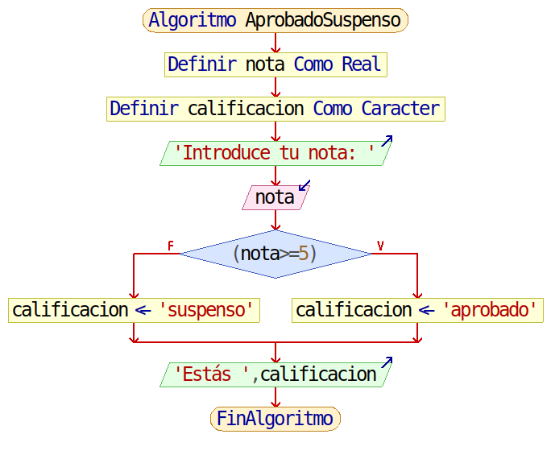
    ~~~
    Algoritmo AprobadoSuspenso

    	//Declaración
    	nota Es Real
    	calificacion Es Caracter

    	//Lectura
    	Escribir Sin Saltar "Introduce tu nota: "
    	Leer nota

    	//Procesamiento
    	Si (nota >= 5) Entonces
    		calificacion = "aprobado"
    	SiNo
    		calificacion = "suspenso"
    	FinSi

    	//Escritura
    	Escribir "Estás " calificacion

    FinAlgoritmo
    ~~~

    [Descargar posible solución para el algoritmo **AprobadoSuspenso**](ejercicios/AprobadoSuspenso.psc)

- **Números iguales**

  Diseñar un algoritmo que lea dos números por teclado y muestre si son iguales o no por pantalla.

  - 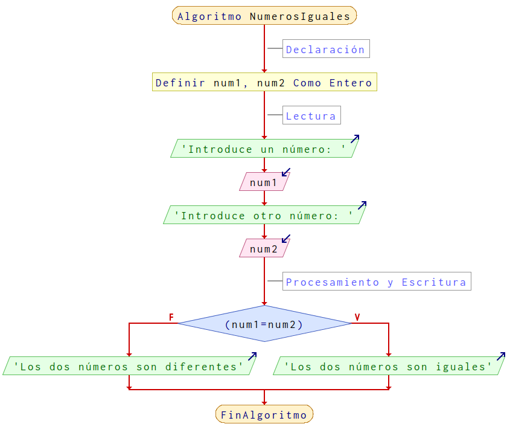
    ~~~
    Algoritmo NumerosIguales

    	//Declaración
    	num1, num2 Son Enteros

    	//Lectura
    	Escribir Sin Saltar "Introduce un número: "
    	Leer num1
    	Escribir Sin Saltar "Introduce otro número: "
    	Leer num2

    	//Procesamiento y Escritura
    	Si (num1 = num2) Entonces
    		Escribir "Los dos números son iguales"
    	SiNo
    		Escribir "Los dos números son diferentes"
    	FinSi

    FinAlgoritmo
    ~~~

    [Descargar posible solución para el algoritmo **NumerosIguales**](ejercicios/NumerosIguales.psc)

- **Ordenar dos números**

  Diseñar un algoritmo que lea dos números por teclado y los muestre ordenados de menor a mayor por pantalla.

  - 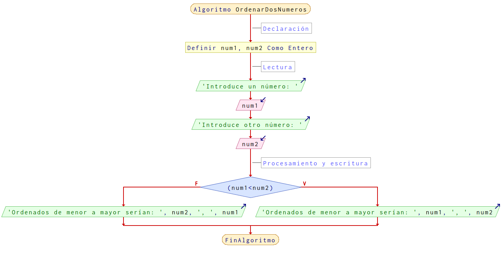
    ~~~
    Algoritmo OrdenarDosNumeros

    	//Declaración
    	num1, num2 Son Enteros

    	//Lectura
    	Escribir Sin Saltar "Introduce un número: "
    	Leer num1
    	Escribir Sin Saltar "Introduce otro número: "
    	Leer num2

    	//Procesamiento y escritura
    	Si (num1 < num2) Entonces
    		Escribir "Ordenados de menor a mayor serían: " num1 ", " num2
    	SiNo
    		Escribir "Ordenados de menor a mayor serían: " num2 ", " num1
    	FinSi

    FinAlgoritmo
    ~~~

    [Descargar posible solución para el algoritmo **OrdenarDosNumeros**](ejercicios/OrdenarDosNumeros.psc)

- **Ordenar tres números**

  Diseñar un algoritmo que lea tres números por teclado y los muestre ordenados de menor a mayor por pantalla.

  - 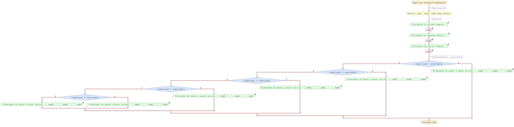
    ~~~
    Algoritmo OrdenarTresNumeros

    	//Declaración
    	num1, num2, num3 Son Enteros

    	//Lectura
    	Escribir Sin Saltar "Introduce el primer número: "
    	Leer num1
    	Escribir Sin Saltar "Introduce el segundo número: "
    	Leer num2
    	Escribir Sin Saltar "Introduce el tercer número: "
    	Leer num3

    	//Procesamiento y escritura
    	Si (num1 < num2 Y num2 < num3) Entonces
    		Escribir "Ordenados de menor a mayor serían: " num1 ", " num2 ", " num3
    	SiNo
    		Si (num1 < num3 Y num3 < num2) Entonces
    			Escribir "Ordenados de menos a mayor serían: " num1 ", " num3 ", " num2
    		SiNo
    			Si (num2 < num1 Y num1 < num3) Entonces
    				Escribir "Ordenados de menos a mayor serían: " num2 ", " num1 ", " num3
    			SiNo
    				Si (num2 < num3 Y num3 < num1) Entonces
    					Escribir "Ordenados de menos a mayor serían: " num2 ", " num3 ", " num1
    				SiNo
    					Si (num3 < num1 Y num1 < num2) Entonces
    						Escribir "Ordenados de menos a mayor serían: " num3 ", " num1 ", " num2
    					SiNo
    						Escribir "Ordenados de menos a mayor serían: " num3 ", " num2 ", " num1
    					FinSi
    				FinSi
    			FinSi
    		FinSi
    	FinSi

    FinAlgoritmo
    ~~~

    [Descargar posible solución para el algoritmo **OrdenarTresNumeros**](ejercicios/OrdenarTresNumeros.psc)

###### Sentencias repetitivas

- **Tabla de multiplicar**

  Diseñar un algoritmo que lea un número por teclado y muestre por pantalla la tabla de multiplicar de dicho número.

  - 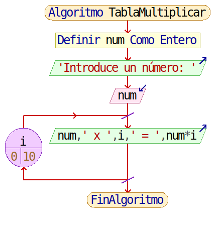
    ~~~
    Algoritmo TablaMultiplicar

    	//Declaración
    	num Es Entero

    	//Lectura
    	Escribir Sin Saltar "Introduce un número: "
    	Leer num

    	//Procesamiento y escritura
    	Para i <- 0 Hasta 10 Hacer
    		Escribir num " x " i " = " num * i
    	FinPara

    FinAlgoritmo
    ~~~

    [Descargar posible solución para el algoritmo **TablaMultiplicar**](ejercicios/TablaMultiplicar.psc)

- **Número positivo**

  Diseñar un algoritmo que lea un número positivo por teclado y lo muestre por pantalla.

  - 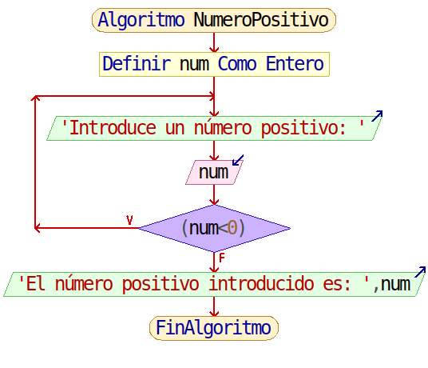
    ~~~
    Algoritmo NumeroPositivo

    	//Declaración
    	num Es Entero

    	//Lectura validada
    	Repetir
    		Escribir Sin Saltar "Introduce un número positivo: "
    		Leer num
    	Mientras Que (num < 0)

    	//Escritura
    	Escribir "El número positivo introducido es: " num

    FinAlgoritmo
    ~~~

    [Descargar posible solución para el algoritmo **NumeroPositivo**](ejercicios/NumeroPositivo.psc)

- **Sumar números**

  Diseñar un algoritmo que lea números por teclado hasta que se introduzca un cero y muestre por pantalla la suma de los mismos.

  - 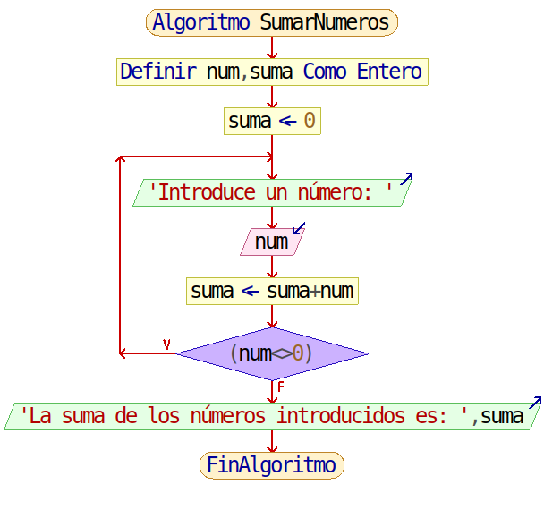
    ~~~
    Algoritmo SumarNumeros

    	//Declaración
    	num, suma Es Entero

    	//Incialización
    	suma <- 0

    	//Lectura y procesamiento
    	Repetir
    		Escribir Sin Saltar "Introduce un número: "
    		Leer num
    		suma <- suma + num
    	Mientras Que (num <> 0)

    	//Escritura
    	Escribir "La suma de los números introducidos es: " suma

    FinAlgoritmo
    ~~~

    [Descargar posible solución para el algoritmo **SumarNumeros**](ejercicios/SumarNumeros.psc)

- **Media números**

  Diseñar un algoritmo que lea números por teclado hasta que se introduzca un cero y muestre por pantalla la media de los mismos.

  - 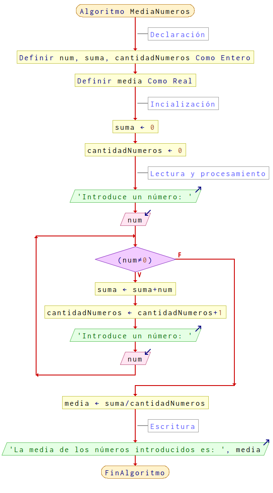
    ~~~
    Algoritmo MediaNumeros

    	//Declaración
    	num, suma, cantidadNumeros Son Enteros
    	media Es Real

    	//Incialización
    	suma <- 0
    	cantidadNumeros <- 0

    	//Lectura y procesamiento
    	Escribir Sin Saltar "Introduce un número: "
    	Leer num
    	Mientras (num <> 0) Hacer
    		suma <- suma + num
    		cantidadNumeros <- cantidadNumeros + 1
    		Escribir Sin Saltar "Introduce un número: "
    		Leer num
    	FinMientras
    	media <- suma / cantidadNumeros

    	//Escritura
    	Escribir "La media de los números introducidos es: " media

    FinAlgoritmo
    ~~~

    [Descargar posible solución para el algoritmo **MediaNumeros**](ejercicios/MediaNumeros.psc)
