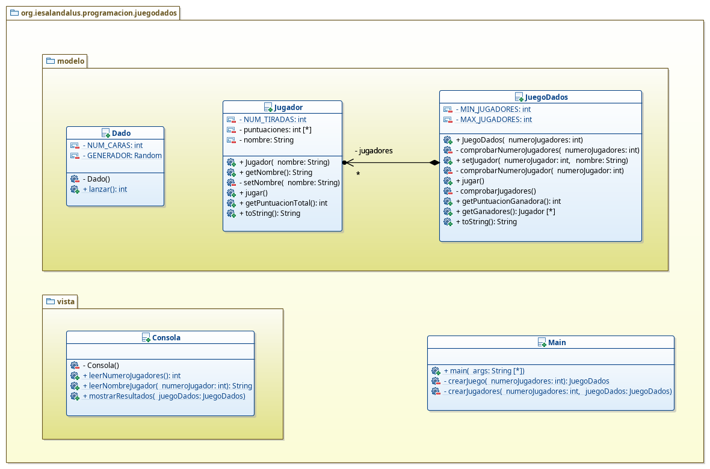

# Algunas clases interesantes en Java

En este apartado encontrarás una breve descripción sobre algunas clases interesantes en Java y cuya utilización te será de gran ayuda. Es esencial que conozcas estas clases y que domines su utilización.

Al igual que en otros apartados, el objetivo principal es que tengáis una amplía gama de ejercicios, con sus respectivas posibles soluciones.

**José Ramón Jiménez Reyes**

 >  @JRJimenezReyes

 >  joseramon.jimenez@iesalandalus.org

### Contenidos
---
- [Arrays](#arrays)
- [Cadenas de caracteres](#cadenas-de-caracteres)
- [Expresiones regulares](#expresiones-regulares)
- [Clases envoltorio](#clases-envoltorio)
- [Fechas y tiempos](#fechas-y-tiempos)
- [Generación de números aleatorios en java](#generacin-de-nmeros-aleatorios-en-java)
- [Ejercicios](#ejercicios)

## Arrays

Un array en java no es más que una estructura de memoria capaz de almacenar objetos (llamados elementos cuando hablamos de arrays) del mismo tipo. Un array en sí es un objeto. A los elementos almacenados en un array se puede acceder mediante un índice que indica el desplazamiento desde el comienzo de dicho array. A la hora de crear un array se establece la longitud del mismo y ésta no se puede cambiar.

Como he comentado, un array es un objeto en java. Por tanto, primero deberemos declarar una referencia a dicho array, después crear el array y posteriormente inicializar su contenido. Veamos cómo se lleva a cabo cada una de estas operaciones.

Para **declarar** una referencia a un array utilizaremos la siguiente nomenclatura: `tipo[] nombre`, donde `tipo` puede ser un tipo primitivo, una clase de la API de java o una clase definida por nosotros mismos. Los corchetes indican que estamos declarando un array. Y `nombre` será el identificador que le damos a nuestra referencia al array.

~~~java
	int[] miArray;
~~~

Con esto habremos declarado la referencia al array identificada por `miArray`. Pero, al igual que ocurría con los objetos, ahora mismo esa referencia es `null`. Por lo que deberemos crear el array y asignarlo a dicho identificador, para que la referencia apunte al array recién creado. Para **crear** el array se utiliza el operador `new` seguido por el tipo de objetos que va almacenar el array y entre corchetes la longitud que queremos asignar a dicho array. La longitud puede ser un valor constante o un valor calculado en tiempo de ejecución.

~~~java
	miArray = new int[15];
~~~

Ahora que ya tenemos creado el array deberemos **inicializar** su contenido. En un array recién creado, todos sus elementos tendrán los valores por defecto del tipo que almacena (en el ejemplo estará todo a 0 que es el valor por defecto para los enteros).

Para poder darle los valores deseados a cada uno de los elementos del array, deberemos acceder a cada elemento en particular y asignarle un valor. Para ello utilizaremos el identificador del array y entre corchetes el índice del elemento al que queremos acceder. Notar que el **primer índice de un array es el 0**.

~~~java
	miArray[0] = 2;
	miArray[1] = 4;
	miArray[2] = 6;
	System.out.println(miArray[2]);	//Muestra 6
	System.out.println(miArray[3]);	//Muestra 0 ya que aún no le hemos asignado ningún valor
~~~

Existe una sintaxis abreviada que nos permite declarar, crear e inicializar un array en una sola sentencia:

~~~java
	int[] miArray = { 2, 4, 6, 8, 10, 12, 14, 16, 18, 20, 22, 24, 26, 28, 30 };
~~~

En este caso la longitud del array se determina por el número de elementos específicados entre las llaves.

Los arrays, al tratarse de objetos, tienen algunos miembros que podemos utilizar. Uno de los más utilizados es el atributo `length` que nos devuelve la longitud de dicho array.

Para **recorrer** un array podemos utilizar un bucle. Es muy importante que controlemos que no nos salimos de los límites del array, tanto por abajo como por arriba (`0` ... `length - 1`), o de lo contrario nos saltará una excepción en tiempo de ejecución indicando que nos hemos salido de los límites del array (`IndexOutOfBoundsException`).

~~~java
	...
	for (int i = 0; i < miArray.length; i++) {
		System.out.println("Elemento en el índice: " + i + ", valor: " + miArray[i]);
	}
~~~

Pero java define otro tipo de bucles, que no habíamos comentado, que permite recorrer colecciones de objetos, entre ellas arrays, de una forma más cómoda y sencilla. Este tipo de bucles son los llamados `foreach`. La estructura de este array es la siguiente: `for (tipoBase identificador: coleccionTipoBase)`. `tipoBase` sería el tipo que almacena la colección, en este caso el array, `identificador` sería un identificador de dicho tipo y `coleccionTipoBase` sería la colección, en este caso array, a recorrer. Este tipo de bucle recorre la colección, en este caso el array, desde el principio al final y en cada iteración asigna el valor del elemento de la colección a la variable `identificador`.

~~~java
	int indice = 0;
	for (int elemento : miArray) {
		System.out.println("Elemento en el índice: " + indice++ + ", valor: " + elemento);
	}
~~~

###### Arrays multidimensionales

Los arrays multidimensionales son arrays de varias dimensiones, aunque pasar de tres dimensiones es complicado ya que su uso no es nada intuitivo.

Lo más normal es la utilización de arrays de dos dimensiones, también llamados matrices. Son arrays de arrays. Para declararlos utilizaremos tantos corchetes como dimensiones queramos declarar.

~~~java
	char[][] crucigrama;
~~~

Al igual que ocurría con los arrays unidimensionales de objetos, una vez declarada la referencia hay que crear los diferentes elementos del array que en este caso también son arrays. Esto podemos hacerlo directamente con el operador `new`.
~~~java
	crucigrama = new char[5][5];
~~~

La forma de representación anterior no sería la más correcta, ya que en verdad, en java un array multidimensional es un array de arrays, por lo que la representación correcta sería la siguiente (aunque por simplicidad utilizaremos la anterior).

También es posible que un array multidimensional tuviese diferentes dimensiones en cada una de las posiciones;

~~~java
	int[][] escalon;
	escalon = new char[5][];
	for (int i = 0; i < escalon.length; i++) {
		escalon[i] = new int[i+1];
	}
~~~

Esto simplemente os lo comento para que lo sepáis, aunque no es muy normal utilizarlo.

Para acceder a los elementos de un array multidimensional deberemos utilizar tantos índices como dimensiones tenga el array.
~~~java
	crucigrama[0][0] = 'a';
	crucigrama[0][1] = 'n';
	...
	crucigrama[1][0] = 'b';
	...
	crucigrama[4][4] = 'l';
~~~

Veamos cómo recorrer el array multidimensional primero para asignarle valores a sus elementos y luego para mostrarlos.

~~~java
	...
	char[][] crucigrama;
	crucigrama = new char[5][5];
	char letra = 'a';
	for (int i = 0; i < crucigrama.length; i++) {
		for (int j = 0; j < crucigrama[i].length; j++) {
			crucigrama[i][j] = letra++;
		}
	}
	for (int i = 0; i < crucigrama.length; i++) {
		for (int j = 0; j < crucigrama[i].length; j++) {
			System.out.println("Elemento [" + i + ", " + j + "] = " + crucigrama[i][j]);
		}
	}
~~~

###### Arrays de objetos

Hasta ahora hemos visto todos los ejemplos con arrays de tipos primitivos. Pero también comenté que los arrays podían almacenar cualquier objeto.

Tanto la declaración, como la creación se hacen exactamente igual, aunque en vez de utilizar como `tipo` un tipo primitivo, se utiliza la clase del objeto que queramos almacenar.

Lo que sí debemos tener en cuenta que una vez creado el array todos sus elementos están inicializados a los valores por defecto, que en el caso de referencias a objetos es `null`. Por lo que debemos crear cada objeto y asignarlo a ese elemento antes de poder acceder al mismo.

~~~java
package arrays;

class Punto {
	private int x;
	private int y;

	public Punto(int x, int y) {
		this.x = x;
		this.y = y;
	}

	public Punto(Punto otro) {
		x = otro.x;
		y = otro.y;
	}

	public int getX() {
		return x;
	}

	public void setX(int x) {
		this.x = x;
	}

	public int getY() {
		return y;
	}

	public void setY(int y) {
		this.y = y;
	}

	@Override
	public String toString() {
		return "Punto [x=" + x + ", y=" + y + "]";
	}

}

public class ArrayObjetos {

	public static void main(String[] args) {
		Punto[] cuadrado = new Punto[4];
		cuadrado[0] = new Punto(0, 0);
		cuadrado[1] = new Punto(10, 0);
		cuadrado[2] = new Punto(10, 10);
		cuadrado[3] = new Punto(0, 10);

		for (Punto punto: cuadrado) {
			System.out.println(punto);
		}

		System.out.println("El primer vértice del cuadrado, tiene la x=" +
				cuadrado[0].getX() + " y la y=" + cuadrado[0].getY());
	}
}
~~~

###### Copiando arrays

A la hora de copiar un array debemos tener cuidado con lo que de verdad pretendemos. Aunque voy a hablar de copiar, el caso sería el mismo para devolverlo por un método o asignarlo a un atributo.

La primera idea sería asignar un array a otro, pero como ya sabemos lo que en verdad sucede es que se están copiando las referencias, por lo que cualquier modificación que hagamos en cualquiera de los arrays afectaría al otro.

~~~java
	...
	Punto[] arrayOrigen = { new Punto(1, 1) };
	Punto[] arrayDestino = new Punto[1];
	arrayDestino = arrayOrigen;
	arrayOrigen[0].setX(2);

	System.out.println(arrayOrigen == arrayDestino);	//Muestra true
	System.out.println(arrayOrigen[0] + ", "
			+ arrayDestino[0]); //Muestra Punto[x=2, x=1], Punto[x=2, y=1]
~~~

Otra opción sería utilizar el método `clone` que se hereda de `Object`, pero esta opción tampoco es una solución adecuada, ya que utilizando este método se crea una nueva referencia del array pero para cada elemento se igualan las referencias.

~~~java
	...
	Punto[] arrayOrigen = { new Punto(1, 1) };
	Punto[] arrayDestino = new Punto[1];
	arrayDestino = arrayOrigen.clone();
	arrayOrigen[0].setX(2);

	System.out.println(arrayOrigen == arrayDestino);	//Muestra false
	System.out.println(arrayOrigen[0] + ", "
			+ arrayDestino[0]); //Muestra Punto[x=2, x=1], Punto[x=2, y=1]
~~~

Hay otros métodos que también permiten hacer una copia de un array como el método `arraycopy` de la clase `System` la cuál acepta como parámetros el array de origen, la posición de origen, el array de destino, la posición del destino en qué copiarlo y la longitud a copiar. Pero este método también se comporta como en el caso anterior.

~~~java
	...
	Punto[] arrayOrigen = { new Punto(1, 1) };
	Punto[] arrayDestino = new Punto[1];
	System.arraycopy(arrayOrigen, 0, arrayDestino, 0, 1);
	arrayOrigen[0].setX(2);

	System.out.println(arrayOrigen == arrayDestino);	//Muestra false
	System.out.println(arrayOrigen[0] + ", "
			+ arrayDestino[0]); //Muestra Punto[x=2, x=1], Punto[x=2, y=1]
~~~

Por último, existen dos métodos de la clase `java.util.Arrays` cuyos identificadores son: `copyOf` que acepta como parámetros el array de origen y la longitud a copiar y devuelve la copia de dicho fragmento del array copiado; y `copyOfRange` que acepta como parámetros el array origen, el índice desde el que va a copiar y el índice donde termina de copiar (sin incluirlo) y devuelve el fragmento de array copiado. Pero ambos métodos se comportan exactamente igual que en el caso anterior.

Podemos comprobar que las técnicas utilizadas para realizar una copia de un array, simplemente realizan una **copia superficial** del array (exceptuando el operador `=` que simplemente iguala las referencias).

Si lo que pretendemos es realizar una **copia profunda** del array, lo que deberemos hacer es: crear un constructor copia de la clase que almacena el array (y de sus clases cliente, es decir, que realice una copia profunda de dicha clase) y recorrer el array creando nuevas instancias de cada uno de los elementos.

~~~java
	...
	Punto[] arrayOrigen = { new Punto(1, 1) };
	Punto[] arrayDestino = new Punto[1];
	for (int i = 0; i < arrayOrigen.length; i++) {
		arrayDestino[i] = new Punto(arrayOrigen[i]);
	}
	arrayOrigen[0].setX(2);

	System.out.println(arrayOrigen == arrayDestino);	//Muestra false
	System.out.println(arrayOrigen[0] + ", "
			+ arrayDestino[0]); //Muestra Punto[x=2, x=1], Punto[x=1, y=1]
~~~

###### Algunos otros métodos interesantes

La clase `java.util.Arrays` nos ofrece algunos otros métodos (además de los vistos) que nos pueden servir de ayuda en algún momento. Veamos algunos de los métodos más interesantes:

- `fill`: acepta como parámetros el array y el valor a asignar a cada elemento y rellena cada elemento del array con dicho valor. Hay que tener cuidado ya que simplemente hace una asignación del valor, por lo que si es una referencia tendremos el problema del **aliasing** para cada elemento.
- `sort`: ordena el array en orden ascendente. Este método trabaja correctamente con tipos primitivos, pero si queremos ordenar un array de objetos, la clase de dicho objeto debe implementar la interfaz `Comparable` o que le pasemos el método para comparar (utilizando una expresión lambda, por ejemplo), pero esto lo dejamos para más adelante.
- `binarySearch`: utiliza el algoritmo de búsqueda binaria para buscar un elemento en el array y devuelve la posición + 1 (en negativo) de dicho elemento. El requisito para que este método funcione correctamente es que el array esté previamente ordenado. Al igual que en el caso anterior, este método funciona correctamente con tipos primitivos pero si hablamos de objetos, la clase debe implementar la interfaz `Comparator` o que le pasemos el método para comparar.

## Cadenas de caracteres

La clase `String` representa una cadena de caracteres. Internamente podríamos verla como un array de caracteres.

Dado que el uso de cadenas de caracteres es muy común en los lenguajes de programación, en java la clase `String` está a medio camino entre un tipo primitivo y una clase. Debido a su amplio uso, su declaración e inicialización se parecen más a un tipo primitivo que a un objeto de una clase. Además, es importante mencionar que es un **objeto inmutable**, es decir, que una vez creado no puede cambiar su contenido.

Para crear una cadena, podemos utilizar dos formas:
- **Implícita**: Asignamos la referencia al objeto `String` a un literal del tipo cadena que se delimita por `""`. `String nombre = "José Ramón";`.
- **Explícita**: Se crea como cualquier otra referencia a un objeto de una clase. `String nombre = new String("José Ramón");`.

La diferencia entre crear una cadena de una forma u otra es, en principio la sencillez y comodidad de utilizar la forma implícita. Pero, además, existe otra diferencia: por cuestiones de eficiencia, cuando creamos una cadena utilizando la forma implícita, java almacenará los literales en una zona especial e intentará reutilizar todos los literales iguales. Sin embargo, cuando utilizamos la forma explícita se comportará como con cualquier otro objeto y los almacenará en el heap de memoria.

~~~java
	String nombre1 = "José Ramón";
	String nombre2 = "José Ramón";
	String nombre3 = new String("José Ramón");
	String nombre4 = new String("José Ramón");
	System.out.println(nombre1 == nombre2);		//Muestra true
	System.out.println(nombre3 == nombre4);		//Muestra false
~~~

Como hemos comentado anteriormente, las cadenas son objetos inmutables, por lo que cualquier operación que hagamos sobre ella, que implique una modificación, lo que hará es crear una nueva cadena, ya que los objetos inmutables no se pueden modificar.

Debido al amplio uso de las cadenas, también existe un operador especial para concatenar cadenas: `+`.
~~~java
	String nombre = "José Ramón";
	System.out.println("Hola " + nombre);		//Muestra: Hola José Ramón
~~~

Vistas las peculiaridades de las cadenas, veamos los principales métodos que nos ofrece la clase `String` para su manipulación y uso.

|------|-----------|
|Método|Explicación|
|------|-----------|
|`char charAt(int index)`|Devuelve el carácter especificado por el índice. El índice debe estar entre `0` y `length() - 1` o de lo contrario lanzará la excepción `IndexOutOfBoundsException`.|
|`String concat(String str)`|Devuelve la concatenación de la cadena actual con la pasada por parámetro.|
|`boolean contains(CharSequence s)`|Devuelve `true` si la cadena contiene la secuencia de caracteres pasada por parámetro.|
|`int compareTo()`|Compara la cadena actual con la pasada por parámetro y devuelve -1, 0 o 1, dependiendo de si la pasada es menor, igual o mayor.|
|`int compareToIgnoreCase()`|Igual que el anterior, pero ignorando mayúsculas y minúsculas.|
|`boolean endsWith(String suffix)`|Devuelve `true` si la cadena actual termina con el sufijo `suffix`.|
|`boolean equals(Object obj)`|Compara si el contenido de la cadena actual y la pasada por paŕametro es el mismo.|
|`boolean equalsIgnoreCase(String string)`|Compara si el contenido de la cadena actual y la pasada por paŕametro es el mismo, ignorando mayúsculas y minúsculas.|
|`int indexOf(char ch)`|Devuelve el índice de la primera ocurrencia del carácter `ch` o -1 si no existe.|
|`int indexOf(char ch, int fromIndex)`|Igual que la anterior, pero comienza la búsqueda a partir del índice `fromIndex`.|
|`int indexOf(String str)`|Devuelve el índice de la primera ocurrencia de la subcadena `str`.|
|`boolean isEmpty()`|Devuelve `true` si la longitud de la cadena es igual a 0.|
|`boolean isBlank()`|Devuelve `true` si la cadena está vacía o solo contiene espacios en blanco. Está disponible a partir del JDK 11.|
|`int lastIndexOf(char ch)`|Devuelve el índice que ocupa la última ocurrencia del caracter. Este método está sobrecargado para que también se le pueda pasar una cadena en vez de un caracter.|
|`int lastIndexOf(char ch, int fromIndex)`|Lo mismo que la anterior, pero comienza la búsqueda desde el índice `fromIndex` hacia atrás. Al igual que el anterior, este método también está sobrecargado para que se le pueda pasar una cadena en vez de un caracter.|
|`int length()`|Devuelve la longitud de la cadena.|
|`boolean startsWith(String prefix)`|Devuelve `true` si la cadena actual comienza por la cadena `prefix`.|
|`boolean startsWith(String prefix, inf offset)`|Devuelve `true` si la cadena actual empieza por la cadena `prefix` empezando en el índice `offset`.|
|`String substring(int beginIndex)`|Devuelve la subcadena de la cadena actual, empezando en `beginIndex` hasta el final.|
|`String substring(int beginIndex, int endIndex)`|Devuelve la subcadena de la cadena actual, empezando en `beginIndex` hasta `endIndex - 1`.|
|`String toUpperCase()`|Devuelve la cadena en mayúsculas.|
|`String toLowerCase()`|Devuelve la cadena en minúsculas.|
|`String trim()`|Devuelve la cadena eliminando los espacios en blanco iniciales y finales.|

Para consultar la lista completa de métodos, os recomiendo consultar la [documentación de la API de java](https://docs.oracle.com/javase/8/docs/api/java/lang/String.html).

###### Formateando cadenas

Hay veces que nos interesa dar formato a una cadena o incluso convertir un tipo a cadena pero con un determinado formato.

Para este menester podemos utilizar el método `format` de clase `String`. A este método se le pasa una cadena con el formato deseado y una lista variable de argumentos. Esta lista variable de argumentos dependerá de la cadena de formato pasada como primer argumento, es decir, de los especificadores de formato utilizados en la misma. De esta misma forma podemos formatear la salida por consola (o por el error) mediante el método `printf` del objeto `out` de la clase `System`. Como luego podréis observar, uno de los principales beneficios es evitar el uso de múltiples concatenaciones a la hora de imprimir por consola (además de hacerlo con el formato deseado).

Primero os voy a mostrar los tipos de conversión de formato más comunes y luego veremos algunos ejemplos de sus usos.

|Tipo de conversión|Tipo al que se aplica|Salida|
|-------------|---------------------|------|
|%a|Números reales|El número real expresado en hexadecimal|
|%b|Cualquier tipo|`true` si no es nulo y `false` en caso contrario|
|%c|caracter|El caracter|
|%d|Enteros|El número entero|
|%e|Números reales|El número real expresado en notación científica|
|%f|Números reales|El número real|
|%n|Nada|Un separador de línea dependiente de la plataforma|
|%o|Enteros|El número entero expresado en octal|
|%s|Cualquier tipo|Su representación como cadena|
|%x|Enteros|El número entero expresado en notación hexadecimal|

Veamos un primer ejemplo de cómo utilizarlos y luego los explicaremos más detalladamente.
~~~java
	String nombre = "José Ramón";
	int edad = 18;
	String salida = String.format("Mi nombre es %s y tengo %d años.", nombre, edad);
	System.out.println(salida);
	//Salida: Mi nombre es José Ramón y tengo 18 años.
	System.out.printf("Mi nombre es %s y tengo %d años.", nombre, edad);
	//Salida: Mi nombre es José Ramón y tengo 18 años.
~~~

Un especificador de formato, además puede ir acompañado de otros modificadores de formato que son opcionales. Veamos cuál es la sintaxis:
~~~java
	%[indice_argumento$][modificador][anchura][.precision]tipo_conversion
~~~
Como se puede apreciar sólo es obligatorio el símbolo `%` acompañado del tipo de conversión. El índice de argumento se utiliza para referirnos a un parámetro en cuestión. El modificador se utiliza para cambiar el formato de salida. La anchura se utiliza para limitar el número de caractares a mostrar. La precisión se utiliza para limitar el número de caracteres a mostrar dependiendo del tipo de conversión.

En el siguiente ejemplo utilizo los **índices** para hacer lo mismo que en el primer ejemplo.
~~~java
	System.out.printf("Mi nombre es: %2$s y tengo %1$d años.", edad, nombre);
~~~

En el siguiente ejemplo vamos a ver cómo formatear **números enteros**.
~~~java
	int numero = 1234;
	System.out.printf("|%d|%n", numero);	//Mostramos el número sin más
	System.out.printf("|%10d|%n", numero);	//Mostramos el número  especificando su longitud
	System.out.printf("|%-10d|%n", numero);	//Mostramos el número especificando su longitud y justificado a la izquierda
	System.out.printf("|%010d|%n", numero);	//Mostramos el número especificando su longitud y rellenamos de 0`s el tamaño no ocupado
	System.out.printf("|%,10d|%n", numero);	//Mostramos el número especificando su longitud y utilizando de separador de miles el separador local
~~~
La salida será la siguiente:
~~~
|1234|
|      1234|
|1234      |
|0000001234|
|     1.234|
~~~

En el siguiente ejemplo vamos a ver cómo formatear **números reales**
~~~java
	double q = 1.0 / 3.0;
	System.out.printf("1.0/3.0 = %5.3f %n", q);
	System.out.printf("1.0/3.0 = %7.5f %n", q);
	q = 1.0 / 2.0;
	System.out.printf("1.0/2.0 = %09.3f %n", q);
~~~
Su salida sería:
~~~
1.0/3.0 = 0,333
1.0/3.0 = 0,33333
1.0/2.0 = 00000,500
~~~

En el siguiente ejemplo vamos a ver cómo formatear **cadenas**
~~~java
	String nombre = "José Ramón";
	System.out.printf("Nombre: |%s|%n", nombre);
	System.out.printf("Nombre: |%15s|%n", nombre);		//Especifico anchura
	System.out.printf("Nombre: |%-15s|%n", nombre);		//Especifico anchura y justificación izquierda
	System.out.printf("Nombre: |%.5s|%n", nombre);		//Especifico máximo de caracteres a mostrar
	System.out.printf("Nombre: |%15.5s|%n", nombre);	//Especifico anchura y número máximo de caracteres a mostrar
~~~
Su salida sería:
~~~
Nombre: |José Ramón|
Nombre: |     José Ramón|
Nombre: |José Ramón     |
Nombre: |José |
Nombre: |          José |
~~~

###### Cadenas de caracteres mutables
Como ya mencioné, un objeto de la clase `String` es un objeto inmutable, lo que quiere decir que no puede cambiar una vez creados. Cualquier operación sobre dicho objeto que conlleve una modificación del mismo lo que hace es crear un nuevo objeto. Por ejemplo, el siguiente código:
~~~java
	String nombre = "José";
	nombre += " ";
	nombre += "Ramón";
~~~
Este código crea tres objetos. El primero en la inicialización y uno por cada concatenación. Cuando trabajamos con pocas de estas operaciones no importa, pero si realizamos muchas de ellas si puede penalizar en recursos y/o tiempo.

Para solventar este problema java nos ofrece dos clases `StringBuilder` y `StringBuffer`. Su interfaz es exactamente la misma (los métodos que nos ofrecen) y con la única diferencia que la primera clase no está sincronizada y la segunda sí. Por tanto, lo recomendable sería utilizar `StringBuilder` en entornos con un solo hilo y `StringBuffer` en entornos multi-hilo.

Los objetos de dichas clases son estructuras dinámicas que pueden crecer cuando lo necesiten. Además de su longitud, tienen un atributo que indica su capacidad (que siempre será mayor o igual que la longitud). Dicha capacidad puede crecer se así es necesario.

Un objeto `String` puede convertirse fácilmente en un objeto de una de las clases anteriores simplemente pasando el objeto `String` a la hora de crear el objeto. A la inversa, simplemente debemos utilizar el método `toString`.

~~~java
	String nombre = "José Ramón";
	StringBuilder nombreSB = new StringBuilder(nombre);
	String otroNombre = nombreSB.toString();
~~~

Los principales métodos que nos ofrecen estas clases son:

|Método|Explicación|
|------|-----------|
|append(...)|Añade al final la cadena o la representación en forma de cadena del objeto primitivo o cadena pasados|
|delete(int inicio, int final)|Borra los caracteres comprendidos entre `inicio` y `final` - 1|
|deleteCharAt(int indice)|Borra el caracter que ocupa el índice `indice`|
|insert(int indice, ...)|Inserta en la posición `indice` la cadena o la representación en forma de cadena del objeto primitivo o cadena pasados|
|replace(int inicio, int final, String str)|Reemplaza los caracteres comprendidos entre `inicio` y `final - 1` por la cadena pasada|
|setCharAt(int indice, char c)|Reemplaza el caracter que ocupa el índice `indice` por el caracter `c`|
|reverse|Invierte el contenido|

Por lo dicho hasta ahora, utilizaremos `String` cuando no vayamos a realizar muchas operaciones con las mismas o estas no vayan a cambiar y en caso contrario `StringBuilder` o `StringBuffer`.

Para mostrar la diferencia en rendimiento veamos la salida del siguiente programa:
~~~java
public class ComparativaCadenas {
    public static void main(String[] args) {
        final int TAMANO = 100000;
        final float NANOSEGUNDOS_SEGUNDO = 1000000000;
        long inicio, tiempoConsumido;

        String cadena = "";
        char caracter = 'a';
        inicio = System.nanoTime();
        for (int n = 0; n < TAMANO; ++n) {
            cadena += caracter;
            caracter = (caracter > 'z') ? 'a' : (char) (caracter + 1);
        }
        tiempoConsumido = System.nanoTime() - inicio;

        System.out.printf("Tiempo: %f s. en la construcción de un String de tamaño %d caracteres.%n", tiempoConsumido / NANOSEGUNDOS_SEGUNDO, TAMANO);

        StringBuilder cadenaSB = new StringBuilder();
        caracter = 'a';
        inicio = System.nanoTime();
        for (int n = 0; n < TAMANO; ++n) {
            cadenaSB.append(caracter);
            caracter = (caracter > 'z') ? 'a' : (char) (caracter + 1);
        }
        tiempoConsumido = System.nanoTime() - inicio;

        System.out.printf("Tiempo: %f s. en la construcción de un StringBuilder de tamaño %d caracteres.%n", tiempoConsumido / NANOSEGUNDOS_SEGUNDO, TAMANO);

        StringBuffer cadenaSBf = new StringBuffer();
        caracter = 'a';
        inicio = System.nanoTime();
        for (int n = 0; n < TAMANO; ++n) {
            cadenaSBf.append(caracter);
            caracter = (caracter > 'z') ? 'a' : (char) (caracter + 1);
        }
        tiempoConsumido = System.nanoTime() - inicio;

        System.out.printf("Tiempo: %f s. en la construcción de un StringBuffer de tamaño %d caracteres.%n", tiempoConsumido / NANOSEGUNDOS_SEGUNDO, TAMANO);
    }
}
~~~

El programa crea una cadena por concatenación de `TAMANO` caracteres y mide el tiempo empleado en ello y lo muestra. Hace lo mismo para un `StringBuilder` y un `StringBuffer`.

La salida del mismo, en mi ordenador, es la siguiente, que creo que habla por ella misma (aunque los tiempos mostrados varían de una ejecución a otra, lo que no varía es la magnitud de la diferencia).
~~~
Tiempo: 1,619124 s. en la construcción de un String de tamaño 100000 caracteres.
Tiempo: 0,004411 s. en la construcción de un StringBuilder de tamaño 100000 caracteres.
Tiempo: 0,009187 s. en la construcción de un StringBuffer de tamaño 100000 caracteres.
~~~

## Expresiones regulares

Una expresión regular no es más que un patrón que empareja con una serie de cadenas. Una expresión regular puede utilizarse para contar cuántas veces se repite un patrón en una cadena, comprobar si una cadena cumple con un determinado patrón, reemplazar un patrón en un texto por otra cadena, etc. La principal utilidad, bajo mi punto de vista, será comprobar que los datos introducidos por un usuario cumplen con un determinado patrón y así evitar errores futuros.

Las expresiones regulares ya se venían utilizando en muchos otros lenguajes e incluso formaban parte de comandos del SO UNIX (tales como sed, awk). Es más, tú sin saberlo las has utilizado cuando haces un listado desde la terminal de los ficheros que tengan tal extensión.

En este apartado veremos cómo definimos las expresiones regulares, es decir, cómo construimos el patrón para que empareje con las cadenas que queremos reconocer. Una vez hecho esto, veremos cómo utilizarlas en java.

#### Construcción de expresiones regulares

Pasemos a ver cómo podemos construir expresiones regulares, pero sin profundizar mucho ya que de este tema se podría hacer un sólo libro como ya los hay: [Mastering Regular Expressions, 3nd Edition, Jeffrey E. F. Friedl, O'Reilly and Associates, 2006](http://www.oreilly.com/catalog/regex3/).

###### Caracteres

En las expresiones regulares podemos utilizar caracteres alfanuméricos que emparejan con ellos mismos y caracteres especiales que hay que escribirlos escapados. Los más comunes son los siguientes:

|Cararacter|Con qué empareja|
|----------|-----------|
| \\\\ |Con el caracter \\ |
|\\n|Con un salto de línea|
|\\r|Con el retorno de carro|
|\\t|Con el tabulador|

Además para construir expresiones regulares también se utilizan algunos caracteres que tienen un significado especial y que, por tanto, también debemos escapar.

En java el caracter de escape se representa por la doble barra `\\` por lo que si queremos emparejar con el caracter `\`, en la expresión regular en java deberemos escribir `\\\\`.

###### Clases de caracteres
Las clases de caracteres definen cuál será el contenido de un patrón. Veamos las principales:

|Representación|Significado|
|--------------|-----------|
|[abc]|Coincide con sólo uno de los caracteres encerrados entre corchetes|
|[^abc]|Negación. Coincide con sólo uno de los caracteres que no esté encerrado entre corchetes|
|[a-z]|Coincide con sólo uno de los caracteres que representa el rango|
|[^a-z]|Coincide con sólo uno de los caracteres que no esté representado por el rango|
|.|Coincide con cualquier caracter excepto con el salto de línea|
|\\w|Coincide con cualquier caracter alfanumérico y el símbolo de subrayado. Equivale a [a-zA-Z0-9_]|
|\\W|Coincide con cualquier caracter no alfanumérico|
|\\d|Coincide con cualquier dígito. Equivale a [0-9]|
|\\D|Coincide con cualquier caracter que no sea un dígito|
|\\s|Coincide con cualquier caracter de espacio o salto de línea. Equivale a [\t\r\n\v\f]|
|\\S|Coincide con cualquier caracter que no sea un espacio o salto de línea|

###### Operadores lógicos
Nos permiten combinar caracteres o clases de caracteres para formar nuevas expresiones regulares.

|Operador|Significado|
|--------|-----------|
|AB|Coincide con la expresión regular A seguida por la B|
|A\|B|Coincide con la expresión regular A o con la expresión regular B|

###### Cuantificadores
Nos permiten indicar el número de veces que debe aparecer un elemento en una expresión regular.

|Cuantificador|Significado|
|-------------|-----------|
|A{n}|Coincide con la repetición de la expresión regular A n veces|
|A{n,}|Coincide con la repetición de la expresión regular A n veces o más|
|A{n,l}|Coincide con la repetición de la expresión regular A entre n y l veces|
|A?|Coincide con la aparición de la expresión regular A 0 o 1 vez|
|A*|Coincide con la aparición de la expresión regular A 0 o más veces (es decir, que A podría no aparecer)|
|A+|Coincide con la aparición de la expresión regular A al menos una vez|

De manera predeterminada, los cuantificadores son **codiciosos**, lo que significa que intentan hacer coincidir la mayor cantidad posible de la cadena. El caracter `?` después del cuantificador hace que el cuantificador **no sea codicioso**, lo que significa que se detendrá tan pronto encuentre una coincidencia.

###### Agrupamientos
Podemos agrupar elementos para tratarlos como una sola unidad mediante su agrupamiento. Además, un grupo puede ser luego consultado. Para agrupar una serie de elementos utilizamos los paréntesis `()`. Para referirnos a cada grupo lo haremos por su número de orden, sabiendo que se agrupa de grupos más externos a más internos. Por ejemplo, la expresión `((A)(B))` contiene tres grupos. El primer grupo sería `((A)(B))`, el segundo `(A)` y el tercero `(B)`. También hay un grupo especial al que nos referimos por el orden 0 que representa la expresión completa.

También podemos agrupar elementos pero sin capturarlos mediante el uso de los paréntesis y comenzando por `?:`. Por ejemplo: `(?:ABC)`.

###### Ejemplos
Es conveniente que practiques con las expresiones regulares ya que son muy utilizadas sobre todo para llevar a cabo validaciones. Para ello te recomiendo que visites la siguiente página [Expresiones regulares](https://regexr.com/) en la que puedes probar las expresiones regulares, consultar la documentación y además te explica qué hace cada elemento, etc.

Veamos algunos ejemplos, aunque luego en los ejercicios veremos más.

- Expresión regular que se ajuste a un código postal: `\d{5}`
- Expresión regular que coincida con un número de teléfono: `\d{9}`
- Expresión regular que coincida con números del 0 al 49: `[0-4]?\d`
- Expresión regular que coincida con números hexadecimales: `[\da-fA-F]+`
- Expresión regular que se ajuste a un número hexadecimal pero en el que no podamos mezclar mayúsculas y minúsculas (utilizamos unas u otras): `[\dA-F]+|[\da-f]+`
- Expresión regular que se ajuste a números de tres cifras del 000 al 255: `[0-1]\d{2}|2[0-4]\d|25[0-5]`

###### Expresiones regulares en java

Para trabajar con expresiones regulares en java deberemos realizar los siguientes pasos:

- Crear una cadena que contenga la expresión regular como hemos visto anteriormente.
- Compilar dicha expresión regular en un patrón, mediante la clase `Pattern`.
- Comprobar las coincidencias de dicho patrón en un texto dado, mediante la clase `Matcher`.

~~~java
System.out.print("Dime tu nombre: ");
String texto = Entrada.cadena();
Pattern patron = Pattern.compile("A.a");
Matcher comparador = patron.matcher(texto);
System.out.println(comparador.matches() ? "Coincide con el patrón `A.a`." : "NO coincide con el patrón `A.a`.");
~~~

Aunque si lo que solo queremos es comprobar si una cadena coincide con un patrón, no es necesario ni siquiera utilizar la clase `Matcher`, podemos hacerlo con el método `matches` de la clase `Pattern`:

~~~java
System.out.print("Dime tu nombre: ");
String texto = Entrada.cadena();
System.out.println(Pattern.matches("A.+a", texto) ? "Coincide con el patrón `A.+a`." : "NO coincide con el patrón `A.+a`.");
~~~

Y la forma más sencilla es utilizar el método `matches` de la clase `String`:

~~~java
System.out.print("Dime tu nombre: ");
String nombre = Entrada.cadena();
System.out.println(nombre.matches("A.+a") ? "Coincide con el patrón `A.+a`." : "NO coincide con el patrón `A.+a`.");
~~~

Te recomiendo que visites la [API de la clase `Pattern`](https://docs.oracle.com/javase/8/docs/api/java/util/regex/Pattern.html) y la [API de la clase `Matcher`](https://docs.oracle.com/javase/8/docs/api/java/util/regex/Matcher.html) para más información.

## Clases envoltorio

Como ya sabemos, en java existen estos tipos de datos:
- **Primitivos**: son los únicos que no son objetos y se utilizan por su eficiencia, además siempre se pasan por valor a los métodos, por lo que es imposible modificarlos dentro del cuerpo del mismo.
- **Objetos**: Son aquellos que se construyen a partir de una clase y podemos interactuar con ellos a través de sus miembros (siempre que su visibilidad nos lo permita). Realmente son referencias a la zona de memoria donde se almacena el estado de dicho objeto, por lo que al pasarlos como parámetro a los métodos se están pasando por referencia.

En java existen 8 clases que envuelven a cada uno de los tipos primitivos, es a lo que se llama **clase envoltorio** o **wrapper** y existen a partir del **JDK 5**. Estas clases nos permiten realizar diferentes operaciones con ellas, entre las que podemos destacar las conversiones desde el tipo primitivo o al tipo primitivo y las converciones desde una cadena o a una cadena. Las clases envoltorio son clases inmutables. Son las siguientes:

|Tipo primitivo|Clase envoltorio|
|--------------|----------------|
|int|Integer|
|short|Short|
|long|Long|
|byte|Byte|
|float|Float|
|double|Double|
|char|Character|
|boolean|Boolean|

Para crear un objeto de una clase envoltorio, lo podríamos hacer como con cualquier otro objeto de una clase (pondremos los ejemplos con la clase `Integer`, aunque son todas parecidas):

~~~java
Integer numero = new Integer(5);
System.out.println(numero.getClass() + ", valor: " + numero);
~~~

Pero está forma de hacerlo no es la más adecuada y desde el **JDK 9** está marcada como **deprecated** u **obsoleta**. Para evitarlo, las clases envoltorio disponen de un método estático de fábrica más adecuado para este fin: `valueOf`.

~~~java
Integer numero = Integer.valueOf(5);
System.out.println(numero.getClass() + ", valor: " + numero);
~~~

Además, este método está sobrecargado y nos permite hacer conversiones, por ejemplo a partir de una cadena:

~~~java
Integer numero = Integer.valueOf("5");
System.out.println(numero.getClass() + ", valor: " + numero);
~~~

Este último método podría lanzar la excepción `NumberFormatException` si la cadena no se puede convertir a un entero.
~~~java
try {
	System.out.print("Dime tu edad: ");
	Integer numero = Integer.valueOf(Entrada.cadena());
	System.out.println(numero.getClass() + ", valor: " + numero);
} catch (NumberFormatException e) {
	System.out.println("La edad introducida no es válida.");
}
~~~

También tenemos los mecanismos de **autoboxing** y **unboxing** (envoltura y desenvoltura automáticas), que consisten en la conversión automática desde el tipo primitivo o al tipo primitivo:

~~~java
Integer numero = 5;                 //Autoboxing
System.out.println(numero.getClass() + ", valor: " + numero);
int numeroPrimitvo = numero;        //Unboxing
System.out.println("Tipo primitivo, valor: " + numeroPrimitvo);
~~~

Siempre podrás obtener más información consultando la [API del paquete `java.lang`](https://docs.oracle.com/javase/8/docs/api/java/lang/package-summary.html) y consultando la clase en cuestión.

## Fechas y tiempos

En las versiones anteriores de java, trabajar con fechas y horas era muy tedioso y a veces se podía convertir en una locura. Pero en la versión 8 de java se han esmerado en hacer que trabajar con fechas y horas sea sencillo. Lo primero que han hecho es unificar los nombres de los métodos, por lo que trabajar con fechas o trabajar con horas es casi idéntico y, por tanto, su aprendizaje se hace mucho más sencillo. Todas las clases que veremos son inmutables (al igual que ocurría con la clase `String`) y eso es importante que lo tengas en cuenta ya que, como sabes, esto quiere decir que dichos objetos no se pueden modificar.

En este apartado veremos cómo trabajar con ellas haciendo uso de los métodos más comunes y útiles, aunque para una completa explicación te recomiendo que le eches un vistazo a la documentación de la API.

- [API LocalDate](https://docs.oracle.com/javase/8/docs/api/java/time/LocalDate.html)
- [API LocalTime](https://docs.oracle.com/javase/8/docs/api/java/time/LocalTime.html)
- [API LocalDateTime](https://docs.oracle.com/javase/8/docs/api/java/time/LocalDateTime.html)
- [API Instant](https://docs.oracle.com/javase/8/docs/api/java/time/Instant.html)
- [API Duration](https://docs.oracle.com/javase/8/docs/api/java/time/Duration.html)
- [API Period](https://docs.oracle.com/javase/8/docs/api/java/time/Period.html)
- [API DateTimeFormatter](https://docs.oracle.com/javase/8/docs/api/java/time/format/DateTimeFormatter.html)
- [API ChronoField](https://docs.oracle.com/javase/8/docs/api/java/time/temporal/ChronoField.html)

###### Fechas

La clase para trabajar con fechas es `LocalDate` que pertenece al paquete `java.time`. Con esta clase podremos trabajar con fechas de forma sencilla. Veamos algunos ejemplos.

El método que nos permite obtener la fecha actual es el método estático `now()`.
~~~java
	LocalDate hoy = LocalDate.now();
	System.out.println("La fecha de hoy es: " + hoy); //Imprime la fecha de hoy, aunque en formato inglés
~~~

Como hemos visto en el ejemplo anterior, la salida por consola no se adecua al formato que a lo mejor esperábamos. Para ello, podemos utilizar la clase `DateTimeFormatter`. Esta clase tiene muchos patrones para elegir, tanto para fechas como para horas Para utilizarlos usaremos el método `ofPattern` de la clase anterior para construir el patrón. Luego pasaremos el patrón al método `format` del objeto fecha. Veamos un ejemplo, partiendo del anterior.
~~~java
	DateTimeFormatter formatoCorto = DateTimeFormatter.ofPattern("d/M/yy");
	DateTimeFormatter formatoLargo = DateTimeFormatter.ofPattern("dd/MM/yyyy");
	DateTimeFormatter formatoTextoLargo = DateTimeFormatter.ofPattern("cccc, d 'de' MMMM 'de' yyyy");
	DateTimeFormatter formatoTextoCorto = DateTimeFormatter.ofPattern("ccc, d 'de' MMM 'de' yyyy");
	System.out.println("La fecha de hoy en formato corto se expresa como: " + hoy.format(formatoCorto));
	System.out.println("La fecha de hoy en formato largo se expresa como: " + hoy.format(formatoLargo));
	System.out.println("La fecha de hoy expresada en texto corto es: " + hoy.format(formatoTextoCorto));
	System.out.println("La fecha de hoy expresada en texto largo es: " + hoy.format(formatoTextoLargo));
~~~

También podemos crear una fecha concreta pasándole el día, mes y año mediante el método estático `of`.
~~~java
	LocalDate anoNuevo = LocalDate.of(2018, 1, 1);
	System.out.println("Año nuevo: " + anoNuevo.format(formatoTextoLargo));
~~~

Nos ofrece métodos para consultar datos de la fecha, como conocer el año `getYear`, el mes `getMonthValue` (el método `getMonth` nos devuelve un enumerado representado dicho mes), el día del año `getDayOfYear`, el día del mes `getDayOfMonth`, el día de la semana `getDayOfWeek`. Podemos consultar también si el año de una fecha fue bisiesto `isLeapYear` o saber el número de días del mes `lengthOfMonth`.

Dada una fecha también podemos manipularla: cambiar el año `withYear`, cambiar el mes `withMonth`, cambiar el día `withDayOfMonth` o cambiar lo que queramos mediante el método `with` que como primer parámetro se le pasa un enumerado `ChronoField` que contiene una gran cantidad de constantes. Ten en cuenta que estos métodos no modifican el objeto sobre que el actúan ya que estos objetos son **inmutables** y lo que hacen es devolver una nueva fecha con el resultado de dicha manipulación.

Nos permite realizar operaciones con una fecha dada: añadir años `plusYears`, añadir meses `plusMonths`, añadir días `plusDays` o añadir lo que queramos mediante `plus` y el uso de `ChronoField`. Lo mismo nos permite restar mediante los métodos `minus*`.

Los métodos `equals` y `compareTo` nos permiten comparar fechas. También podemos utilizar los métodos `isBefore`, `isAfter` y `isEqual`

Por último, podemos crear fechas a partir de cadenas (sería el proceso inverso al formateo) mediante el método `parse`.
~~~java
	String liberacionJava8 = "18/03/2014";
	LocalDate fechaLiberacionJava8 = LocalDate.parse(liberacionJava8, formatoLargo);
	System.out.println("Fecha de liberación de Java 8: " + fechaLiberacionJava8.format(formatoTextoLargo));
~~~

###### Tiempo
La clase para trabajar con tiempos en java 8 es la clase `LocalTime`. Esta clase representa la hora, minutos, segundos y nanosegundos de un tiempo dado. Su uso es muy parecido al de las fechas.

Para obtener el tiempo actual se utiliza el método `now`.
~~~java
	LocalTime ahora = LocalTime.now();
	System.out.println("Son las: " + ahora);
~~~

Como ocurría con las fechas, el formato de salida a lo mejor no es el esperado. Para personalizar el formato de salida utilizaremos la clase `DateTimeFormatter` con el patrón adecuado. El proceso a seguir es el mismo que para una fecha.
~~~java
	DateTimeFormatter formatoCortoAMPM = DateTimeFormatter.ofPattern("h:m:s");
	DateTimeFormatter formatoLargoAMPM = DateTimeFormatter.ofPattern("hh:mm:ss");
	DateTimeFormatter formatoCorto24h = DateTimeFormatter.ofPattern("H:m:s");
	DateTimeFormatter formatoLargo24h = DateTimeFormatter.ofPattern("HH:mm:ss");
	DateTimeFormatter formatoTexto = DateTimeFormatter.ofPattern("h 'horas' m 'minutos' s 'segundos' a");
	System.out.println("La hora actual en formato corto AM/PM se expresa como: " + ahora.format(formatoCortoAMPM));
	System.out.println("La hora actual en formato largo AM/PM se expresa como: " + ahora.format(formatoLargoAMPM));
	System.out.println("La hora actual en formato corto 24h se expresa como: " + ahora.format(formatoCorto24h));
	System.out.println("La hora actual en formato largo 24h se expresa como: " + ahora.format(formatoLargo24h));
	System.out.println("La hora actual expresada en texto es: " + ahora.format(formatoTexto));
~~~

También podemos crear un tiempo concreto pasándole la hora, los minutos, los segundos ... mediante el método estático `of`.
~~~java
	LocalTime mediaNoche = LocalTime.of(0, 0, 0);
	System.out.println("Media noche: " + mediaNoche.format(formatoLargoAMPM));
~~~

También posee métodos para consultar la hora `getHour`, los minutos `getMinute`, los segundos `getMinute` y los nanosegundos `getNano`.

Ofrece métodos para manipular un tiempo: cambiar la hora `withHour`, cambiar los minutos `withMinute`, cambiar los segundos `withSecond`, añadir o restar horas `plusHour` y `minusHour`, añadir o restar minutos `plusMinutes` y `minusMinutes`, añadir o restar segundos `plusSeconds` y `minusSecond` y añadir o restar nanosegundos `plusNano` y `minusNano`. Recordar que estos métodos no modifican el objeto fecha sobre el que actúa ya que dichos objetos son **inmutables** y lo que hacen es devolver una copia con dicho objeto modificado.

Los métodos `equals` y `compareTo` nos permiten comparar tiempos. También se pueden utilizar los métodos `isBefore`, `isAfter` y `isEquals`.

También podemos crear tiempos a partir de cadenas (proceso inverso al formateo) mediante el método `parse`.
~~~java
	String mediaNocheString = "00:00:00";
	mediaNoche = LocalTime.parse(mediaNocheString, formatoLargo24h);
	System.out.println("Media noche desde cadena: " + mediaNoche.format(formatoTexto));
~~~

###### Fechas y tiempos agrupados
En java 8 también podemos representar en un solo objeto la fecha y el tiempo juntos mediante la clase `LocalDateTime`. Su uso es una combinación de las dos clases vistas anteriormente. Por tanto no nos detendremos en más detalles.

## Generación de números aleatorios en java

###### `Math.random()`

En la clase `Math` existe el método estático `random` que genera números aleatorios comprendidos en el siguiente intervalo: [0, 1), es decir entre cero (inclusive) hasta el uno (exclusive).

Si nosotros queremos generar números enteros aleatorios comprendidos en un intervalo dado [x, y] ambos inclusive, debemos utilizar la siguiente sentencia, en la que podremos realizar un casting a entero o bien utilizar el método `Math.floor`:
~~~java
	int x = 100;
	int y = 200;
	int aleatorio1 = (int) (Math.random() * (y - x + 1) + x);
	int aleatorio2 = Math.floor(Math.random() * (y - x + 1) + x);
~~~

###### Clase `Random`
La clase `Random` pertenece al paquete `java.util` y nos ofrece más posibilidades y es la forma más recomendada (aunque si queremos podemos utilizar `SecureRandom` que genera números aleatorios criptográficamente más seguros).

Para hacer uso de esta clase debemos generar una instancia de la misma y luego utilizar el método `nextDouble` que genera números en el intervalo [0, 1).

Sin embargo, dicha clase también posee el método `nextInt(int)` que genera números enteros aleatorios en el intervalo [0, int - 1]. Por tanto, si queremos generar números enteros en el intervalo [x, y] debemos utilizar el siguiente código:
~~~java
	Random generador = new Random();
	int numeroAleatorio = generador.nextInt(y - x + 1) + x;
~~~

Desde java 8, la clase `Random` posee varios métodos sobrecargados que nos permiten generar un `IntStream` que es un flujo de números aleatorios. Por ejemplo, si queremos simular que tiramos un dado 15 veces podríamos utilizar el siguiente código:
~~~java
	Random generador = new Random();
	IntStream flujoNumerosAleatorios = generador.ints(15, 1, 7);
	Iterator<Integer> iterador = flujoNumerosAleatorios.iterator();
	while (iterador.hasNext()) {
		System.out.println(iterador.next());
	}
~~~

Otra forma sería hacerlo con las funciones lambda de java 8:
~~~java
	Random generador = new Random();
	IntStream flujoNumerosAleatorios = generador.ints(15, 1, 7);
	flujoNumerosAleatorios.forEach(tirada -> System.out.println(tirada));
~~~

## Ejercicios

###### Arrays

- **Letra del DNI**

  Escribir un programa java que lea el número de tu DNI y te muestra la letra correspondiente al mismo. Las letras del DNI se calculan quedándonos con el resto del numero de DNI entre 23 y aplicando esta correspondencia:
	~~~
	0 1 2 3 4 5 6 7 8 9 10 11 12 13 14 15 16 17 18 19 20 21 22
	T R W A G M Y F P D X  B  N  J  Z  S  Q  V  H  L  C  K  E
	~~~
	Para ello, inicializa un array con estos valores y calcula la letra de un dni dado.

	- Posible solución
		~~~java
		package arrays;

		import utilidades.Entrada;

		public class LetraDni {

			private static final char[] LETRAS_DNI = {'T','R','W','A','G','M','Y','F','P','D','X','B','N','J','Z','S','Q','V','H','L','C','K','E'};

			public static void main(String[] args) {
				int dni;
				do {
					System.out.print("Dime el número de tu DNI: ");
					dni = Entrada.entero();
				} while (dni < 1 || dni > 99999999);
				System.out.println("La letra de tu DNI es: " + LETRAS_DNI[dni % 23]);
			}

		}
		~~~
		[Descargar posible solución para el programa **LetraDni**](ejercicios/arrays/LetraDni.java)

- **Mayor y menor**

	Escribir un programa en java que pida por teclado el número enteros a generar, que deberá ser al menos dos. Cree un array de enteros de ese tamaño y lo rellene con números aleatorios entre 0 y 1000. Finalmente nos mostrará cuál es el mayor, cuál es el menor y la posición que ocupan.

	- Posible solución
		~~~java
		package arrays;

		import utilidades.Entrada;

		public class MayorMenor {

			public static void main(String[] args) {
				int cantidadNumeros;
				do {
					System.out.print("Inroduce la cantidad de números a generar: ");
					cantidadNumeros = Entrada.entero();
				} while (cantidadNumeros < 2);
				int[] numeros = new int[cantidadNumeros];
				for (int i = 0; i < numeros.length; i++) {
					numeros[i] = (int) (Math.random() * 1000);
				}
				int mayor = 0;
				int menor = 1000;
				int posMayor = -1;
				int posMenor = -1;
				for (int i = 0; i < numeros.length; i++) {
					if (numeros[i] > mayor) {
						mayor = numeros[i];
						posMayor = i;
					}
					if (numeros[i] < menor) {
						menor = numeros[i];
						posMenor = i;
					}
				}
				System.out.printf("El número mayor es: %d y ocupa la posición: %d%n", mayor, posMayor);
				System.out.printf("El número menor es: %d y ocupa la posición: %d%n", menor, posMenor);
			}

		}
		~~~
		[Descargar posible solución para el programa **MayorMenor**](ejercicios/arrays/MayorMenor.java)

- **Media**

	Escribir un programa java que lea por teclado la cantidad de números a generar, que deberá ser al menos 3. Cree un array de dicho tamaño y los genere aleatoriamente entre 0 y 100. Debe calcular la media de los mismos como entero y contar la cantidad de números que hay por encima, por debajo y los que son iguales a la media. También debe anotar las posiciones en las que se encuentran los números iguales a la media. Para ello ve almacenando sus posiciones en un `StringBuffer` separados por comas y lo muestre sólo en el caso que haya números iguales. Si solo hay uno no debe mostrar la coma final.

	- Posible solución
		~~~java
		package arrays;

		import utilidades.Entrada;

		public class Media {

			public static void main(String[] args) {
				int cantidadNumeros;
				do {
					System.out.print("Introduce la cantidad de números a generar: ");
					cantidadNumeros = Entrada.entero();
				} while (cantidadNumeros < 3);
				int[] numeros =  new int[cantidadNumeros];
				for (int i = 0; i < numeros.length; i++) {
					numeros[i] = (int) (Math.random() * 100);
				}
				int suma = 0;
				for (int i = 0; i < numeros.length; i++) {
					suma += numeros[i];
				}
				int media = suma / cantidadNumeros;
				int encimaMedia = 0;
				int debajoMedia = 0;
				int igualesMedia = 0;
				StringBuilder posicionesIgualesMedia = new StringBuilder();
				for (int i = 0; i < numeros.length; i++) {
					if (numeros[i] > media)
						encimaMedia++;
					else if (numeros[i] < media)
						debajoMedia++;
					else {
						igualesMedia++;
						posicionesIgualesMedia.append(posicionesIgualesMedia.toString().equals("") ? "" : ", ");
						posicionesIgualesMedia.append(i);
					}
				}
				System.out.printf("La media de todos los números es: %d%n", media);
				System.out.printf("Hay %d números por encima.%n", encimaMedia);
				System.out.printf("Hay %d números por debajo.%n", debajoMedia);
				System.out.printf("Hay %d números iguales.%n", igualesMedia);
				if (posicionesIgualesMedia.length() > 0) {
					System.out.printf("Las posiciones que ocupaban los elementos iguales era: %s", posicionesIgualesMedia);
				}
			}

		}
		~~~
		[Descargar posible solución para el programa **Media**](ejercicios/arrays/Media.java)

- **Tablero de ajedrez**

	Escribir un programa en java que muestre por pantalla un tablero de ajedrez, en el que las casillas blancas estarán representadas por el caracter ' ' y las negras por el caracter 'X'. Para ello primero inicializará el tablero al declararlo y lo mostrará. Luego inicializará el tablero en tiempo de ejecución y lo mostrará.

	- Posible solución
		~~~java
		package arrays;

		public class Tablero {

			public static void main(String[] args) {
				char[][] tablero;

				tablero = inicializarTableroDeclaracion();
				imprimeTablero(tablero);
				System.out.println();
				tablero = inicializarTableroEjecucion();
				imprimeTablero(tablero);
			}

			private static char[][] inicializarTableroDeclaracion() {
				char[][] tablero = {
						{' ', 'X', ' ', 'X', ' ', 'X', ' ', 'X'},
						{'X', ' ', 'X', ' ', 'X', ' ', 'X', ' '},
						{' ', 'X', ' ', 'X', ' ', 'X', ' ', 'X'},
						{'X', ' ', 'X', ' ', 'X', ' ', 'X', ' '},
						{' ', 'X', ' ', 'X', ' ', 'X', ' ', 'X'},
						{'X', ' ', 'X', ' ', 'X', ' ', 'X', ' '},
						{' ', 'X', ' ', 'X', ' ', 'X', ' ', 'X'},
						{'X', ' ', 'X', ' ', 'X', ' ', 'X', ' '}};
				System.out.println("Tablero inicializado al declarlo");
				return tablero;
			}

			private static char[][] inicializarTableroEjecucion() {
				char[][] tablero;
				tablero = new char[8][8];
				for (int i = 0; i < tablero.length; i++) {
					for (int j = 0; j < tablero[i].length; j++) {
						if (i % 2 == 0) {
							tablero[i][j] = (j % 2 == 0) ? ' ' : 'X';
						} else {
							tablero[i][j] = (j % 2 != 0) ? ' ' : 'X';
						}
					}

				}
				System.out.println("Tablero inicializado en tiempo de ejecución");
				return tablero;
			}

			private static void imprimeTablero(char[][] tablero) {
				for (int i = 0; i < tablero.length; i++) {
					for (int j = 0; j < tablero[i].length; j++) {
						System.out.print(tablero[i][j]);
					}
					System.out.println();
				}
			}

		}
		~~~
		[Descargar posible solución para el programa **Tablero**](ejercicios/arrays/Tablero.java)

- **Estudio estadístico IMC**

	Escribir un programa java que lea el IMC de una cantidad mayor que 2 de sujetos y nos muestre la media del IMC de dichos sujetos, el nombre del sujeto (o de uno de los sujetos) con mayor IMC y con menor IMC, la cantidad de sujetos con IMC por encima de la media y por debajo. El IMC de un sujeto se calcula como la división de su peso en kg. entre el cuadrado de su altura en cm.

	- **Posible solución**:
		SujetoEstudio.java
		~~~java
		package clasesdominio;

		public class SujetoEstudio {
			private String nombre;
			private double peso;
			private double altura;

			public SujetoEstudio(String nombre, double peso, double altura) {
				setNombre(nombre);
				setPeso(peso);
				setAltura(altura);
			}

			public String getNombre() {
				return nombre;
			}

			private void setNombre(String nombre) {
				if (nombre == null) {
					throw new IllegalArgumentException("El nombre de un sujeto no puede ser nulo.");
				}
				if (nombre.equals("")) {
					throw new IllegalArgumentException("El nombre de un sujeto no puede estar vacío.");
				}
				this.nombre = nombre;
			}

			public double getPeso() {
				return peso;
			}

			private void setPeso(double peso) {
				if (peso <= 0) {
					throw new IllegalArgumentException("El peso del sujeto debe ser mayor que cero");
				}
				this.peso = peso;
			}

			public double getAltura() {
				return altura;
			}

			private void setAltura(double altura) {
				if (altura <= 0) {
					throw new IllegalArgumentException("La altura del sujeto debe ser mayor que cero");
				}
				this.altura = altura;
			}

			public double getIMC() {
				return peso / (altura*altura);
			}

		}
		~~~
		[Descargar clase **SujetoEstudio.java**](ejercicios/clasesdominio/SujetoEstudio.java)

		CalculoIMC.java

		~~~java
		package arrays;

		import clasesdominio.SujetoEstudio;
		import utilidades.Entrada;

		public class CalculoIMC {

			public static void main(String[] args) {

				double maximoImc = 0;
				double minimoImc = Double.MAX_VALUE;
				double sumaImcs = 0;
				double mediaImcs;
				int posicionMinimoImc = 0;
				int posicionMaximoImc = 0;
				int sujetosPorEncimaMedia = 0;
				int sujetosPorDebajoMedia = 0;

				int cantidadSujetos;
				do {
					System.out.print("Introduce la cantidad de sujetos a estudiar: ");
					cantidadSujetos = Entrada.entero();
				} while (cantidadSujetos < 3);

				SujetoEstudio[] sujetos = new SujetoEstudio[cantidadSujetos];
				double[] imcs = new double[cantidadSujetos];

				for (int i = 0; i < cantidadSujetos; i++) {
					sujetos[i] = leerSujeto(i + 1);
					imcs[i] = sujetos[i].getIMC();
					if (imcs[i] < minimoImc) {
						minimoImc = imcs[i];
						posicionMinimoImc = i;
					}
					if (imcs[i] > maximoImc) {
						maximoImc = imcs[i];
						posicionMaximoImc = i;
					}
					sumaImcs += imcs[i];
				}
				mediaImcs = sumaImcs / cantidadSujetos;

				for (int i = 0; i < imcs.length; i++) {
					if (imcs[i] < mediaImcs) sujetosPorEncimaMedia++;
					if (imcs[i] > mediaImcs) sujetosPorDebajoMedia++;
				}

				System.out.printf("%nResultados del estudio%n");
				System.out.printf("----------------------%n");
				System.out.printf("El sujeto con mayor IMC es: %s%n", sujetos[posicionMaximoImc].getNombre());
				System.out.printf("El sujeto con menor IMC es: %s%n", sujetos[posicionMinimoImc].getNombre());
				System.out.printf("La media de IMCs es: %f%n", mediaImcs);
				System.out.printf("Hay %d sujetos por encima de la media.%n", sujetosPorEncimaMedia);
				System.out.printf("Hay %d sujetos por debajo de la media.%n", sujetosPorDebajoMedia);
			}

			private static SujetoEstudio leerSujeto(int numero) {
				String nombre;
				do {
					System.out.printf("Introduce el nombre del sujeto nº %d: ", numero);
					nombre = Entrada.cadena();
				} while (nombre.equals(""));
				double peso;
				do {
					System.out.printf("Introduce el peso en kg. del sujeto nº %d: ", numero);
					peso = Entrada.realDoble();
				} while (peso <= 0);
				double altura;
				do {
					System.out.printf("Introduce la altura en cm. del sujeto nº %d: ", numero);
					altura = Entrada.realDoble();
				} while (altura <= 0);
				return new SujetoEstudio(nombre, peso, altura);
			}

		}

		~~~
		[Descargar clase **CalculoIMC.java**](ejercicios/arrays/CalculoIMC.java)

###### Expresiones regulares

- **Reconocimiento DNI**

	Escribir un programa que pida por teclado un DNI mientras éste no sea válido. Luego mostrará el número por un lado y la letra por otra. Todo ello lo debe hacer utilizando expresiones regulares y grupos en las mismas.

	- Posible solución
		~~~java
		package expresionesregulares;

		import java.util.regex.Matcher;
		import java.util.regex.Pattern;

		import utilidades.Entrada;

		public class ReconoceDni {

			private static final String ER_DNI = "([0-9]{8})([A-Za-z])";

			public static void main(String[] args) {
				String dni;
				Pattern patron;
				Matcher comparador;

				patron = Pattern.compile(ER_DNI);
				do {
					System.out.print("Introduce un DNI: ");
					dni = Entrada.cadena();
					comparador = patron.matcher(dni);
				} while (!comparador.matches());

				System.out.printf("Número: %s%n", comparador.group(1));
				System.out.printf("Letra NIF: %s%n", comparador.group(2));
			}

		}
		~~~
		[Descargar clase **ReconoceDni.java**](ejercicios/expresionesregulares/ReconoceDni.java)

- **Valida teléfono**

	Escribir un programa en java que valide un teléfono utilizando una expresión regular pero usada en métodos de la clase `String`.

	- Posible solución
		~~~java
		package expresionesregulares;

		import utilidades.Entrada;

		public class ValidaTelefono {

			private static final String ER_TELEFONO = "[96]?[0-9]{8}";

			public static void main(String[] args) {
				String telefono;

				do {
					System.out.print("Introduce un telefono: ");
					telefono = Entrada.cadena();
				} while (!telefono.matches(ER_TELEFONO));

				System.out.printf("Teléfono válido: %s%n", telefono);
			}

		}
		~~~
		[Descargar clase **ValidaTelefono.java**](ejercicios/expresionesregulares/ValidaTelefono.java)

- **Prefijos telefónicos**

	Escribir un programa java que valide si un teléfono introducido cumple el formato de un teléfono español. Puede llevar el prefijo internacional o no. Será válido si su prefijo provincial es de tres cifras y el número de teléfono de 6 cifras o el prefijo de capital es dos cifras y el número de teléfono de 7 cifras. Cada campo irá separado por espacios. Finalmente mostrará o el prefijo de provincia o el prefijo de capital.

	- Posible solución
		~~~java
		package expresionesregulares;

		import java.util.regex.Matcher;
		import java.util.regex.Pattern;

		import utilidades.Entrada;

		public class PrefijoTelefono {

			private static final String ER_TELEFONO = "(?:\\+34 )?(9\\d{2}) \\d{6}|(9\\d) \\d{7}";

			public static void main(String[] args) {
				Pattern patron;
				Matcher comparador;

				patron = Pattern.compile(ER_TELEFONO);
				String telefono;
				do {
					System.out.print("Introduce un teléfono español valido \n"
							+ "(separa el prefijo nacional -lo puedes obviar-, el provincial o de capital y el teléfono por espacios): ");
					telefono = Entrada.cadena();
					comparador = patron.matcher(telefono);
				} while (!comparador.matches());

				String prefijo = (comparador.group(1)!=null) ? comparador.group(1) : comparador.group(2);
				String nombrePrefijo = (comparador.group(1)!=null) ? "provincia" : "capital";
				System.out.printf("Teléfono fijo español válido y el prefijo de %s es: %s%n", nombrePrefijo, prefijo);
			}

		}
		~~~
		[Descargar clase **PrefijoTelefono.java**](ejercicios/expresionesregulares/PrefijoTelefono.java)

- **Reconocer correos en un texto**

	Escribir un programa en java que reconozca todos los correos electrónicos encontrados en un texto dado y muestre todos aquellos que haya reconocido.

	- Posible solución
		~~~java
		package expresionesregulares;

		import java.util.regex.Matcher;
		import java.util.regex.Pattern;

		public class ReconoceCorreos {

			private static final String ER_CORREO = "\\w+[\\.\\w]*@\\w+[\\.\\w]*\\.\\w{2,5}\\b\\s?";

			public static void main(String[] args) {
				Pattern patron;
				Matcher comparador;

				String posiblesCorreos = "Hola@mundo.ab miCorreo@gmail.com.mialias correoFalso95@yahoo.es "
						+ "jose.ramon@midominio.com JoSeRaMoN@miAarroba jose.ramon@kk.com";

				patron = Pattern.compile(ER_CORREO);
				comparador = patron.matcher(posiblesCorreos);

				while (comparador.find()) {
					System.out.printf("Correo reconocido: %s%n", comparador.group());
				}
			}

		}
		~~~
		[Descargar clase **ReconoceCorreos.java**](ejercicios/expresionesregulares/ReconoceCorreos.java)

- **Cuenta palabras**

	Escribir un programa en java que cuente las palabras que hay en una frase introducida por teclado.

	- Posible solución
		~~~java
		package expresionesregulares;

		import java.util.regex.Matcher;
		import java.util.regex.Pattern;

		import utilidades.Entrada;

		public class CuentaPalabras {

			public static final String ER_PALABRA = "[A-Za-záéíóúü]+";

			public static void main(String[] args) {
				String frase;
				Pattern patron;
				Matcher comparador;

				do {
					System.out.print("Introduce una frase: ");
					frase = Entrada.cadena();
				} while (frase.equals(""));

				patron = Pattern.compile(ER_PALABRA, Pattern.UNICODE_CASE + Pattern.CASE_INSENSITIVE);
				comparador = patron.matcher(frase);
				int numPalabras = 0;
				while (comparador.find())
				{
					System.out.println("Palabra encontrada:" + comparador.group());
					numPalabras++;
				}
				System.out.printf("La frase contenía %d palabras.", numPalabras);
			}

		}
		~~~
		[Descargar clase **CuentaPalabras.java**](ejercicios/expresionesregulares/CuentaPalabras.java)

- **Cuenta vocales**

	Escribir un programa java que cuente las vocales existentes en una frase introducida por teclado, ignorando mayúsculas y minúsculas.

	- Posible solución
		~~~java
		package expresionesregulares;

		import java.util.regex.Matcher;
		import java.util.regex.Pattern;

		import utilidades.Entrada;

		public class CuentaVocales {

			private static final String ER_VOCALES = "[aeiouáéíóúü]";
			public static void main(String[] args) {
				String frase;
				Pattern patron;
				Matcher comparador;

				do {
					System.out.print("Introduce una frase: ");
					frase = Entrada.cadena();
				} while (frase.equals(""));

				patron = Pattern.compile(ER_VOCALES, Pattern.UNICODE_CASE + Pattern.CASE_INSENSITIVE);
				comparador = patron.matcher(frase);
				int numVocales = 0;
				while (comparador.find())
				{
					numVocales++;
				}

				System.out.printf("La frase contenía %d vocales.", numVocales);
			}

		}
		~~~
		[Descargar clase **CuentaVocales.java**](ejercicios/expresionesregulares/CuentaVocales.java)

###### Ejercicios fechas y tiempos

- **Ejemplo básico de fechas**

	Crea un programa que imprima la fecha actual en diferentes formatos (corto, largo, de texto, ...), que cree un objeto fecha con la fecha de año nuevo del año pasado mediante el método `of` y la muestre por pantalla y que cree un objeto con la fecha de liberación de java 8 (18/03/2004) mediante una cadena utilizando el método `parse` y posteriormente la muestre por pantalla.

	- Posible solución

		Una posible solución podría ser el siguiente código.

		~~~java
		package org.iesalandalus.programacion.fechashoras;

		import java.time.*;
		import java.time.format.DateTimeFormatter;

		public class Fechas {

			public static void main(String[] args) {
				LocalDate hoy = LocalDate.now();
				System.out.println("La fecha de hoy es: " + hoy);

				DateTimeFormatter formatoCorto = DateTimeFormatter.ofPattern("d/M/yy");
				DateTimeFormatter formatoLargo = DateTimeFormatter.ofPattern("dd/MM/yyyy");
				DateTimeFormatter formatoTextoLargo = DateTimeFormatter.ofPattern("cccc, d 'de' MMMM 'de' yyyy");
				DateTimeFormatter formatoTextoCorto = DateTimeFormatter.ofPattern("ccc, d 'de' MMM 'de' yyyy");
				System.out.println("La fecha de hoy en formato corto se expresa como: " + hoy.format(formatoCorto));
				System.out.println("La fecha de hoy en formato largo se expresa como: " + hoy.format(formatoLargo));
				System.out.println("La fecha de hoy expresada en texto corto es: " + hoy.format(formatoTextoCorto));
				System.out.println("La fecha de hoy expresada en texto largo es: " + hoy.format(formatoTextoLargo));

				LocalDate anoNuevo = LocalDate.of(2018, 1, 1);
				System.out.println("Año nuevo: " + anoNuevo.format(formatoTextoLargo));

				String liberacionJava8 = "18/03/2014";
				LocalDate fechaLiberacionJava8 = LocalDate.parse(liberacionJava8, formatoLargo);
				System.out.println("Fecha de liberación de Java 8: " + fechaLiberacionJava8.format(formatoTextoLargo));
			}

		}
		~~~

- **Ejemplo básico de fechas**

	Crea un programa que imprima la hora actual en diferentes formatos (corto, largo, de texto, ...), que cree un objeto tiempo con la hora del mediodía mediante el método `of` y la muestre por pantalla y que cree un objeto con la hora de la medianoche mediante una cadena utilizando el método `parse` y posteriormente la muestre por pantalla.

	- Posible solución

		Una posible solución podría ser el siguiente código.

		~~~java
		package org.iesalandalus.programacion.fechashoras;

		import java.time.*;
		import java.time.format.DateTimeFormatter;

		public class Horas {

			public static void main(String[] args) {
				LocalTime ahora = LocalTime.now();
				System.out.println("Son las: " + ahora);

				DateTimeFormatter formatoCortoAMPM = DateTimeFormatter.ofPattern("h:m:s");
				DateTimeFormatter formatoLargoAMPM = DateTimeFormatter.ofPattern("hh:mm:ss");
				DateTimeFormatter formatoCorto24h = DateTimeFormatter.ofPattern("H:m:s");
				DateTimeFormatter formatoLargo24h = DateTimeFormatter.ofPattern("HH:mm:ss");
				DateTimeFormatter formatoTexto = DateTimeFormatter.ofPattern("h 'horas' m 'minutos' s 'segundos' a");
				System.out.println("La hora actual en formato corto AM/PM se expresa como: " + ahora.format(formatoCortoAMPM));
				System.out.println("La hora actual en formato largo AM/PM se expresa como: " + ahora.format(formatoLargoAMPM));
				System.out.println("La hora actual en formato corto 24h se expresa como: " + ahora.format(formatoCorto24h));
				System.out.println("La hora actual en formato largo 24h se expresa como: " + ahora.format(formatoLargo24h));
				System.out.println("La hora actual expresada en texto es: " + ahora.format(formatoTexto));

				LocalTime medioDia = LocalTime.of(12, 0, 0);
				System.out.println("Media día: " + medioDia.format(formatoLargo24h));

				String mediaNocheString = "00:00:00";
				LocalTime mediaNoche = LocalTime.parse(mediaNocheString, formatoLargo24h);
				System.out.println("Media noche desde cadena: " + mediaNoche.format(formatoTexto));
			}

		}
		~~~

- **Fecha nacimiento y cumpleaños**
	Crea un programa que nos pida la fecha de nacimiento como cadena en un formato válido mientras esta no sea válida. Nos muestre dicha fecha por pantalla, nos diga qué día de la semana era y nos diga los días que faltan para el mismo, los que han pasado o si hoy es nuestro cumpleaños en cuyo caso nos felicitará y nos dirá los años que cumplimos.

	- Posible solución

		Una posible solución podría ser el siguiente código.

		~~~java
		package org.iesalandalus.programacion.fechashoras;

		import java.time.LocalDate;
		import java.time.format.DateTimeFormatter;
		import java.time.format.DateTimeParseException;
		import java.time.format.TextStyle;
		import java.util.Locale;

		import org.iesalandalus.programacion.utilidades.Entrada;

		public class FechaNacimiento {
			static final String STR_FORMATO_FECHA = "dd/MM/yyyy";
			static final DateTimeFormatter FORMATO_FECHA = DateTimeFormatter.ofPattern(STR_FORMATO_FECHA);
			public static void main(String[] args) {
				LocalDate fechaNacimiento = null;
				boolean fechaValida = false;
				do {
					try {
						System.out.printf("Introduce tu fecha de nacimiento (%s): ", STR_FORMATO_FECHA);
						fechaNacimiento = LocalDate.parse(Entrada.cadena(), FORMATO_FECHA);
						fechaValida = true;
					} catch (DateTimeParseException e) {
						fechaValida = false;
					}

				} while(!fechaValida);
				System.out.printf("Tu fecha de nacimiento fué: %s%n", fechaNacimiento.format(FORMATO_FECHA));
				System.out.printf("El día de la semana era: %s%n", fechaNacimiento.getDayOfWeek().getDisplayName(TextStyle.FULL, Locale.getDefault()));

				LocalDate hoy = LocalDate.now();
				LocalDate cumple = hoy.withDayOfMonth(fechaNacimiento.getDayOfMonth()).withMonth(fechaNacimiento.getMonthValue());
				if (cumple.isBefore(hoy)) {
					System.out.printf("Tu cumpleaños ya ha pasado hace %d días.%n", hoy.minusDays(cumple.getDayOfYear()).getDayOfYear());
				} else if (cumple.isAfter(hoy)){
					System.out.printf("Para tu cumpleaños faltan %d días.%n", cumple.minusDays(hoy.getDayOfYear()).getDayOfYear());
				} else {
					System.out.printf("FELICIDADES!!!! Hoy es tu cumpleaños y cumples %d años.%n", hoy.getYear() - fechaNacimiento.getYear());
				}
				Period edad = Period.between(fechaNacimiento, hoy);
				System.out.printf("Tienes: %d años, %d meses y %d días.", edad.getYears(), edad.getMonths(), edad.getDays());
			}
		}
		~~~

###### Ejercicios variados

- **Baraja de cartas**

	Debes crear un programa que modele una baraja de cartas y simule que intercambias cartas de posiciones aleatorias n veces y muestre las se han quedado en la misma posición inicial y cuántas han sido. Para ello te propongo el siguiente diagrama de clases:

	

	
	

	- Posible solución

		Una posible solución a este ejercicio la puedes encontrar en el siguiente repositorio:

		[Repostiorio con la posible solución para la baraja de cartas](https://github.com/JRJimenezReyes/BarajaCartas)

- **Juego de dados**

	Debes crear un programa en java que simule un juego de dados. El juego de dados consiste en que entre 2 y 10 jugadores lanzarán un dado 5 veces y ganará o ganarán los que su puntuación haya sido la más alta.
	
	Un dado simplemente se podrá lanzar y en su lanzamiento devolverá un número entero entre 1 y 6, ambos inclusive.
	
	Un jugador tendrá un nombre que no puede estar vacío, sabrá jugar (es decir, sabrá lanzar el dado 5 veces), llevará apuntado el resultado de cada tirada y sabrá sumar sus tiradas para mostrar su puntuación total obtenida. Además, un jugador se mostrará indicando su nombre, sus tiradas y su puntuación total.
	
	El juego de dados tendrá un conjunto de jugadores entre 2 y 10, se podrá jugar, lo que hará que cada jugador comience el juego y será capaz de informar de la puntuación ganadora y de los jugadores que han obtenido dicha puntuación. Un juego de dados se representa, representando cada uno de los jugadores (su nombre, tiradas y puntuación total).
	
	El programa principal preguntará cuántos jugadores quieren jugar, leerá los nombres de cada uno de los jugadores, comenzará la partida y mostrará los resultados (jugadores, puntuación ganadora y nombre de los ganadores). Para ello debes implementar el diseño que se expone en el siguiente diagrama de clases:

	

	
	

	- Posible solución

		Una posible solución a este ejercicio la puedes encontrar en el siguiente repositorio:

		[Repostiorio con la posible solución para el juego de dados](https://github.com/JRJimenezReyes/JuegoDados)

