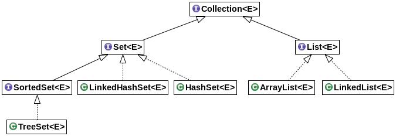
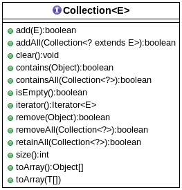
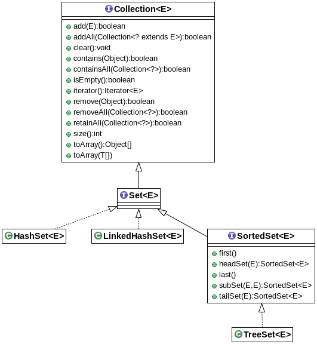
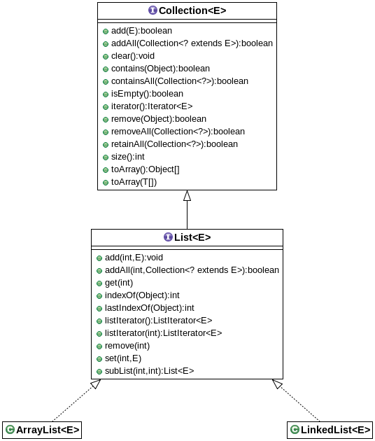
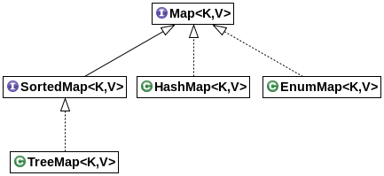
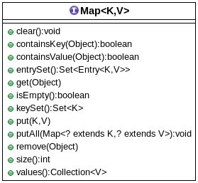

# Estructuras dinámicas en java

En este apartado trataremos las **estructuras dinámicas en java**. Para ello primero abordaremos la genericidad en java, ya que es el instrumento utilizado para la utilización de las estructuras de datos dinámicas. Seguidamente, he pretendido presentaros las estructuras de datos más utilizadas en java.

Al igual que en otros apartados, el objetivo principal es que tengáis una amplía gama de ejercicios, con sus respectivas posibles soluciones, sobre **estructuras dinámicas en java**.

**José Ramón Jiménez Reyes**

 >  @JRJimenezReyes

 >  joseramon.jimenez@iesalandalus.org

### Contenidos
---
- [Introducción](#introduccin)
- [Genéricos](#genricos)
- [Colecciones](#colecciones)
- [Conjuntos](#conjuntos)
- [Listas](#listas)
- [Mapas](#mapas)
- [Ejercicios](#ejercicios)

## Introducción

En apartados anteriores hemos tratado estructuras de datos tales como `String` o `Array`.

La primera de ellas era una estructura que permitía almacenar una secuencia de caracteres. Pero una de sus características era que son objetos inmutables. Es decir, que una vez creada no podía cambiar. Además, cada operación que conllevaba la modificación de la misma lo que realmente hacía era crear una nueva instancia para albergar el resultado de dicha modificación.

La segunda de ellas era una estructura que permitía almacenar una cantidad prefijada de elementos del mismo tipo. Si alcanzábamos la cantidad prefijada de elementos, esta estructura no permitía almacenar más elementos.

Como sabéis, estas estructuras son muy útiles y muy utilizadas, pero adolecen de un gran inconveniente: los tamaños establecidos en su creación no pueden ser modificados (entre otros inconvenientes). Debido a esto, a estas estructuras de datos se les suele denominar **estructuras de datos estáticas**.

En este apartado nos vamos a dedicar a introducir las **estructuras dinámicas de datos** que, a diferencia de las anteriores, si pueden modificar su tamaño en tiempo de ejecución, es decir, pueden crecer o decrecer según nuestras necesidades. Es por ello, que dominarlas es esencial debido a su amplio uso, dadas sus ventajas.

Por ello, empezaremos viendo cómo declarar y utilizar clases genéricas, ya que son la base de las estructuras dinámicas de datos. Luego pasaremos a ver las colecciones y sus principales tipos. Finalmente veremos los mapas. Y como siempre os mostraré ejemplos de uso de todo ello.

## Genéricos

En java, a partir de la versión 5, existen los denominados genéricos. Los genéricos son el mecanismo que nos brinda java para usar tipos abstractos para definir clases, interfaces y métodos y que luego instanciaremos con un tipo concreto. Como puedes imaginar, esto también es posible haciendo uso de la clase `Object`, pero con el uso de genéricos tenemos muchas ventajas, tales como:

- La comprobación de tipos se hace en tiempo de compilación y no tendremos indeseadas `ClassCastException` que muchas veces son difíciles de depurar.
- Eliminamos el abuso de los castings que hacen que nuestro código no sea lo suficientemente legible.
- Nos permiten la reutilización de código con tipado seguro, por ejemplo para implementar clases contenedoras como las colecciones o implementar algoritmos genéricos.

Una **clase genérica** es una clase que en su definición contiene un parámetro de tipo o una lista de parámetros de tipos, que serán establecidos cuando esta sea instanciada. Generalmente, estos parámetros son nombrados como `E` (elemento de una colección), `T` (un tipo), `K` (una clave), `V` (un valor), etc. aunque nosotros podemos ponerle el nombre que creamos conveniente. Los parámetros son encerrados entre los signos `<` y `>` y si hay más de uno se separan por comas.

Cuando declaramos una clase genérica debemos indicar el parámetro de tipo. A la hora de instanciar una clase genérica también debemos indicar el parámetro de tipo, aunque a partir de java 7 podemos utilizar el operador diamante `<>` y el tipo se inferirá de la declaración.

Veamos un ejemplo muy sencillo, para ver cómo se implementa una clase genérica y cómo se trabaja con ella. Para ello vamos a declarar una clase que sea capaz de contener cualquier tipo de contenido y para ello utilizaremos una clase genérica. Veamos su implementación y luego veremos su utilización.

~~~java
public class Contenedor<T> {

	T contenido;

	public Contenedor(T contenido) {
		this.contenido = contenido;
	}

	public T get() {
		return contenido;
	}
}
~~~

Como podéis observar, al lado del nombre de la clase hemos declarado el parámetro para el tipo (encerrado entre `<` y `>`). Ese parámetro lo utilizamos dentro de la clase como un tipo y podemos declarar un atributo de ese tipo, pasarlo como parámetro a un método o devolverlo.

Veamos ahora cómo utilizarla. Para ello la utilizaremos con un `Integer` y con un `String`.

~~~java
public class PruebaContenedor {

	public static void main(String[] args) {
		Contenedor<Integer> contenedorEntero = new Contenedor<>(1);
		System.out.println("Contenido del contenedor entero: " + contenedorEntero.get());

		Contenedor<String> contenedorCadena = new Contenedor<>("Hola!");
		System.out.println("Contenido del contenedor cadena: " + contenedorCadena.get());
	}
}
~~~

Como se puede ver hemos declarado dos variables de nuestra clase. Una que contendrá `Integer` y otra que contendrá `String`. Para ello, a la hora de la declaración hemos utilizado el nombre de la clase seguida por el tipo que queremos darle al parámetro de tipo, encerrado entre `<` y `>`. Luego hemos llamado al operador `new` para crearla y seguido al nombre de la clase hemos utilizado el operador diamante `<>` que indica que es una clase genérica y que infiere el tipo del parámetro de tipo de la declaración de la misma en la que sí indicábamos el parámetro de tipo. Como veis, es un ejemplo que puede tener poca utilidad, pero que sí nos sirve para ver cómo declarar y utilizar los genéricos.

Al igual que hemos hecho con las clases, también podemos declarar **interfaces genéricas**.

También es posible **restringir los parámetros de tipo** indicando de quién deben extender, aunque no entraremos en detalle por no complicar más las cosas.

Los genéricos tienen algunas restricciones, como pueden ser:

- No podemos instanciar tipos genéricos con tipos primitivos. Para ello debemos utilizar las clases envoltorio como `Integer`, `Float`, `Double`, etc. El compilador transforma automáticamente los tipos primitivos en sus clases envoltorio y viceversa, es el mecanismo conocido como **autoboxing**.
- Sobre un parámetro de tipo solo podemos aplicar métodos públicos de la clase `Object` (el método `clone` no es público en la clase `Object`).
- No se pueden crear instancias de los parámetros de tipo.
- No se pueden crear arrays de los parámetros de tipo.
- Tampoco se pueden declarar campos `static` de dichos tipos.

También podemos crear métodos genéricos, incluso en clases que no son genéricas. Para ello, antes del tipo que devuelve el método, debemos indicar el parámetro de tipo que se utilizará en el método (deberá estar encerrado entre `<` y `>`). Cualquier método con un parámetro de tipo se denomina **método genérico**. Veamos un ejemplo:

~~~java
public class MetodoGenerico {

	public static <T> String separarPorComas(List<T> elementos) {
		StringBuilder elementosSeparadosPorComas = new StringBuilder();
		for (T elemento : elementos) {
			elementosSeparadosPorComas.append(elemento).append(',');
		}
		if (!elementosSeparadosPorComas.isEmpty()) {
			elementosSeparadosPorComas.deleteCharAt(elementosSeparadosPorComas.length() - 1);
		}
		return elementosSeparadosPorComas.toString();
	}

	public static void main(String[] args) {
		List<Integer> numeros = new ArrayList<>();
		numeros.add(1);
		numeros.add(2);
		numeros.add(3);
		System.out.println(separarPorComas(numeros));

		List<String> cadenas = new ArrayList<>();
		cadenas.add("Hola");
		cadenas.add("que");
		cadenas.add("tal");
		System.out.println(separarPorComas(cadenas));
	}
}
~~~

Pues ya conoces algo más sobre los genéricos que, aunque simplemente ha sido una pequeña introducción, te servirá para comprender perfectamente el funcionamiento y uso de las estructuras dinámicas de datos en java que será lo que veremos a continuación.

## Colecciones

Una colección es un almacén de objetos de la misma clase y que utilizamos en nuestros programas para poder gestionarlos correctamente. Es muy común **añadir** nuevos objetos al almacén, **buscar** si existe un objeto en el almacén, **listar** todos los objetos del almacén, **borrar** un objeto del mismo, etc. Pues a este almacén le llamamos **colección** y a los objetos que se almacenan en él, ya que son objetos genéricos, les llamamos **elementos**.

Es común hablar de los elementos que se almacenan en la colección como **objetos de dominio** u objetos **DTO** (Direct Transfer Object) debido al nombre de su patrón de diseño en el que se basa. También es común llamar a las colecciones de dichos objetos como **objetos de negocio** u objetos **DAO** (Direct Access Object) también debido al nombre de su patrón de diseño.

Java nos ofrece una API completa para trabajar con estas estructuras. Todo está perfectamente jerarquizado y se estructura en interfaces que definen las operaciones básicas y luego diferentes implementaciones que pueden ser más aconsejables para ciertas situaciones pero desaconsejables para otras.

La interfaz `Collection` es la que define las operaciones básicas de toda la jerarquía y que resumidamente podemos representar en este diagrama de clases. Ni que decir tiene que simplemente he mostrado las más usuales, pero hay muchas más y que esta jerarquía es una versión resumida de la verdadera jerarquía del API de java.

  

Veamos qué es lo que la interfaz `Collection` define y que obliga a que todas sus descendientes en la jerarquía deban implementar.

  

Pasemos a ver cuál debe ser el comportamiento de los principales métodos declarados en esta interfaz que, recordemos, aún no han sido implementados por ninguna clase.

|Método|Descripción|
|------------------|
|`add`|Añade un elemento a la colección. Devuelve un valor lógico indicando si se ha podido añadir o no.|
|`clear`|Elimina todos los elementos de la colección.|
|`contains`|Informa si el elemento pasado por parámetro está incluido en la colección o no.|
|`isEmpty`|Informa si la colección está vacía o no.|
|`remove`|Intenta eliminar el elemento pasado por parámetro. Devuelve un valor lógico indicando si se ha podido eliminar o no.|
|`size`|Devuelve el número de elementos almacenados en la colección.|

Como hemos comentado, la interfaz define el comportamiento genérico, pero dependerá de la implementación el comportamiento específico.

## Conjuntos

Un conjunto es una colección de elementos en la que **no hay elementos repetidos**. Los conjuntos están implementados por la interfaz `Set` y `SortedSet`, que podemos ver en el siguiente diagrama de clases.

  

Como se puede apreciar, la interfaz `Set` no añade ninguna nueva funcionalidad a las colecciones. Sin embargo, la interfaz `SortedSet` sí añade unas cuantas funcionalidades mínimas a las colecciones.

Dado que la interfaz `Set` no añade nueva funcionalidad, tenemos el inconveniente que de un conjunto no podemos recuperar un elemento de una forma trivial. Para ello deberíamos utilizar un iterador y recorrerlo hasta encontrarlo. Además, cabe destacar que cuando recorremos un conjunto, el orden no tiene nada que ver con el orden de inserción.

Las dos implementaciones directas de `Set` son `HashSet` y `LinkedHashSet`. Ambas implementan una tabla hash o de dispersión, aunque la segunda también utiliza nodos enlazados. El caso es que para determinar si un elemento pertenece al conjunto o no se basan tanto en el método `equals` como en el método `hashCode`, dependiendo de la situación. Recordad que ya dijimos que ambos métodos debían ser consistentes y que si dos objetos eran iguales su código hash debía ser el mismo.

Dado que un conjunto no puede almacenar elementos repetidos, el método `add` devuelve el resultado real de la operación dado que si existe el elemento a añadir devolverá `false` ya que no ha podido añadirlo y devolverá `true` si el elemento no existía.

La clase `TreeSet` implementa la interfaz `SortedSet` que es una colección de **elementos no repetidos y ordenados**. Esta implementación se basa en árboles binarios de búsqueda. Requiere que la clase que contienen tenga definida una ordenación, bien sea porque la clase implementa la interfaz `Comparable` o porque le pasamos una instancia de la clase `Comparator` en el constructor. Hablaremos de esto más adelante.

## Listas

Las listas son **secuencias de elementos** a las que podemos **acceder por su posición**. La posición va desde 0 hasta la longitud - 1. Siempre se añade al final y como sí acepta elementos repetidos, el método `add` siempre devuelve `true` ya que siempre puede añadir el elemento.

La interfaz `List` añade nuevas funcionalidades a la interfaz `Collection` para poder permitir operar con los índices. Esto lo podemos ver claramente en el siguiente diagrama de clases.

  

Las principales operaciones que añade la interfaz `List` son las siguientes:

|Método|Descripción|
|------------------|
|`add(int i, E e)`|Añade el elemento `e` en la posición `i` y desplaza los demás elementos a la derecha.|
|`E get(int i)`|Devuelve el elemento que ocupa la posición `i`.|
|`int indexOf(E e)`|Devuelve el índice que ocupa el elemento `e` o `-1` en caso de que no exista.|
|`E remove(int i)`|Elimina el elemento que ocupa la posición `i`.|
|`E set(int i, E e)`|Modifica el elemento que ocupa la posición `i`, poniéndolo a `e`.|

La interfaz `List` es implementada por dos clases:
- `ArrayList` es una implementación basada en arrays redimensionables, es decir, si necesita crecer, crea un array de mayor capacidad y copia los elementos. Como puedes imaginar, esta operación es bastante costosa, por lo que debemos tenerlo en cuenta. Pero esta implementación también adolece de otros problemas:
  - Cuando insertamos un elemento en medio, debe desplazar todos los elementos a partir de esa posición hacia la derecha.
  - Cuando eliminamos un elemento de en medio, debe desplazar todos los elementos desde dicha posición una posición a la izquierda.
- `LinkedList` es una implementación basada en nodos doblemente enlazados. Esta implementación es muy eficiente con las operaciones realizadas en los extremos, pero no pasa lo mismo con las posiciones intermedias.

### Recorridos

La forma adecuada de declarar una lista o un conjunto es utilizando la interfaz (`List` o `Set`) en la declaración y así podremos cambiar su implementación en cualquier momento sin modificar nuestro código. Esto es válido a la hora de declarar parámetros de un método o el valor que devuelve. En la declaración debemos indicar la clase que va a albergar entre `<` y `>`. Para su creación utilizaremos el operador `new` seguido por el constructor de la clase que queremos utilizar (su implementación) seguida del operador diamante `<>`.

~~~java
...
Set<Integer> primos = new HashSet<>();
...
List<String> nombres = new ArrayList<>();
...
~~~

Para su recorrido podremos utilizar el bucle `foreach` que ya conocemos:

~~~java
...
for (Integer primo : primos) {
	System.out.println(primo);
}
...
for (String nombre : nombres) {
	System.out.println(nombre);
}
...
~~~

Pero también podemos utilizar un iterador. Un iterador es un objeto genérico que nos permite recorrer los elementos de una colección de una forma uniforme para todas ellas. Un iterador posee tres métodos:
- `boolean hasNext()` indica si quedan más elementos en el iterador o no.
- `T next()` devuelve el siguiente elemento del iterador.
- `void remove()` elimina el último elemento devuelto por el iterador, **tanto del iterador como de la colección**.

Por tanto, podemos utilizar un iterador para recorrer una colección. En este primer ejemplo utilizaremos un bucle `for`:

~~~java
...
for (Iterator<Integer> iterador = primos.iterator(); iterador.hasNext();) {
	int primo = iterador.next();
	System.out.println(primo);
}
...
for (Iterator<String> iterador = nombres.iterator(); iterador.hasNext();) {
	String nombre = iterador.next();
	System.out.println(nombre);
}
...
~~~

O también podíamos haber utilizado un bucle `while` si nos parece más apropiado:

~~~java
...
Iterator<Integer> iterador = primos.iterator();
while (iterador.hasNext()) {
	int primo = iterador.next();
	System.out.println(primo);
}
...
Iterator<String> iterador = nombres.iterator();
while (iterador.hasNext()) {
	String nombre = iterador.next();
	System.out.println(nombre);
}
...
~~~

### Ordenaciones

Para ordenar una lista (o que un `SortedSet` se ordene como nosotros queremos) tenemos varias posibilidades.

###### Primera posibilidad

Lo más fácil sería que los elementos pertenezcan a una clase que tiene definido un orden, es decir, que implementa la interfaz `Comparable<T>`. Esta interfaz es una interfaz genérica y que obliga a definir el método `int compareTo(<T> otro)` que devuelve:

- Un número **negativo** si el elemento pasado por parámetro es **menor** que el actual.
- **0** si ambos elementos son **iguales**.
- Un número **positivo** si el elemento pasado por parámetro es **mayor** que el actual.

Si la clase de los elementos implementa esta interfaz, podremos utilizar la clase de utilidades `Collections`, por medio de su método `sort` que, en una primera implementación, recibe una lista cuyos elementos implementan la interfaz `Comparable` y que ordena dicha lista.

Si una clase implementa la interfaz `Comparable` este será el orden que utilizará un `TreeSet` para mantener sus elementos ordenados.

###### Segunda posibilidad

Podemos utilizar una clase que implemente la interfaz `Comparator<T>` que obliga a definir el método `int compare(T elemento1, T elemento2)` que devuelve:

- Un número **negativo** si `elemento1` es **menor** que `elemento2`.
- **0** si ambos elementos son **iguales**.
- Un número **positivo** si `elemento1` es **mayor** que `elemento2`.

Podemos crear una clase para tal efecto o simplemente crear una clase anónima, que sería algo más aconsejable. Por ejemplo, queremos ordenar una lista de cadenas primero por su longitud y después por su orden alfabético.

~~~java
...
Collections.sort(palabras, new Comparator<String>() {

	@Override
	public int compare(String elemento1, String elemento2) {
		return (elemento1.length() == elemento2.length()) ?
			elemento1.compareTo(elemento2) :
			Integer.compare(elemento1.length(), elemento2.length());
	}

});
...
~~~

Aunque la forma idónea de hacerlo sería utilizando las funciones lambda, dado que `Comparator` es una interfaz funcional, de la siguiente forma:

~~~java
Collections.sort(palabras, (elemento1, elemento2) -> (elemento1.length() == elemento2.length()) ?
	elemento1.compareTo(elemento2) :
	Integer.compare(elemento1.length(), elemento2.length())			
);
~~~

En el constructor de un `TreeSet` también es posible utilizar una clase que implemente la interfaz `Comparator`.

Pero la interfaz `Comparator` también define algunos métodos estáticos que nos pueden ayudar a crear nuestras propias ordenaciones de una forma sencilla e incluso encadenar comparaciones.

~~~java
...
Collections.sort(palabras, Comparator.comparing(String::length).thenComparing(String::compareTo));
...
~~~

Los tres ejemplos anteriores realizan la misma ordenación de nuestra lista, pero podemos apreciar la simplicidad y elegancia de esta última forma.

También podíamos haber utilizado el método `sort` de la interfaz `List` que acepta como parámetro un `Comparator`.

~~~java
...
palabras.sort(Comparator.comparing(String::length).thenComparing(String::compareTo));
...
~~~

## Mapas

Los mapas son estructuras de datos dinámicas en las que se puede acceder a los valores de los elementos mediante una clave, en vez de por su índice como hacíamos con las listas. Es importante aclarar que todas las claves deben ser diferentes, es decir, que no puede existir dos claves repetidas. Son también conocidos como diccionarios o arrays asociativos. A la hora de declararlos debemos utilizar un par de clases, indicando la clase que hará de clave y la que hará de valor `<K, V>`. Veamos su jerarquía:

  

Vista la jerarquía, veamos la funcionalidad que fuerza la interfaz `Map`.

  

El comportamiento de los principales métodos debería ser el siguiente:

|Método|Descripción|
|------------------|
|`void clear()`|Elimina todas las entradas del mapa.|
|`boolean containsKey(Object key)`|Indica si el mapa contiene una entrada con la clave especificada.|
|`boolean containsValue(Object value)`|Indica si el mapa contiene una entrada con dicho valor (o varias).|
|`Set<Entry<K, V>> entrySet()`|Devuelve un conjunto de entradas, es decir, de pares clave-valor.|
|`V get(Object key)`|Devuelve el valor de la entrada cuya clave es la especificada o `null` si no existe una entrada con dicha clave.|
|`V getOrDefault(Object key, V defaultValue)`|Devuelve el valor de la entrada cuya clase se especifica o `defaultValue` si no existe una entra con dicha clave.|
|`boolean isEmpty()`|Indica si el mapa está vacío o no.|
|`Set<K> keySet()`|Devuelve el conjunto de claves del mapa.|
|`V put(K key, V value)`|Establece el valor de la entrada asociada a la clave especificada.|
|`V remove(Object key)`|Elimina la entrada asociada a la clave indicada.|
|`int size()`|Devuelve el número de entradas que contiene el mapa.|
|`Collection<V> values()`|Devuelve una colección cuyo contenido son todos los valores asociados a las entradas del mapa.|

Las implementaciones de la interfaz `Map` son las siguientes (incluyo la implementación de `SortedMap`):

- `HashMap` Implementación de un mapa utilizando una tabla hash.
- `EnumMap` Implementación de un mapa utilizando arrays en la que las claves deben ser enumerados. En el constructor debemos indicar la clase del enumerado que utilizaremos de clave.
- `TreeMap` Implementación basada en árboles binarios de búsqueda balanceados y que implementa la interfaz `SortedMap`.

Para recorrer un mapa debes hacerlo utilizando alguna de las vistas que nos ofrece:
- El conjunto de claves `keySet()`.
- La colección de valores `values()`.
- El conjunto de entradas `entrySet()`.

Si utilizamos un `Iterator` con cualquiera de estas vistas, podremos eliminar elementos del mapa cuando lo recorremos.

Imagina que queremos simular la tirada de un dado y contar cuántas veces sale cada una de ellas y que nos muestre sus ocurrencias de forma ordenada. Para ello podemos utilizar un mapa ordenado cuyas entradas serán un par de enteros: la clave representará la cara y el valor representara el número de veces que ha salido dicha cara.

~~~java
private static final int CANTIDAD = 100;
private static final int CARAS = 6;

...
	Random generador = new Random();
	List<Integer> numeros = new ArrayList<>();
	for (int i = 0; i < CANTIDAD; i++) {
		numeros.add(generador.nextInt(CARAS) + 1);
	}
	Map<Integer, Integer> ocurrencias = new TreeMap<>();
	for (Integer numero : numeros) {
		ocurrencias.put(numero, ocurrencias.getOrDefault(numero, 0)  + 1)
	}
	System.out.println(ocurrencias);
...
~~~

## Ejercicios

- **Cola de nodos enlazados**

  Implementar una cola genérica que utilice nodos enlazados, que implemente los métodos `encolar` y `desencolar` y que no acepte valores nulos.

  - Posible solución

    **Nodo.java**
    ~~~java
    public class Nodo<E> {

    	private E elemento;
    	private Nodo<E> siguiente;

    	public Nodo(E elemento) {
    		this.elemento = elemento;
    	}

    	public E getElemento() {
    		return elemento;
    	}

    	public Nodo<E> getSiguiente() {
    		return siguiente;
    	}

    	public void setSiguiente(Nodo<E> siguiente) {
    		this.siguiente = siguiente;
    	}

    }
    ~~~

    **Cola.java**
    ~~~java
    public class Cola<E> {

    	private Nodo<E> principio;
    	private Nodo<E> fin;

    	public boolean estaVacia() {
    		return (principio == null);
    	}

    	public void encolar(E elemento) {
    		Objects.requireNonNull(elemento, "ERROR: No acepto elementos nulos.");
    		if (principio == null) {
    			principio = new Nodo<>(elemento);
    			fin = principio;
    		} else {
    			fin.setSiguiente(new Nodo<>(elemento));
    			fin = fin.getSiguiente();
    		}
    	}

    	public E desencolar() {
    		E elemento = null;
    		if (principio != null) {
    			elemento = principio.getElemento();
    			principio = principio.getSiguiente();
    		}
    		return elemento;
    	}

    }
    ~~~

    **PruebaCola.java**
    ~~~java
    public class PruebaCola {
    	public static void main(String[] args) {
    		Cola<Integer> colaEnteros = new Cola<>();
    		System.out.println(colaEnteros.desencolar());
    		colaEnteros.encolar(1);
    		System.out.println(colaEnteros.desencolar());
    		colaEnteros.encolar(1);
    		colaEnteros.encolar(2);
    		System.out.println(colaEnteros.desencolar());
    		System.out.println(colaEnteros.desencolar());
    		colaEnteros.encolar(1);
    		colaEnteros.encolar(2);
    		colaEnteros.encolar(3);
    		System.out.println(colaEnteros.desencolar());
    		System.out.println(colaEnteros.desencolar());
    		System.out.println(colaEnteros.desencolar());

    		System.out.println("---------------------");

    		Cola<Character> colaCaracteres = new Cola<>();
    		System.out.println(colaCaracteres.desencolar());
    		colaCaracteres.encolar('a');
    		System.out.println(colaCaracteres.desencolar());
    		colaCaracteres.encolar('a');
    		colaCaracteres.encolar('b');
    		System.out.println(colaCaracteres.desencolar());
    		System.out.println(colaCaracteres.desencolar());
    		colaCaracteres.encolar('a');
    		colaCaracteres.encolar('b');
    		colaCaracteres.encolar('c');
    		System.out.println(colaCaracteres.desencolar());
    		System.out.println(colaCaracteres.desencolar());
    		System.out.println(colaCaracteres.desencolar());
    	}
    }
    ~~~

- **Lista sin elementos repetidos**

  Implementar una lista genérica que no acepte elementos repetidos, que inserte por el final y que permita borrar un elemento.

  - Posible solución

    **ListaSinRepetidos.java**
    ~~~java
    import java.util.ArrayList;
    import java.util.List;

    import javax.naming.OperationNotSupportedException;

    public class ListaSinRepetidos<E> {

    	private List<E> elementos;

    	public ListaSinRepetidos() {
				elementos = new ArrayList<>();
    	}

    	public List<E> get() {
				return elementos;
    	}

    	public void insertar(E elemento) throws OperationNotSupportedException {
				Objects.requireNonNull(elemento, "ERROR: No se puede insertar un elemento nulo.");
				if (elementos.contains(elemento)) {
					throw new OperationNotSupportedException("ERROR: Ya existe un elemento igual (" + elemento + ").");
				}
				elementos.add(elemento);
    	}

    	public void borrar(E elemento) throws OperationNotSupportedException {
				Objects.requireNonNull(elemento, "ERROR: No se puede borrar un elemento nulo.");
				if (!elementos.contains(elemento)) {
					throw new OperationNotSupportedException("ERROR: No existe ningún elemento igual (" + elemento + ").");
				}
				elementos.remove(elemento);
    	}

    }
    ~~~

    **PruebaListaSinRepetidos.java**
    ~~~java
    import javax.naming.OperationNotSupportedException;

    public class PruebaListaSinRepetidos {

    	public static void main(String[] args) {
    		ListaSinRepetidos<Integer> listaEnteros = new ListaSinRepetidos<>();
    		for (int i = 0; i < 20; i++) {
    			try {
    				listaEnteros.insertar(i/2);
    			} catch (OperationNotSupportedException e) {
    				System.out.println(e.getMessage());
    			}
    		}
    		for (Integer elemento : listaEnteros.get()) {
    			System.out.println(elemento);
    		}

    		ListaSinRepetidos<String> listaCadenas = new ListaSinRepetidos<>();
    		for (int i = 0; i < 20; i++) {
    			try {
    				listaCadenas.insertar("Cadena " + i/2);
    			} catch (OperationNotSupportedException e) {
    				System.out.println(e.getMessage());
    			}
    		}
    		for (String elemento : listaCadenas.get()) {
    			System.out.println(elemento);
    		}
    	}

    }
    ~~~

- **Diccionario**

	Implementar un diccionario que almacene las iniciales ordenadas de las diferentes entradas que contiene, que también estarán ordenadas.

	- Posible solución

		~~~java
		import java.util.ArrayList;
		import java.util.List;
		import java.util.Map;
		import java.util.Set;
		import java.util.TreeMap;
		import java.util.TreeSet;

		public class Diccionario {

			public static void main(String[] args) {
				List<String> palabras = new ArrayList<>();
				palabras.add("Lista");
				palabras.add("Mapa");
				palabras.add("Conjunto");
				palabras.add("lista");
				palabras.add("colección");
				Map<Character, Set<String>> diccionario = new TreeMap<>();
				for (String palabra : palabras) {
					palabra = palabra.toUpperCase();
					char inicial = palabra.charAt(0);
					Set<String> entradas;
					if (diccionario.containsKey(inicial)) {
						entradas = diccionario.get(inicial);
					} else {
						entradas = new TreeSet<>();
					}
					entradas.add(palabra);
					diccionario.put(inicial, entradas);
				}
				System.out.println(diccionario);
			}

		}
		~~~
