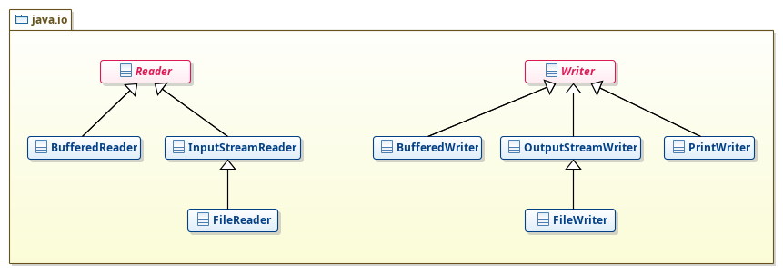
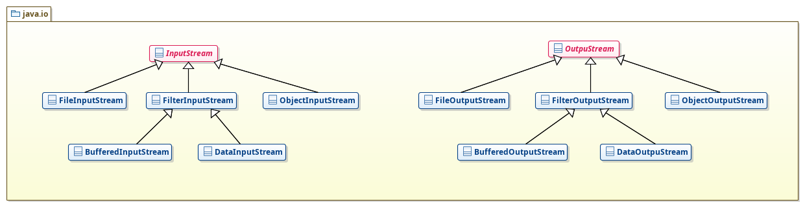

# Ficheros en java

En este apartado veremos cómo trabajar con **ficheros en java**. Para ello primero haremos una introducción, para posteriormente ver cómo trabajar con los tipos de ficheros más comunes.

Al igual que en otros apartados, el objetivo principal es que tengáis una amplía gama de ejercicios, con sus respectivas posibles soluciones, sobre **ficheros en java**.

**José Ramón Jiménez Reyes**

 >  @JRJimenezReyes

 >  joseramon.jimenez@iesalandalus.org

### Contenidos
---
- [Introducción](#introduccin)
- [El sistema de archivos](#el-sistema-de-archivos)
- [Ficheros de texto](#ficheros-de-texto)
- [Ficheros binarios](#ficheros-binarios)
- [Ejercicios](#ejercicios)

## Introducción

En java ya sabemos cómo interactuar con el usuario, leyendo datos de la consola o mostrandolos. Es la forma en la que nuestro programa se comunica con el exterior. Este tipo de comunicación es a lo que se llama **operaciones de E/S (Entrada/Salida) estándar**.

Todo lo que hacíamos lo almacenábamos en estructuras de datos alojadas en memoria, que al terminar nuestro programa se perdían. Sería deseable que hubiese persistencia para los datos y así que no se perdiesen al finalizar. Y es aquí donde entran en juego otro tipo de operaciones de E/S como son las **operaciones de E/S a través de ficheros**.

Pero, ¿qué es un fichero o archivo? De forma escueta, podríamos decir que son una serie de datos almacenados en algún dispositivo de almacenamiento. Como ya sabemos se identifican por su **nombre** (en el que a veces queremos distinguir su **extensión**) y están almacenados en una **ruta**. La ruta indica el camino a seguir, dentro de la estrctura de carpetas, hasta llegar al archivo. Existen dos tipos de rutas:
- **Ruta absoluta**: Indica el camino completo desde la raíz del sistema de archivos. Para separar los directorios se utiliza la barra (`/`en Linux y Mac y `\` en windows), además en windows comienzan con la letra de la unidad. Por ejemplo: `/home/profesor/programacion/leeme.txt` en Linux, o `E:\datos\programacion\leeme.txt` en Windows.
- **Ruta relativa**: Indica el camino relativo a partir de una carpeta dada y comienzan por un nombre de carpeta, por ejemplo: `programacion/leeme.txt`. Cuando utilizamos rutas relativas debemos tener en cuenta que al ejecutarlo desde el IDE la ruta relativa comienza a partir de la raíz del proyecto. Cuando lo ejecutamos desde la línea de comandos, por ejemplo, la ruta relativa comienza a partir del directorio en el que nos encontramos.

Todos los ficheros almacenan una cantidad de bytes determinada por su tamaño, pero dependiendo de la **interpretación** que hagamos de ese conjunto de bytes, podemos distinguir:
- **Ficheros binarios**: No se hace ningún tipo de interpretación de los bytes almacenados en los mismos. Se suele decir que la información se almacena en crudo. Ejemplos de estos tipos son los ficheros ejecutables, los ficheros de imágenes, los ficheros de música, etc.
- **Ficheros de texto**: Cada dos bytes representa un caracter unicode y, por lo tanto, son entendibles por nosotros y fácilmente modificables. Ejemplos de estos tipos son los archivos fuente, los archivos de configuración, etc.

Si nos atenemos a cómo accedemos a los ficheros podemos distinguir dos modos de acceso:
- **Acceso secuencial**: Para acceder a un determinado byte debemos pasar por todos los bytes anteriores. Un simil podría ser las antiguas cintas de casette, en las que para escuchar una canción debíamos pasar por todas las anteriores.
- **Acceso aleatorio**: Podemos acceder a cualquier byte que deseemos. Un simil podría ser los CD de música, en los que podemos escuchar la canción que deseemos.

En java todas las operaciones de E/S se encuentran en el paquete `java.io` y es lo que veremos en los siguientes apartados. Antes de continuar, sería conveniente mencionar que en java existen un par de abstracciones relacionadas con los ficheros:
- **Flujo de datos** también conocido como `Stream`, es una abstracción que se asocia al fichero físico, aunque podría ser cualquier otro como la memoría, la red, el teclado, etc., y que es tratada por la máquina virtual. Toda operación de E/S se hará a través de un flujo de datos, por lo que nosotros trabajaremos de la misma forma sea cual sea el dispositivo al que esté asociado el flujo.
- **Buffer de datos** es una abstracción que se asocia a un flujo y actúa de intermediario entre nuestro programa y el flujo, haciendo más eficientes las lecturas y escrituras. Se comporta como una memoria intermedia que almacena una cantidad de bytes definida, de forma que las lecturas se realizan desde esta memoria intermedia y cuando se lee por completo se carga otro bloque en la misma. Para las escrituras actúa de forma similiar, escribimos en la memoria intermedia y cuando se llena, se vuelca al flujo y se vacía.

Cuando trabajamos con ficheros, debemos crear la asociación, bien sea mediante un flujo o mediante un buffer. A esto es a lo que se conoce como **abrir el fichero**. Leeremos o escribiremos los datos y finalmente eliminaremos la asociación para liberar el recurso. A esto es a lo que se llama **cerrar el fichero**. Es importante cerrar los ficheros. 

También debemos tener en cuenta que es posible que se produzcan situaciones anómalas: el fichero no existe y no se puede abrir, no tenemos permisos para abrir el archivo, el sistema de archivos está lleno y no se puede escribir, etc. Las excepciones más comunes que pueden saltar al trabajar con ficheros son:
- `FileNotFoundException`: Cuando no se puede abrir el fichero.
- `EOFException`: Cuando se llega al final del archivo. Esta excepción salta al leer ficheros de objetos.
- `IOException`: Excepción general que indica que ha sucedido algo no esperado al trabajar con ficheros; no existe, no se tienen permisos, sistema de archivos lleno, etc. Es la clase padre de las anteriores y de cualquier excepción que puede saltar al trabajar con ficheros.

Teniendo en mente que es posible que salte alguna excepción y que es muy importante cerrar los ficheros, debemos capturar las excepciones para evitar estas situaciones inesperadas y posibilitar cerrar los ficheros. Para facilitar esta tarea, a partir de java 7, existe la construcción `try-with-resources`. Esta construcción es como un `try-catch` normal en la que se indica el o los recursos que se van a abrir y es la máquina virtual la que se encarga de cerrar el o los recursos, bien al capturar alguna excepción o bien al finalizar. Veamos un ejemplo para clarificar:

~~~java
    try (FileInputStream entrada = new FileInputStream(ficheroEntrada)){
        //Procesar fichero
    } catch (FileNotFoundException e) {
        System.out.println("No se puede leer el fichero de entrada");
    } catch (IOException e) {
        System.out.println("Error inesperado de Entrada/Salida");
    }
~~~

Como se puede apreciar, en el try se abre el fichero, pero nunca se cierra, ya que es la máquina virtual la encargada por el hecho de utilizar esta construcción.

Ahora que ya conocemos todos estos, es la hora de que pasemos a ver las posibilidades que nos ofrece el paquete `java.io` para trabajar con ficheros. Ante cualquier duda siempre puedes consultar la [documentación de la API de `java.io`](https://docs.oracle.com/javase/8/docs/api/java/io/package-summary.html)

## El sistema de archivos

Para trabajar con el sistema de ficheros nos vamos a centrar en las siguientes clases o interfaces:
- `File`: Clase que nos ofrece una representación abstracta de un fichero y que nos permite realizar con él las operaciones más comunes: creación, borrado, consultar propiedades, etc.
- `FileFilter` y`FilenameFilter`: Interfaces que determinan el comportamiento que deben tener las clases que vayamos a utilizar para filtrar el listado de archivos de una carpeta.

### File

Esta clase pertenece al paquete `java.io` y hereda directamente de `Object`. Es una representación abstracta del fichero, pero no es el fichero en sí mismo. Es más, podría ser la representación abstracta de un fichero que ni siquiera existe, por ejemplo porque vamos a crearlo.

Con esta clase podemos hacer todas las operaciones a realizar con un fichero o carpeta. 

Para crear objetos de tipo `File` se nos ofrecen varios constructores, aunque los más comunes son los siguientes:

|Constructor|Descripción|
|-----------------------|
|`File(String nombre)`|Crea un objeto del tipo `File` en la localización asociada al nombre que se le pasa, que puede ser una ruta absoluta o relativa (es recomendable utilizar las rutas relativas en la medida de lo posible). Si el nombre termina en un separador nos estaremos refiriendo a una carpeta.|
|`File(String ruta, String nombre)`|Igual que el anterior, aunque ahora la ruta y el nombre se indican por separado.|
|`File(Uri uri)`|Crea un objeto del tipo `File` asociado a la URI indicada.| 

Para construir las rutas, debemos utilizar el separador del sistema, para que nuestra aplicación sea portable de un SO a otro. Para ello la clase `File` tiene la constante `separator` que nos devuelve dicho separador dependiente de la plataforma.

Veamos los métodos más comunes de su API:

|Método|Descripción|
|------------------|
|`boolean canExecute()`|Comprueba si el archivo es ejecutable.|
|`boolean canRead()`|Comprueba si tenemos permisos de lectura.|
|`boolean canWrite()`|Comprueba si tenemos permisos de escritura.|
|`boolean createNewFile()`|Crea un nuevo fichero vacío si es que no existe.|
|`boolean delete()`|Borra el fichero.|
|`boolean exist()`|Comprueba si existe el fichero.|
|`String getParent()`|Devuelve la cadena asociada al camino.|
|`String getName()`|Devuelve la cadena asociada al nombre.|
|`boolean isDirectory()`|Comprueba si es una carpeta.|
|`boolean isFile()`|Comprueba si es un fichero regular.|
|`boolean isHidden()`|Comprueba si es un fichero oculto.|
|`long length()`|Devuelve el tamaño del fichero.|
|`long lastModified()`|Devuelve la fecha, medida en milisegundos que han trasncurrido desde el 01/01/1970, de la última modificación.|
|`String[] list()`|Devuelve un array con los nombres de los ficheros y directorios contenidos en el mismo.|
|`String[] list(FilenameFilter filtro)`|Devuelve un array con los nombre de los ficheros y directorios aplicando el filtro.|
|`File[] lisFiles()`|Devuelve un array con los ficheros y directorios contenidos en el mismo.|
|`File[] listFiles(FileFilter filtro)`|Devuelve un array con los ficheros y directorios aplicando el filtro.|
|`File[] listFiles(FilenameFilter filtro)`|Devuelve un array con los ficheros y directorios aplicando el filtro.|
|`boolean mkdir()`|Crea la carpeta.|
|`boolean renameTo(File nombre)`|Renombra el fichero al indicado por el fichero que se le pasa.|
|`boolean setExecutable(boolean ejecutable)`|Establece el permiso de ejecucion al indicado.|
|`boolean setLastModified(long tiempo)`|Establece la fecha de la última modificación a la indicada.|
|`boolean setReadable(boolean leible)`|Establece el permiso de lectura al indicado.|
|`boolean setWritable(boolean escribible)`|Establece el permiso de escritura al indicado.|

En el apartado de [ejercicios](#ejercicios) tienes algunos ejemplos sobre el uso de la clase `File`.

### Filtros

Hemos visto que con el método `list` podemos listar todos los archivos de una carpeta dada. Pero a veces no queremos listar todos los archivos sino solo aquellos que cumplan con cierto criterio. Por ello dicho método está sobrecargado para establecer el criterio de filtrado. 

Para ello tenemos las siguientes interfaces que determinan el comportamiento de las clases capaces de realizar este tipo de filtrado:

- `FileFilter`: Para filtrar basándonos en el fichero (sus características). Obliga a implementar el método `boolean accept(File fichero)`.
- `FilenameFilter`: Para filtrar basándonos en el nombre del fichero. Obliga a implementar el método `boolena accept(File padre, String nombre)`.

Recordad que podemos utilizar una clase anónima para este cometido o, dado que ambas son interfaces funcionales, podemos utilizar funciones lambda.

Por ejemplo, podemos filtrar por extensión de la siguiente forma:
~~~java
    ...
    File[] contenido = carpeta.listFiles(new FileFilter() {
			
        @Override
        public boolean accept(File padre, String nombre) {
            return nombre.endsWith(".java");
        }

    });
    ...
~~~

También podemos utilizar una función lambda para realizar el mismo filtrado:
~~~java
    ...
    File[] contenido = carpeta.listFiles((padre, nombre) -> nombre.endsWith(".java"));
    ...
~~~

## Ficheros de texto

Para trabajar con ficheros de texto tenemos las siguientes clases, que podemos ver en este diagrama de clases muy simplificado. Estos son las principales, aunque hay más.

### Flujos de caracteres

Para trabajar con **flujos de caracteres** utilizaremos las clases, `FileReader` y `FileWriter` que crearán un flujo de entrada o salida sobre el fichero que pasemos en el constructor. Podemos pasarle un objeto de la clase `File` o una cadena con la ruta del fichero. Al crear el flujo puede lanzar la excepción `FileNotFoundException` si el fichero no existe, o existe y es un directorío, para el caso de las lecturas y si el fichero existe y no es un fichero, o no se puede escribir en la ruta indicada, para el caso de las escrituras. Para la clase `FileWriter` también podemos pasar en el constructor un parámetro lógico inicando si vamos a añadir o vamos a machacar (por defecto sobrescribe).

Las clases `InputStreamReader` y `OutputStreamWriter` son las encargadas de realizar las conversiones entre codificaciones y las anteriores heredan de ellas. 

~~~java
    ...
    private static final String FICHERO = String.format("%s%s%s", "ficheros", File.separator, "ficheroTexto.txt");
    ...
    try (FileReader entrada = new FileReader(FICHERO)){
        // Procesamiento
    } catch (FileNotFoundException e) {
        System.out.println("No se puede leer el fichero de entrada");
    } catch (IOException e) {
        System.out.println("Error inesperado de Entrada/Salida");
    }
    ...
~~~

Para **leer de un flujo de entrada de caracteres**, mediante objetos de la clase `FileReader`, utilizaremos los métodos:
- `int read()`: lee un solo caracter y devuelve el carácter leído o -1 si llegó al final.
- `int read(char[] caracteres, int desplazamiento, int cantidad)`: lee hasta la cantidad de caracteres indicados por `cantidad` y los almacena en el array `caracteres` comenzando desde la posición indicada por `desplazamiento`. Deveulve la cantidad de caracteres leídos o -1 si llegó al final.

Para **escribir en un flujo de salida de caracteres**, mediante objetos de la clase `FileWriter` utilizaremos los siguientes métodos:
- `void append(char caracter)`: Añade el caracter indicado al final del flujo.
- `void write(char caracter)`: Escribe el caracter indicado en el flujo.
- `void write(char[] caracteres, int desplazamiento, int cantidad)`: Escribe hasta la cantidad de caracteres indicados por `cantidad` comenzando en `desplazamiento` del array `caracteres`.
- `void write(String cadena)`: Escribe la cadena de caracteres en el flujo.

Para escribir en un flujo de caracteres, también podemos utilizar la clase `PrintWriter` que nos ofrece métodos como `print`, `println`, `printf`, etc. que de sobra conocemos.

En java también tenemos algunos flujos predefinidos como son:
- `System.in`: Objeto de la clase `InputStreamReader` que está asociado a la entrada estándard.
- `System.out`: Objeto de la clase `PrintStream` que está asociado a la salida estándard.
- `System.err`: Objeto de la clase `PrintStream` que está asociado al error estándard.

### Buferes de caracteres
También podemos utilizar buferes para realizar las operaciones de E/S. Los buferes se montan sobre flujos ya creados, bien sean de entrada o de salida. Son objetos de las clases `BufferedReader` y `BufferedWriter`.

~~~java
    ...
    private static final String FICHERO = String.format("%s%s%s", "ficheros", File.separator, "ficheroTexto.txt");
    ...
    try (BufferedReader entrada = new BufferedReader(new FileReader(FICHERO))){
        String linea;
        while ((linea = entrada.readLine()) != null) {
            //Procesamiento
        }
    } catch (FileNotFoundException e) {
        System.out.println("No se puede leer el fichero de entrada.");
    } catch (IOException e) {
        System.out.println("Error inesperado de Entrada/Salida.");
    }
    ....
~~~

Para la lectura podemos utilizar el método adicional `readline` que devuelve la línea leída o `null` si ha llegado al final.

Para la escritura podemos utilizar los métodos `write` y `newLine`.

Es conveniente utilizar buferes dada su eficiencia en comparación con los simples flujos. Te recomiendo que hagas una prueba: ejecuta midiendo el tiempo (por ejemplo utilizando el comando `time`) la copia de un fichero de texto utilizando flujos y utilizando buferes y fíjate en la diferencia que hay al hacerlo con ficheros grandes. Estos ejemplos los tienes en los ejercicios. Te mostraré los resultados cuando hablemos de ficheros binarios ya que es más fácil tener ficheros algo más grandes.

## Ficheros binarios

Para trabajar con ficheros binarios tenemos las siguientes clases, que podemos ver en este diagrama de clases muy simplificado. Estos son las principales, aunque hay más.

### Flujos binarios

Para trabajar con **flujos binarios** utilizaremos las clases, `FileInputStream` y `FileOutputStream` que crearán un flujo de entrada o salida sobre el fichero que pasemos en el constructor. Podemos pasarle un objeto de la clase `File` o una cadena con la ruta del fichero. Al crear el flujo puede lanzar la excepción `FileNotFoundException` si el fichero no existe, o existe y es un directorío, para el caso de las lecturas y si el fichero existe y no es un fichero, o no se puede escribir en la ruta indicada, para el caso de las escrituras. Para la clase `FileOutputStream` también podemos pasar en el constructor un parámetro lógico inicando si vamos a añadir o vamos a machacar (por defecto sobrescribe).

Para **leer de un flujo de entrada binario**, mediante objetos de la clase `FileInputStream`, utilizaremos los métodos:
- `int read()`: lee un solo byte y devuelve el byte leído o -1 si llegó al final.
- `int read(byte[] datos, int desplazamiento, int cantidad)`: lee hasta la cantidad de bytes indicados por `cantidad` y los almacena en el array `datos` comenzando desde la posición indicada por `desplazamiento`. Deveulve la cantidad de bytes leídos o -1 si llegó al final.

Para **escribir en un flujo de salida binario**, mediante objetos de la clase `FileOutputStream` utilizaremos los siguientes métodos:
- `void write(int dato)`: Escribe el byte indicado en el flujo.
- `void write(byte[] datos, int desplazamiento, int cantidad)`: Escribe hasta la cantidad de bytes indicados por `cantidad` comenzando en `desplazamiento` del array `datos`.

### Buferes binarios

También podemos utilizar buferes para realizar las operaciones de E/S. Los buferes se montan sobre flujos ya creados, bien sean de entrada o de salida. Son objetos de las clases `BufferedInputStream` y `BufferedOutputStream`.

~~~java
    ...
    public static final String FICHERO = String.format("%s%s%s", "ficheros", File.separator, "ficheroBinarioPeque.bin");
    ...
    File ficheroEntrada = new File(FICHERO);
    try (BufferedInputStream entrada = new BufferedInputStream(new FileInputStream(ficheroEntrada))){
        //Procesamiento
    } catch (FileNotFoundException e) {
        System.out.println("No se puede leer el fichero de entrada");
    } catch (IOException e) {
        System.out.println("Error inesperado de Entrada/Salida");
    }
	
    ....
~~~

Para la lectura podemos utilizar el método adicional `read` que devuelve el byte leíd0 o -1 si ha llegado al final.

Para la escritura podemos utilizar los métodos `write` al que se le pasa el byte a escribir.

Cuando hablamos de ficheros de texto dijimos que era conveniente utilizar buferes debido a su eficiencia. En los ejercicios tienes ejemplos, entre otros, de como copiar un fichero binario utilizando flujos y utilizando buferes. Ambos copian el mismo fichero. Os dejo, como ya os comenté, la comparativa de copiar un fichero de unos 9 Mb. utilizando flujos y buferes en mi ordenador. Ni que decir tiene que lo mismo pasa con los ficheros de texto. Creo que las ventajas son obvias.

~~~bash
pepino@Tor:~/Desarrollos/java/IntelliJ/Ficheros$ ls -l  ficheros/ficheroBinarioGrande.bin 
-rw-rw-r-- 1 pepino pepino 9544366 mar 20 12:28 ficheros/ficheroBinarioGrande.bin
pepino@Tor:~/Desarrollos/java/IntelliJ/Ficheros$ time java -cp out/production/classes/ org.iesalandalus.programacion.ficheros.secuencial.bytes.flujos.CopiarFicheroBinario 
Fichero copiado satisfactoriamente.

real    1m46,534s
user    0m9,208s
sys     1m37,442s
pepino@Tor:~/Desarrollos/java/IntelliJ/Ficheros$ time java -cp out/production/classes/ org.iesalandalus.programacion.ficheros.secuencial.bytes.buffers.CopiarFicheroBinario 
Fichero copiado satisfactoriamente.

real    0m0,184s
user    0m0,118s
sys     0m0,127s
pepino@Tor:~/Desarrollos/java/IntelliJ/Ficheros$ 
~~~

### Ficheros de objetos primitivos

En java podedmos...

## Ejercicios

###### File

- **Mostrar propiedades**

  Escribir un programa en java que muestre por pantalla las propiedades de un fichero que pida por consola y si es un directorio debe mostrar también su contenido. Este proceso lo repetirá mientras no introduzcamos como nombre de fichero: `FIN`.

    - Posible solución
      ~~~java
        package org.iesalandalus.programacion.ficheros.file;

        import java.io.File;
        import java.util.Date;

        import org.iesalandalus.programacion.utilidades.Entrada;

        public class MostrarPropiedades {

            public static void main(String[] args) {

                mostrarPropiedadesSistema();
                System.out.print("Escribe el nombre del fichero: ");
                String nombreFichero = Entrada.cadena();
                while(!nombreFichero.equals("FIN")) {
                    File fichero = new File(nombreFichero);
                    if (fichero.exists()) {
                        mostrarPropiedadesFichero(fichero);
                    } else {
                        System.out.printf("El fichero: %s No existe.%n", nombreFichero);
                    }
                    
                    System.out.print("Escribe el nombre del fichero: ");
                    nombreFichero = Entrada.cadena();
                }

            }

            private static void mostrarPropiedadesSistema() {
                System.out.println("Propiedades del sistema");
                System.out.println("=======================");
                System.out.printf("Separador del sistema: %s%n", File.separator);
                System.out.printf("Directorio de trabajo: %s%n", new File("").getAbsolutePath());
                System.out.printf("Directorio de trabajo (user.dir): %s%n%n", System.getProperty("user.dir"));
            }

            private static void mostrarPropiedadesFichero(File fichero) {
                System.out.printf("Fecha última modificación: %s%n", new Date(fichero.lastModified()));
                System.out.printf("Directorio? %s%n", fichero.isDirectory());
                System.out.printf("Fichero? %s%n", fichero.isFile());
                System.out.printf("Se puede escribir? %s%n", fichero.canWrite());
                System.out.printf("Se puede leer? %s%n", fichero.canRead());
                System.out.printf("Se puede ejecutar? %s%n", fichero.canExecute());
                System.out.printf("Camino absoluto: %s%n", fichero.getAbsolutePath());
                System.out.printf("Tamaño: %d%n", fichero.length());
                
                if (fichero.isDirectory()) {
                    System.out.println();
                    System.out.println("Contenido del directorio");
                    System.out.println("========================");
                    File[] ficheros = fichero.listFiles();
                    if (ficheros != null) {
                        for (File file : ficheros) {
                            if (file.isDirectory()) {
                                System.out.printf("D-> %s%n", file);
                            } else {
                                System.out.printf("A-> %s%n", file);
                            }
                        }
                    }
                }
                System.out.printf("---------------------------%n%n");
            }

        }
      ~~~

      [Descargar posible solución para el programa **MostrarPropiedades**](ejercicios/file/MostrarPropiedades.java)

- **Mostrar árbol**

  Escribir un programa en java que muestre por pantalla el árbol de contenidos de la carpeta actual.

    - Posible solución
      ~~~java
        package org.iesalandalus.programacion.ficheros.file;

        import org.iesalandalus.programacion.utilidades.Entrada;

        import java.io.File;

        public class MostrarArbol {

            public static void main(String[] args) {
                System.out.print("Introduce la carpeta a mostrar: ");
                String nombreCarpeta = Entrada.cadena();
                File carpeta = new File(nombreCarpeta);
                if (!carpeta.exists()) {
                    System.out.printf("%s NO existe.", nombreCarpeta);
                } else {
                    imprimeArbol(carpeta, "");
                }
            }

            private static void imprimeArbol(File carpeta, String tabulador) {
                File[] contenido = carpeta.listFiles();
                if (contenido != null) {
                    for (File file : contenido) {
                        if (file.isDirectory()) {
                            System.out.printf("%s|-%s%n", tabulador, file.getName());
                            imprimeArbol(file, tabulador + "|  ");
                        } else {
                            System.out.printf("%s+-%s%n", tabulador, file.getName());
                        }
                    }
                }
            }

        }
      ~~~

      [Descargar posible solución para el programa **MostrarArbol**](ejercicios/file/MostrarArbol.java)

###### Filtros

- **Filtrar ficheros con clase anónima**

  Escribir un programa en java que liste los ficheros comprendidos entre dos fechas introducidas por teclado de la carpeta actual. Utiliza una clase anónima.

    - Posible solución
      ~~~java
        package org.iesalandalus.programacion.ficheros.file;

        import java.io.File;
        import java.io.FileFilter;
        import java.sql.Timestamp;
        import java.time.LocalDate;
        import java.time.LocalDateTime;
        import java.time.format.DateTimeFormatter;
        import java.time.format.DateTimeParseException;

        import org.iesalandalus.programacion.utilidades.Entrada;

        public class MostrarFicherosEntreDosFechasConFileFilterClaseAnonima {
            
            private static final String STR_FORMATO_FECHA = "dd/MM/yyyy";
            private static final DateTimeFormatter FORMATO_FECHA = DateTimeFormatter.ofPattern(STR_FORMATO_FECHA);
            private static final String NOMBRE_CARPETA = ".";

            public static void main(String[] args) {
                
                LocalDate fechaInicio = leerFecha(String.format("Introduce la fecha de inicio (%s): ", STR_FORMATO_FECHA));
                LocalDate fechaFin = leerFecha(String.format("Introduce la fecha de fin (%s): ", STR_FORMATO_FECHA));

                File carpeta = new File(NOMBRE_CARPETA);
                File[] contenido = carpeta.listFiles(new FileFilter() {
                    
                    @Override
                    public boolean accept(File fichero) {
                        LocalDate fechaFichero = getUltimaModificacion(fichero).toLocalDate();
                        return (fichero.isFile() && !fechaFichero.isBefore(fechaInicio)	&& !fechaFichero.isAfter(fechaFin));
                    }

                });
                
                if (contenido != null) {
                    for (File fichero : contenido) {
                        System.out.printf("%s: %s%n", fichero.getName(), 
                                getUltimaModificacion(fichero).toLocalDate().format(FORMATO_FECHA));
                    }
                }
            }

            private static LocalDateTime getUltimaModificacion(File fichero) {
                return new Timestamp(fichero.lastModified()).toLocalDateTime();
            }

            private static LocalDate leerFecha(String mensaje) {
                LocalDate fecha = null;
                boolean fechaValida;
                do {
                    try {
                        System.out.printf("%s", mensaje);
                        fecha = LocalDate.parse(Entrada.cadena(), FORMATO_FECHA);
                        fechaValida = true;
                    } catch (DateTimeParseException e) {
                        fechaValida = false;
                    }

                } while(!fechaValida);
                return fecha;
            }
        }
      ~~~

      [Descargar posible solución para el programa **MostrarFicherosEntreDosFechasConFileFilterClaseAnonima**](ejercicios/file/MostrarFicherosEntreDosFechasConFileFilterClaseAnonima.java)

- **Filtrar ficheros con función lambda**

  Escribir un programa en java que liste los ficheros comprendidos entre dos fechas introducidas por teclado de la carpeta actual. Utiliza una clase anónima.

    - Posible solución
      ~~~java
        package org.iesalandalus.programacion.ficheros.file;

        import java.io.File;
        import java.sql.Timestamp;
        import java.time.LocalDate;
        import java.time.format.DateTimeFormatter;
        import java.time.format.DateTimeParseException;

        import org.iesalandalus.programacion.utilidades.Entrada;

        public class MostrarFicherosEntreDosFechasConFileFilterLambda {
            
            private static final String STR_FORMATO_FECHA = "dd/MM/yyyy";
            private static final DateTimeFormatter FORMATO_FECHA = DateTimeFormatter.ofPattern(STR_FORMATO_FECHA);
            private static final String NOMBRE_CARPETA = ".";

            public static void main(String[] args) {
                
                LocalDate fechaInicio = leerFecha(String.format("Introduce la fecha de inicio (%s): ", STR_FORMATO_FECHA));
                LocalDate fechaFin = leerFecha(String.format("Introduce la fecha de fin (%s): ", STR_FORMATO_FECHA));

                File carpeta = new File(NOMBRE_CARPETA);
                File[] contenido = carpeta.listFiles(fichero -> {
                    LocalDate fechaFichero = getUltimaModificacion(fichero);
                    return (fichero.isFile() && !fechaFichero.isBefore(fechaInicio) && !fechaFichero.isAfter(fechaFin));
                });
                
                if (contenido != null) {
                    for (File fichero : contenido) {
                        System.out.printf("%s: %s%n", fichero.getName(), 
                                getUltimaModificacion(fichero).format(FORMATO_FECHA));
                    }
                }
            }

            private static LocalDate getUltimaModificacion(File fichero) {
                return new Timestamp(fichero.lastModified()).toLocalDateTime().toLocalDate();
            }

            private static LocalDate leerFecha(String mensaje) {
                LocalDate fecha = null;
                boolean fechaValida;
                do {
                    try {
                        System.out.printf("%s", mensaje);
                        fecha = LocalDate.parse(Entrada.cadena(), FORMATO_FECHA);
                        fechaValida = true;
                    } catch (DateTimeParseException e) {
                        fechaValida = false;
                    }

                } while(!fechaValida);
                return fecha;
            }
        }
      ~~~

      [Descargar posible solución para el programa **MostrarFicherosEntreDosFechasConFileFilterLambda**](ejercicios/file/MostrarFicherosEntreDosFechasConFileFilterLambda.java)

###### Flujos de caracteres

- **Mostrar fichero de texto**

  Escribir un programa en java que muestre un fichero de texto por consola, utilizando flujos.

    - Posible solución
      ~~~java
          package org.iesalandalus.programacion.ficheros.secuencial.caracteres.flujos;
  
          import java.io.*;
  
          public class MostrarFicheroTexto {
  
              private static final String FICHERO = String.format("%s%s%s", "ficheros", File.separator, "ficheroTexto.txt");
              
              public static void main(String[] args) {
                  try (FileReader entrada = new FileReader(FICHERO)){
                      int dato;
                      while ((dato = entrada.read()) != -1) {
                          System.out.print((char) dato);
                      }
                  } catch (FileNotFoundException e) {
                      System.out.println("No se puede leer el fichero de entrada");
                  } catch (IOException e) {
                      System.out.println("Error inesperado de Entrada/Salida");
                  }
              }
  
          }
      ~~~

      [Descargar posible solución para el programa **MostrarFicheroTexto**](ejercicios/caracteres/flujos/MostrarFicheroTexto.java)

- **Escribir fichero de texto**

  Escribir un programa en java que escriba en un fichero de texto todo lo que introducimos consola mientras no se lea el caracter `|`, utilizando flujos.

    - Posible solución
      ~~~java
          package org.iesalandalus.programacion.ficheros.secuencial.caracteres.flujos;
  
          import java.io.*;
  
          public class EscribirFicheroTexto {
              
              private static final String FICHERO = String.format("%s%s%s", "ficheros", File.separator, "salidaFicheroTexto.txt");
              
              public static void main(String[] args) {
                  try (FileWriter salida = new FileWriter(FICHERO);
                      InputStreamReader entrada = new InputStreamReader(System.in)){
                      int dato;
                      while ((dato = entrada.read()) != '|') {
                          salida.write((char)dato);
                      }
                  } catch (FileNotFoundException e) {
                      System.out.printf("No existe el fichero de destino: %s%n", FICHERO);
                  }
                  catch (IOException e) {
                      System.out.println("Error inesperado de Entrada/Salida");
                  }
              }
  
          }
      ~~~

      [Descargar posible solución para el programa **EscribirFicheroTexto**](ejercicios/caracteres/flujos/EscribirFicheroTexto.java)

- **Copiar fichero de texto**

  Escribir un programa en java que copie un fichero de texto en otro, utilizando flujos.

    - Posible solución
      ~~~java
          package org.iesalandalus.programacion.ficheros.secuencial.caracteres.flujos;
  
          import java.io.*;
  
          public class CopiarFicheroTexto {
              
              private static final String FICHERO_ENTRADA = String.format("%s%s%s", "ficheros", File.separator, "ficheroTextoGrande.txt");
              private static final String FICHERO_SALIDA = String.format("%s%s%s", "ficheros", File.separator, "salidaFicheroTexto.txt");
              
              public static void main(String[] args) {
                  try (FileReader entrada = new FileReader(FICHERO_ENTRADA); FileWriter salida = new FileWriter(FICHERO_SALIDA)){
                      int dato;
                      while ((dato = entrada.read()) != -1) {
                          salida.write((char)dato);
                      }
                      System.out.println("Fichero copiado satisfactoriamente.");
                  } catch (FileNotFoundException e) {
                      if (e.getMessage().startsWith(FICHERO_ENTRADA)) {
                          System.out.printf("No existe el fichero de origen: %s%n", FICHERO_ENTRADA);
                      } else {
                          System.out.printf("No existe el directorio de destino o no tengo permiso de escritura: %s%n", FICHERO_SALIDA);
                      }
                  } catch (IOException e) {	
                      System.out.println("Error inesperado de Entrada/Salida.");
                  } 
              }
  
          }
      ~~~

      [Descargar posible solución para el programa **CopiarFicheroTexto**](ejercicios/caracteres/flujos/CopiarFicheroTexto.java)

###### Buferes de caracteres

- **Mostrar fichero de texto**

  Escribir un programa en java que muestre un fichero de texto por consola, utilizando buferes.

    - Posible solución
      ~~~java
          package org.iesalandalus.programacion.ficheros.secuencial.caracteres.buffers;
  
          import java.io.BufferedReader;
          import java.io.File;
          import java.io.FileNotFoundException;
          import java.io.FileReader;
          import java.io.IOException;
  
          public class MostrarFicheroTexto {
              
              private static final String FICHERO = String.format("%s%s%s", "ficheros", File.separator, "ficheroTexto.txt");
              
              public static void main(String[] args) {
                  try (BufferedReader entrada = new BufferedReader(new FileReader(FICHERO))){
                      String linea;
                      while ((linea = entrada.readLine()) != null) {
                          System.out.println(linea);
                      }
                  } catch (FileNotFoundException e) {
                      System.out.println("No se puede leer el fichero de entrada.");
                  } catch (IOException e) {
                      System.out.println("Error inesperado de Entrada/Salida.");
                  }
              }
          }
      ~~~

      [Descargar posible solución para el programa **MostrarFicheroTexto**](ejercicios/caracteres/buffers/MostrarFicheroTexto.java)

- **Copiar fichero de texto**

  Escribir un programa en java que copie un fichero de texto en otro, utilizando buferes.

    - Posible solución
      ~~~java
          package org.iesalandalus.programacion.ficheros.secuencial.caracteres.buffers;
  
          import java.io.BufferedReader;
          import java.io.BufferedWriter;
          import java.io.File;
          import java.io.FileNotFoundException;
          import java.io.FileReader;
          import java.io.FileWriter;
          import java.io.IOException;
  
          public class CopiarFicheroTexto {
  
              private static final String FICHERO_ENTRADA = String.format("%s%s%s", "ficheros", File.separator, "ficheroTextoGrande.txt");
              private static final String FICHERO_SALIDA = String.format("%s%s%s", "ficheros", File.separator, "salidaFicheroTexto.txt");
              
              public static void main(String[] args) {
                  try (BufferedReader entrada = new BufferedReader(new FileReader(FICHERO_ENTRADA)); BufferedWriter salida = new BufferedWriter(new FileWriter(FICHERO_SALIDA))){
                      String linea;
                      while ((linea = entrada.readLine()) != null) {
                          salida.write(linea);
                          salida.newLine();
                      }
                      System.out.println("Fichero copiado satisfactoriamente.");
                  } catch (FileNotFoundException e) {
                      if (e.getMessage().startsWith(FICHERO_ENTRADA)) {
                          System.out.printf("No existe el fichero de origen: %s%n", FICHERO_ENTRADA);
                      } else {
                          System.out.printf("No existe el directorio de destino o no tengo permiso de escritura: %s%n", FICHERO_SALIDA);
                      }
                  } catch (IOException e) {	
                      System.out.println("Error inesperado de Entrada/Salida.");
                  } 
              }
  
          }
      ~~~

      [Descargar posible solución para el programa **CopiarFicheroTexto**](ejercicios/caracteres/buffers/CopiarFicheroTexto.java)

###### Flujos binarios

- **Mostrar fichero binario**

  Escribir un programa en java que muestre un fichero binario por consola, utilizando flujos. La salida debe ser similar a la salida del comando `hexdump -C`.

    - Posible solución
      ~~~java
        package org.iesalandalus.programacion.ficheros.secuencial.bytes.flujos;

        import java.io.File;
        import java.io.FileInputStream;
        import java.io.FileNotFoundException;
        import java.io.IOException;

        public class MostrarFicheroBinario {
            
            public static final String FICHERO = String.format("%s%s%s", "ficheros", File.separator, "ficheroBinarioPeque.bin");
            
            public static void main(String[] args) {

                File ficheroEntrada = new File(FICHERO);
                try (FileInputStream entrada = new FileInputStream(ficheroEntrada)){
                    mostrarFichero(entrada);
                } catch (FileNotFoundException e) {
                    System.out.println("No se puede leer el fichero de entrada");
                } catch (IOException e) {
                    System.out.println("Error inesperado de Entrada/Salida");
                }
            }

            private static void mostrarFichero(FileInputStream entrada) throws IOException {
                int dato;
                int numBytes = 0;
                int desplazamiento = 0;
                StringBuilder lineaHexa = new StringBuilder();
                StringBuilder lineaChar = new StringBuilder();
                while ((dato = entrada.read()) != -1) {
                    numBytes++;
                    lineaHexa.append(String.format("%02x ", dato));
                    lineaChar.append((32 <= dato && 126 >= dato) ? (char)dato : ".");
                    if (numBytes == 8)
                        lineaHexa.append(" ");
                    if (numBytes == 16) {
                        System.out.printf("%08x %s |%s|%n",  desplazamiento, lineaHexa, lineaChar);
                        numBytes = 0;
                        desplazamiento += 16;
                        lineaHexa.delete(0, lineaHexa.capacity());
                        lineaChar.delete(0, lineaChar.capacity());
                    }
                }
                System.out.printf("%08x %-49s |%-16s|%n",  desplazamiento, lineaHexa, lineaChar);
            }
        }
      ~~~

      [Descargar posible solución para el programa **MostrarFicheroBinario**](ejercicios/bytes/flujos/MostrarFicheroBinario.java)

- **Copiar fichero binario**

  Escribir un programa en java que copie un fichero binario en otro, utilizando flujos.

    - Posible solución
      ~~~java
        package org.iesalandalus.programacion.ficheros.secuencial.bytes.flujos;

        import java.io.File;
        import java.io.FileInputStream;
        import java.io.FileNotFoundException;
        import java.io.FileOutputStream;
        import java.io.IOException;

        public class CopiarFicheroBinario {

            private static final String FICHERO_ENTRADA = String.format("%s%s%s", "ficheros", File.separator, "ficheroBinarioGrande.bin");
            private static final String FICHERO_SALIDA = String.format("%s%s%s", "ficheros", File.separator, "SalidaFicheroBinarioGrande.bin");

            public static void main(String[] args) {
                try (FileInputStream entrada = new FileInputStream(FICHERO_ENTRADA); FileOutputStream salida = new FileOutputStream(FICHERO_SALIDA)) {
                    copiarFichero(entrada, salida);
                } catch (FileNotFoundException e) {
                    if (e.getMessage().startsWith(FICHERO_ENTRADA)) {
                        System.out.printf("No existe el fichero de origen: %s%n", FICHERO_ENTRADA);
                    } else {
                        System.out.printf("No existe el directorio de destino o no tengo permiso de escritura: %s%n", FICHERO_SALIDA);
                    }
                } catch (IOException e) {
                    System.out.println("Error inesperado de Entrada/Salida.");
                }
            }

            private static void copiarFichero(FileInputStream entrada, FileOutputStream salida) {
                try {
                    int dato;
                    while ((dato = entrada.read()) != -1) {
                        salida.write(dato);
                    }
                    System.out.println("Fichero copiado satisfactoriamente.");
                } catch (IOException e) {
                    System.out.println("Error inesperado de Entrada/Salida.");
                }
            }
        }
      ~~~

      [Descargar posible solución para el programa **CopiarFicheroBinario**](ejercicios/bytes/flujos/CopiarFicheroBinario.java)

###### Buferes binarios

- **Mostrar fichero binario**

  Escribir un programa en java que muestre un fichero binario por consola, utilizando buferes. La salida debe ser similar a la salida del comando `hexdump -C`.

    - Posible solución
      ~~~java
        package org.iesalandalus.programacion.ficheros.secuencial.bytes.buffers;

        import java.io.BufferedInputStream;
        import java.io.File;
        import java.io.FileInputStream;
        import java.io.FileNotFoundException;
        import java.io.IOException;

        public class MostrarFicheroBinario {

            public static final String FICHERO = String.format("%s%s%s", "ficheros", File.separator, "ficheroBinarioPeque.bin");
            
            public static void main(String[] args) {
                File ficheroEntrada = new File(FICHERO);
                try (BufferedInputStream entrada = new BufferedInputStream(new FileInputStream(ficheroEntrada))){
                    mostrarFichero(entrada);
                } catch (FileNotFoundException e) {
                    System.out.println("No se puede leer el fichero de entrada");
                } catch (IOException e) {
                    System.out.println("Error inesperado de Entrada/Salida");
                }
            }

            private static void mostrarFichero(BufferedInputStream entrada) throws IOException {
                int numBytes = 0;
                int desplazamiento = 0;
                StringBuilder lineaHexa = new StringBuilder();
                StringBuilder lineaChar = new StringBuilder();
                byte[] linea = new byte[16];
                while ((numBytes = entrada.read(linea)) != -1) {
                    for (int i = 0; i < 16; i++) {
                        if (i == 8)
                            lineaHexa.append(" ");
                        if (numBytes > i) {
                            lineaHexa.append(String.format("%02x ", linea[i]));
                            lineaChar.append((32 <= linea[i] && 126 >= linea[i]) ? (char)linea[i] : ".");
                        } else {
                            lineaHexa.append("   ");
                            lineaChar.append(" ");
                        }
                    }
                    System.out.printf("%08x %-48s |%-16s|%n",  desplazamiento, lineaHexa, lineaChar);
                    desplazamiento += 16;
                    lineaHexa.delete(0, lineaHexa.capacity());
                    lineaChar.delete(0, lineaChar.capacity());
                }
            }

        }
      ~~~

      [Descargar posible solución para el programa **MostrarFicheroBinario**](ejercicios/bytes/buffers/MostrarFicheroBinario.java)

- **Copiar fichero binario**

  Escribir un programa en java que copie un fichero binario en otro, utilizando buferes.

    - Posible solución
      ~~~java
        package org.iesalandalus.programacion.ficheros.secuencial.bytes.buffers;

        import java.io.BufferedInputStream;
        import java.io.BufferedOutputStream;
        import java.io.File;
        import java.io.FileInputStream;
        import java.io.FileNotFoundException;
        import java.io.FileOutputStream;
        import java.io.IOException;

        public class CopiarFicheroBinario {
            
            private static final String FICHERO_ENTRADA = String.format("%s%s%s", "ficheros", File.separator, "ficheroBinarioGrande.bin");
            private static final String FICHERO_SALIDA = String.format("%s%s%s", "ficheros", File.separator, "SalidaFicheroBinarioGrande.bin");
            
            public static void main(String[] args) {
                try (BufferedInputStream entrada = new BufferedInputStream(new FileInputStream(FICHERO_ENTRADA)); BufferedOutputStream salida = new BufferedOutputStream(new FileOutputStream(FICHERO_SALIDA))){
                    copiarFichero(entrada, salida);
                } catch (FileNotFoundException e) {
                    if (e.getMessage().startsWith(FICHERO_ENTRADA)) {
                        System.out.printf("No existe el fichero de origen: %s%n", FICHERO_ENTRADA);
                    } else {
                        System.out.printf("No existe el directorio de destino o no tengo permiso de escritura: %s%n", FICHERO_SALIDA);
                    }
                } catch (IOException e) {
                    System.out.println("Error inesperado de Entrada/Salida.");
                } 
            }

            private static void copiarFichero(BufferedInputStream entrada, BufferedOutputStream salida) {
                try {
                    byte[] datos = new byte[1024];
                    while (entrada.read(datos) != -1) {
                        salida.write(datos);
                    }
                    System.out.println("Fichero copiado satisfactoriamente.");
                } catch (IOException e) {
                    System.out.println("Error inesperado de Entrada/Salida");
                }
            }

        }
      ~~~

      [Descargar posible solución para el programa **CopiarFicheroBinario**](ejercicios/bytes/buffers/CopiarFicheroBinario.java)

