# Introducción a la programación orientada a objetos en Java

En este apartado encontrarás una breve descripción sobre los conceptos en los que se sustenta la **programación orientada a objetos**. Seguidamente pasaré a mostrar cómo definir, declarar, utilizar, etc. clases y objetos.

Al igual que en otros apartados, el objetivo principal es que tengáis una amplía gama de ejercicios, con sus respectivas posibles soluciones.

**José Ramón Jiménez Reyes**

 >  @JRJimenezReyes

 >  joseramon.jimenez@iesalandalus.org

### Contenidos
---
- [Programación orientada a objetos](#progrmacin-orientada-a-objetos)
- [Clases en Java](#clases-en-java)
- [Objetos en Java](#objetos-en-java)
- [Excepciones](#excepciones)
- [Registros](#registros)
- [Paquetes](#paquetes)
- [Enumerados](#enumerados)
- [Ejercicios](#ejercicios)

## Programación orientada a objetos

La programación orientada a objetos es un paradigma de programación en el que un programa es un conjunto de objetos que se relacionan entre sí. Esta forma de resolver un problema se adecúa más a lo que nos encontramos en la vida real y por eso la abstracción es más fácil.

La programación orientada a objetos se basa en una serie de conceptos o características:

- **Abstracción**: permite centrarnos en las propiedades de los tipos de datos y no en su implementación.

- **Encapsulación**: permite agrupar en un mismo módulo el estado o estructura de un tipo de dato y su comportamiento.

- **Ocultación de la información**: permite indicar a qué propiedades de un tipo de dato tendremos acceso y a cuáles no.

- **Modularidad**: permite descomponer el problema en componentes que pueden ser combinados entre sí para llegar a la solución del mismo.

- **Polimorfismo**: permite que un tipo de dato pueda hacer referencia a diferentes tipos de dato.

- **Herencia**: permite definir tipos de dato a partir de otros ya definidos y que el comportamiento de éstos se base en los primeros.

## Clases en Java

Una clase es el molde que define cómo será el nuevo tipo de dato que se está creando. Además, una clase también define el comportamiento que tendrán todos los objetos que pertenezcan a dicha clase.

Por tanto, una clase se podrá definir por su estado o estructura y por su comportamiento. El **estado** vendrá dado por los **atributos** de la clase y el **comportamiento** por los **métodos** de la misma. El comportamiento para todos los objetos de una clase es el mismo, lo que varía es el estado de cada objeto.

> Por ejemplo, imagina que vamos a crear un videojuego en el que nos cuentan que los personajes del juego tendrán un nombre, un nivel de energía y un color. Por ahora, nos comentan también que los personajes pueden chocar con otros personajes o con paredes y que eso les hará perder energía, pero que pueden charlar con otros personajes lo que les podrá hacer aumentar su energía. Por lo que se podría modelar un personaje con una clase como la que se muestra en el diagrama, en la que podemos distinguir su estado y su comportamiento.
> 

> 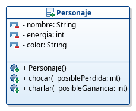
> 

> Como se puede apreciar hay un apartado en el diagrama en el que se muestran los atributos y otro en el que se muestran los métodos (podrás apreciar que aparece un método adicional que se llama igual que la clase y en el que nos detendremos un poco más adelante).

En Java podemos definir una clase utilizando la siguiente sintaxis:
~~~java
	[modificadores] class NombreClase [herencia] [interfaces]{
		[atributos]
		[metodos]
	}
~~~

Aunque modificadores hay varios, por ahora simplemente nos quedaremos con `public`, que indica que la clase será visible desde todas las partes del código.

De la parte de la herencia e interfaces ya hablaremos en otro apartado más detenidamente.

Una clase debe tener un nombre significativo y debe ir almacenada en un fichero con extensión `.java` con el mismo nombre de la clase (esto es debido a que la clase es pública, más adelante veremos otros casos al respecto). Recuerda que para nombrar las clases utilizábamos identificadores cuya inicial fuese una mayúscula y si era la composición de varias palabras, cada una de ellas comenzaba en mayúscula.

> Por tanto, podremos definir en java nuestra clase del ejemplo, de la siguiente forma:

~~~java
	public class Personaje {

	}
~~~

###### Atributos

Los atributos definen la estructura de datos que formará la clase.

Para declarar los atributos utilizaremos la siguiente sintaxis:
~~~java
[modificadoresAcceso][modificadoresContenido] tipo nombre;
~~~

Los modificadores de acceso son los que permitirán indicar el nivel de ocultación de la información para dichos atributos. Podemos encontrarnos los siguientes:
- `public`: indica que cualquier clase tiene acceso a dicho atributo.
- `protected`: indica que cualquier subclase de ésta tendrá acceso a dicho atributo y también las clases que pertenezcan al mismo paquete que la clase que estamos definiendo.
- `private`: indica que el atributo sólo será accesible desde la clase que estamos definiendo.
- **por omisión**: si no indicamos ningún modificador de acceso, estaremos indicando que el nivel de acceso es a nivel de paquete y sólo podrán acceder a este atributo las clases que pertenezcan al mismo paquete que la clase que estamos definiendo.

En el siguiente diagrama de clases se muestra cómo se representa la visibilidad de cada atributo:

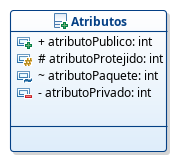

Los modificadores de contenido son aquellos que le dan un sentido especial al contenido de ese atributo. Podemos encontrar:
- `static`: indica que el atributo será de clase y no de instancia. Lo veremos más adelante.
- `final`: indica que el valor del atributo no se puede cambiar.

Existe algún modificador más que no me detendré ni a nombrar, por ahora.

> Ahora añadimos los atributos a la clase y quedaría así:

~~~java
public class Personaje {

	private String nombre;
	private int energia;
	private String color;

}
~~~

###### Métodos

Los métodos son los encargados de realizar operaciones que sean aplicables a los objetos de la clase. Además, para conservar el principio de ocultación, deberían ser los únicos que modificasen el valor de los atributos.

Los métodos contarán con una cabecera y un cuerpo. La cabecera será la declaración del método en sí, en la que indicaremos entre otros: el nivel de acceso, el valor devuelto, el nombre y la lista de parámetros. El cuerpo será el código que implemente dicho método.

Para declarar un método debemos utilizar la siguiente sintaxis:
~~~java
	[modificadoresAcceso][modificadoresContenido] valorDevuelto nombre([listaParametros])[excepciones]
~~~
Los modificadores de acceso son iguales que para los atributos y tienen el mismo significado.

Los modificadores de contenido son casi iguales que para los atributos pero su significado cambia:
- `static`: indica que el método es un método de clase y no de instancia. Lo veremos más adelante.
- `final`: indica que el método no puede ser sobreescrito en la cadena de herencia. Lo veremos en otro apartado.
- `abstract`: indica que es un método abstracto y que no tiene implementación. Lo veremos en otro apartado.

La lista de parámetros es una lista de declaraciones separadas por comas, es decir, de tipo de dato y nombre separados por coma. 

Un método también puede aceptar un número variable de parámetros del mismo tipo mediante la construcción `varargs`, utilizando la sintaxis `tipo... nombre`, lo que indica que puede recibir un numero variable de parámetros del tipo indicado. Esta sintaxis no es más que una forma transparente de pasar como parámetro un array.

Del apartado `[excepciones]` ya hablaremos algo más adelante.

Los métodos que devuelven algo distinto de `void` deben acabar con una sentencia `return valor` y devolverán un `valor` del mismo tipo del declarado. Es importante notar que el valor devuelto deberá ser almacenado en alguna variaable (o mostrado por consola en su caso) o de lo contrario se perderá.

Los métodos se pueden sobrecargar, es decir, definir varios métodos que tengan el mismo identificador pero con distinta lista de parámetros (sin tener en cuenta el valor devuelto). Un uso muy común de sobrecarga de métodos es en el caso de los constructores.

> En el siguiente código mostramos nuestra clase con dos primeras implementaciones de los métodos `chocar` y `charlar`:

~~~java
public class Personaje {

	private String nombre;
	private int energia;
	private String color;

	public void chocar(int posiblePerdida) {
		energia -= posiblePerdida;
	}

	public void charlar(int posibleGanancia) {
		energia += posibleGanancia;
	}

}
~~~

###### Constructores
Los constructores son un tipo de método especial que se llaman igual que la clase y los únicos que no devuelven ningún valor. Su modificador de acceso suele ser `public`. Estos métodos son los encargados de asignar valores iniciales a los atributos, es decir, de establecer el estado inicial del objeto.

Podemos distinguir tres:
- **Por defecto**: es aquel constructor que no acepta parámetros y que inicializará el valor de los atributos a un valor por defecto conveniente para la clase.
- **Con parámetros**: Son los que aceptan parámetros y dependiendo de estos parámetros los atributos tomarán unos valores u otros. Generalmente los parámetros suelen ser valores iniciales que queremos darle a alguno de los atributos.
- **Copia**: Es aquel constructor que es capaz de realizar una copia del objeto que se le pasa como parámetro, que será del mismo tipo que la clase que estamos definiendo. Cuando hablemos del problema de las referencias volveremos a hablar de este tipo de constructores y en qué consiste la **copia profunda** en contraposición con la **copia superficial**.

Si nosotros no definimos ningún constructor, el compilador generará uno por defecto por nosotros. Recuerda el método que aparecía en el diagrama de clases que se llamaba igual que la clase.

Un constructor puede llamar a otro constructor. Por ejemplo, un constructor con parámetros, primero podría querer llamar al constructor por defecto y luego realizar otras acciones. Para ello se utiliza la llamada a `this()` que llamaría al constructor por defecto o si indicamos los parámetros adecuados, a otro constructor con dichos parámetros. La llamada a `this()` (o sus homólagas con parámetros) debe ser la primera línea de la implementación del constructor.

En los constructores (y en muchos otros métodos, como por ejemplo en los métodos de modificación o setters, que veremos más adelate) es típico que el parámetro del método se llame igual que el atributo cuyo valor queremos establecer. Con esto surge un problema de ambigüedad, ya que dentro del método cuando utilicemos dicho nombre, nos estaremos refiriendo al parámetro y no al atributo. Para eliminar dicha ambigüedad debemos utilizar la palabra clave `this` que se refiere a la clase en cuestión y mediante la utilización del operador `.` podremos acceder al atributo deseado:

> Si añadimos los constructores a nuestro ejemplo de `Personaje`, el código podría quedarnos así:

~~~java
public class Personaje {

	private String nombre;
	private int energia;
	private String color;

	public Personaje() {
		nombre = "Personaje";
		energia = 100;
		color = "Rojo";
	}

	public Personaje(String nombre) {
		this();
		this.nombre = nombre;
	}

	public void chocar(int posiblePerdida) {
		energia -= posiblePerdida;
	}

	public void charlar(int posibleGanancia) {
		energia += posibleGanancia;
	}

}
~~~

###### Métodos de acceso y modificación
Son aquellos métodos que nos permiten consultar y/o establecer el valor de los atributos. A veces, nos referimos a ellos como getters y setters respectivamente.

Los métodos de consulta se nombran como `getNombre` donde `Nombre` es el nombre del atributo que queremos consultar. En el caso de que sea un atributo de tipo `boolean` se utiliza `isNombre` para realizar la consulta.

Los métodos de modificación se nombran como `setNombre` donde `Nombre` es el nombre del atributo que queremos modificar.

Cierto es que estos métodos podrían tener el nombre que quisiéramos, pero por convención utilizaremos estos nombres.

Para cumplir con el principio de ocultación, la norma general es:
- Definiremos los atributos con una visibilidad `private`.
- Pensaremos qué atributos queremos que sean accesibles desde fuera y creamos métodos de consulta para los mismos con una visibilidad `public`. Generalmente, para todos los atributos querremos que se pueda consultar su valor, aunque habría que estudiar cada caso concreto.
- Pensaremos qué atributos queremos que se puedan modificar, pasándole un nuevo valor. Ten en cuenta que habrá atributos que no tenga mucho sentido que podamos cambiar a nuestro antojo ya que: no tiene sentido cambiar dicho atributo una vez creado el objeto, depende de otros atributos que se pueda modificar o no, al modificar este atributo también habría que modificar otros para que nuestra clase guarde la consistencia, etc. Una vez decididos qué atributos queremos que se puedan modificar crearemos sus métodos de modificación con una visibilidad `public`.
- Habrá atributos para los que no queramos crear métodos de modificación, pero para los que tenemos que hacer ciertas validaciones antes de modificar el valor de dicho atributo. Para estos atributos es una buena práctica crear métodos de modificación con visibilidad `private` que usarán otros métodos, como pudiera ser el constructor, para que lleve a cabo dichas validaciones. Es una buena costumbre llamar a los métodos `set` para modificar el valor de los atributos.

De esta forma estamos aislando a los clientes de nuestra clase de los cambios en la estructura de la misma.

> Siguiendo con nuestro ejemplo del videojuego, debemos proporcionar a la clase de métodos de acceso para los atributos. Sin embargo, los métodos de modificación de los atributos no tienen sentido para todos ellos, ya que no tiene sentido cambiar el nombre de un personaje una vez creado y tampoco tiene sentido modificar a nuestro antojo la energía de un personaje, ya que se hará por medio de otros métodos. Por tanto, nuestro diagrama de clases queda como sigue:
> 

> 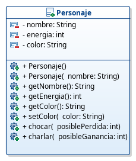
> 

> Y nuestra clase quedaría tal como sigue:

~~~java
public class Personaje {

	private String nombre;
	private int energia;
	private String color;

	public Personaje() {
		nombre = "Personaje";
		energia = 100;
		color = "Rojo";
	}

	public Personaje(String nombre) {
		this();
		this.nombre = nombre;
	}

	public String getNombre() {
		return nombre;
	}

	public int getEnergia() {
		return energia;
	}

	public String getColor() {
		return color;
	}

	public void setColor(String color) {
		this.color = color;
	}

	public void chocar(int posiblePerdida) {
		energia -= posiblePerdida;
	}

	public void charlar(int posibleGanancia) {
		energia += posibleGanancia;
	}

}
~~~

###### Miembros estáticos

Hasta ahora hemos visto los miembros (atributos y métodos) de instancia, es decir, los miembros particulares de cada uno de los objetos que se creen de dicha clase. Pero hay situaciones en las que debemos compartir información entre todos los objetos de una clase o que queremos utilizar algún método de la clase sin necesidad de tener que instanciar un objeto de la misma. Estos son los miembros de clase.

Los **atributos de clase** son atributos compartidos por todos los objetos de la clase y en su definición utilizamos el modificador `static`. Por ejemplo, imaginemos que queremos saber en cada momento cuántos objetos se han creado de una clase. Para ello definiremos un atributo de clase que, en el constructor de la misma, se irá incrementando. Para los atributos de clase podemos definir los métodos de acceso y/o modificación según convenga.

En java no existen las **constantes** como tal, pero podemos conseguir el mismo efecto declarando dicho atributo como `static final`. Por tanto, sería un atributo de clase que no se puede modificar. Estos atributos no tiene sentido que tengan métodos de acceso y mucho menos de modificación ya que no está permitida. Es normal utilizar las constantes para indicar los valores por defecto que utilizaremos en los constructores, entre otros usos. Este tipo de atributos hay que inicializarlos en la declaración o en el constructor y ya no se le podrá cambiar el valor.

Los **métodos de clase** son métodos que no se aplican sobre objetos, sino sobre la clase en sí. Para definir estos métodos debemos utilizar el modificador `static` en su declaración. Para invocar estos métodos no es necesario instanciar ningún objeto de la clase. Estos métodos se invocan sobre la clase (su nombre). Aunque no lo creas ya has utilizado métodos de clase sin saberlo: `Math.random()`, `Entrada.entero()`, etc. Otra aspecto importante sobre estos métodos es que en su cuerpo **sólo pueden hacer referencia a miembros de clase** y en ningún caso a miembros de instancia.

Es común declarar **clases de utilidades** que sólo tienen métodos de clase y atributos de clase. Por ejemplo, la clase `Math` o la clase `Entrada`. Dado que no vamos a instanciar objetos de dichas clases, debemos evitar que el compilador nos cree el constructor por defecto y para ello definiremos un **constructor privado** vacío y así nos aseguramos que nadie va a instanciar un objeto de nuestra clase de utilidades. Esto puedes verlo en la implementación de la clase `Entrada` que os proporcioné en el apartado anterior para realizar la entrada por teclado.

> Supongamos que para nuestro videojuego queremos llevar la cuenta de los personajes que hemos ido creando y que podamos consultarlo. Además, en el constructor por defecto asignaremos un nombre que haga referencia al número de personaje. También queremos utilizar algunas constantes para los valores iniciales. Veamos cómo quedaría nuestro diagrama de clases y el código de nuestra clase. Podéis apreciar en el diagrama que los miembros estáticos aparecen subrayados (además, he hecho que se muestren con un color diferente ya que el subrayado no se aprecia lo suficiente).
> 

> 
> 

~~~java
public class Personaje {

	private static final int ENERGIA_INICIAL = 100;
	private static final String COLOR_INICIAL = "Rojo";
	private static final String PREFIJO_NOMBRE = "Personaje";

	private static int numPersonajes = 0;

	private String nombre;
	private int energia;
	private String color;

	public Personaje() {
		numPersonajes++;
		nombre = PREFIJO_NOMBRE + numPersonajes;
		energia = ENERGIA_INICIAL;
		color = COLOR_INICIAL;
	}

	public Personaje(String nombre) {
		this();
		this.nombre = nombre;
	}

	public String getNombre() {
		return nombre;
	}

	public int getEnergia() {
		return energia;
	}

	public String getColor() {
		return color;
	}

	public void setColor(String color) {
		this.color = color;
	}

	public static int getNumPersonajes() {
		return numPersonajes;
	}

	public void chocar(int posiblePerdida) {
		energia -= posiblePerdida;
	}

	public void charlar(int posibleGanancia) {
		energia += posibleGanancia;
	}

}
~~~

##### Relación de clientela

Hasta ahora hemos declarado atributos de tipos primitivos o a lo sumo `String`. Pero una clase también puede tener atributos cuyos tipos sean otra clase. Cuando una clase X declara atributos cuyo tipo es de otra clase Y, entonces se dice que **la clase X es cliente de la clase Y**.

A veces nos ponemos a diseñar una clase y vemos que tenemos demasiados atributos de tipos primitivo. Generalmente esto nos está indicando que deberíamos crear otra clase que contenga algunos de dichos atributos relacionados y así hacer la primera clase cliente de la segunda.

Cuando tenemos un atributo cuyo tipo es de otra clase debemos tener en cuenta que en el constructor habrá que crearlo o de lo contrario su valor será `null`.

Más adelante hablaremos del problema del **aliasing** que debemos tener muy en cuenta.

También hacer notar que en los diagramas de clase, estos atributos cuyo tipo son de otra clase no aparecen como tal en el compartimento de atributos. La relación de clientela se expresa en estos diagramas mediante una flecha desde la clase cliente a la otra. La flecha se etiqueta con el nombre y visibilidad del atributo, y la cardinalidad, que por ahora será `1` ya que se trata de un atributo simple y no es un array o una colección, en cuyo caso podría poner el límite superior del array o `*` si es que no tiene límite superior.

> Imaginemos que ahora nos dicen que nuestro personaje ocupará una posición dentro la pantalla, que podrá ir cambiando conforme se vaya moviendo. Podríamos añadir dos atributos nuevos a nuestra clase que indiquen la posición X e Y de nuestro personaje. Sin embargo, otra solución más acertada sería crear una clase llamada `Posicion` que contendrá como atributos la posición X e Y y luego hacer que nuestra clase `Personaje` sea cliente de la clase `Posicion`. Como queremos que nuestro personaje se pueda mover, permitiremos modificar la posición en X y en Y, por lo que haremos que los métodos de modificación sean públicos para poder modificar dichas coordenas desde fuera de la clase (además esto lo hacemos por motivos didácticos para luego ejemplificar algunos problemas que pueden surgir de este diseño). Para que nuestro personaje se pueda mover debemos implementar un método llamado `mover` que recibirá como parámetros el incremento en la coordenada X y el incremento en la coordenada Y, y que modifique la posición de nuestro personaje en consecuencia. Tendremos unas constantes que marcarán los límites de la coordenada X y la Y y si intentamos asignar un valor que no esté dentro de esos límites, no lo permitirá y le asignará el valor mínimo, aunque en principio no deberíamos dejar hacerlo, pero eso lo dejamos para corregirlo cuando veamos las excepciones. Veamos cómo quedaría el diagrama de clases y el código de ambas clases.
> 

> 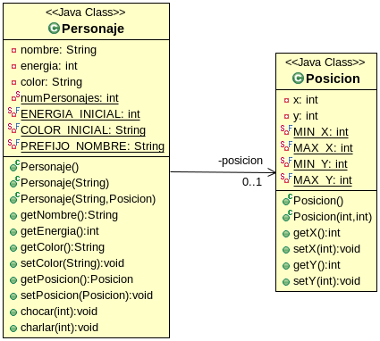
> 

###### Posicion.java
~~~java
public class Posicion {

	private static final int MIN_X = 0;
	private static final int MAX_X = 100;
	private static final int MIN_Y = 0;
	private static final int MAX_Y = 100;

	private int x;
	private int y;

	public Posicion() {
		x = MIN_X;
		y = MIN_Y;
	}

	public Posicion(int x, int y) {
		setX(x);
		setY(y);
	}

	public Posicion(Posicion posicion) {
		x = posicion.x;
		y = posicion.y;
	}

	public int getX() {
		return x;
	}

	public void setX(int x) {
		if (x < MIN_X || x> MAX_X) {
			this.x = MIN_X;
		} else {
			this.x = x;
		}
	}

	public int getY() {
		return y;
	}

	public void setY(int y) {
		if (y < MIN_Y || y > MAX_Y) {
			this.y = MIN_Y;
		} else {
			this.y = y;
		}
	}

}
~~~

###### Personaje.java
~~~java
public class Personaje {

	private static final int ENERGIA_INICIAL = 100;
	private static final String COLOR_INICIAL = "Rojo";
	private static final String PREFIJO_NOMBRE = "Personaje";

	private static int numPersonajes = 0;

	private String nombre;
	private int energia;
	private String color;
	private Posicion posicion;

	public Personaje() {
		numPersonajes++;
		nombre = PREFIJO_NOMBRE + numPersonajes;
		energia = ENERGIA_INICIAL;
		color = COLOR_INICIAL;
		posicion = new Posicion();
	}

	public Personaje(String nombre) {
		this();
		this.nombre = nombre;
	}

	public Personaje(String nombre, Posicion posicion) {
		this(nombre);
		this.posicion = posicion;
	}

	public String getNombre() {
		return nombre;
	}

	public int getEnergia() {
		return energia;
	}

	public String getColor() {
		return color;
	}

	public void setColor(String color) {
		this.color = color;
	}

	public Posicion getPosicion() {
		return posicion;
	}

	public void chocar(int posiblePerdida) {
		energia -= posiblePerdida;
	}

	public void charlar(int posibleGanancia) {
		energia += posibleGanancia;
	}

	public void mover(int x, int y) {
		posicion.setX(posicion.getX() + x);
		posicion.setY(posicion.getY() + y);
	}

}
~~~

## Objetos en Java

Un objeto es una instancia particular de una clase que se crea en tiempo de ejecución. Podemos tener tantos objetos como sea necesario, ya sean de diferentes clases o de la misma. Dicha instancia del objeto es una representación en memoria del estado de dicho objeto, es decir, de los valores particulares de cada atributo de dicho objeto.

Lo primero que debemos hacer es **declarar el objeto**. Dicha declaración se hace de la misma manera que declarábamos cualquier otra variable de tipo primitivo, pero en vez del tipo primitivo utilizamos el nombre de la clase a la que pertenece dicho objeto.
~~~java
	Personaje miPersonaje;
~~~
Al declarar el objeto, lo que realmente estamos haciendo es indicar que dicho identificador será una referencia a un objeto de esa clase. En ese momento, dicha referencia tiene el valor `null`, es decir, aún no apunta a ninguna posición de memoria.

Seguidamente debemos **crear el objeto**. Para crear el objeto utilizaremos el operador `new` seguido por uno de los constructores de la clase.
~~~java
	miPersonaje = new Personaje("Calamardo");
~~~
Con la creación del objeto lo que estamos haciendo es reservar un espacio de memoria para albergar un objeto de dicha clase y hacer que la referencia a dicho objeto apunte a dicha posición de memoria. En la siguiente imagen lo puedes ver de forma gráfica.

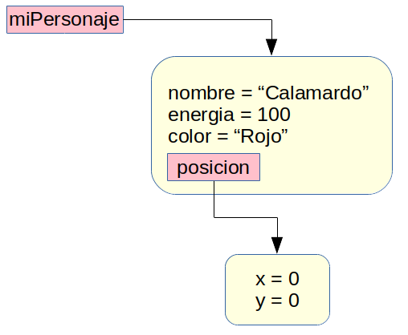

Una vez tenemos declarada la referencia y creado el objeto, ya podemos utilizar dicho objeto. Para acceder a los miembros para los que su visibilidad nos lo permita, utilizamos el identificador de la referencia, seguido de un `.` y seguido del miembro al que queremos acceder, que según hemos visto, deberían ser métodos ya que el acceso a los atributos no está indicando en la mayoría de los casos.
~~~java
	miPersonaje.chocar(20);
	int energiaAux = miPersonaje.getEnergia();
~~~

##### Mostrar el estado de un objeto

Si queremos mostrar el estado de un objeto podemos utilizar, por ejemplo, la sentencia `System.out.println` pasándole la referencia a dicho objeto. Sin embargo, si hacemos esto se nos mostrará información sobre la clase a la que pertenece el objeto y una referencia a su identificador.

Generalmente, nos convendrá que a la hora de realizar esta operación se muestre el estado del objeto, es decir, el valor de cada uno de sus atributos. Para ello, la clase simplemente debe sobreescribir el método `toString` heredado de `Object` para que dicha representación se adecúe a nuestras necesidades. Este método no recibe parámetros y devuelve una cadena con la representación del mismo.

> Ahora queremos que nuestra clase `Posicion` permita mostrar el estado de los objetos de la misma, informándonos del valor de `x` y de `y`. Para ello simplemente sobreescribiremos el método `toString` para que se adecúe a estas premisas.

~~~java
	...
	@Override
	public String toString() {
		return String.format("Posicion[x=%s, y=%s]", this.x, this.y);
	}
~~~

> Una vez hecho esto, ya podremos mostrar el estado de los objetos de la clase `Posicion`

~~~java
	...
	Posicion miPosicion = new Posicion();
	System.out.println(miPosicion);		//Muestra: x=0, y=0
~~~

##### Referencias

Cuando asignamos una referencia a otra, no estamos copiando el contenido de una en otra, simplemente estamos igualando ambas referencias al mismo objeto.

Por ejemplo, cuando nosotros ejecutamos el siguiente código:
~~~java
	...
	Posicion posicion1 = new Posicion();
	Posicion posicion2;
	posicion2 = posicion1;
~~~
Lo que realmente está ocurriendo es lo siguiente:

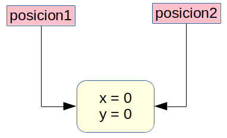

Este uso de las referencias tienen algunas ventajas como la compartición o la posibilidad de crear estructuras recursivas, pero tiene un inconveniente: **el aliasing**.

Veamos en qué consiste este problema, analizando el siguiente código:
~~~java
	...
	Posicion posicion1 = new Posicion(10, 10);
	Posicion posicion2;
	posicion2 = posicion1;
	System.out.println(posicion1);		//Muestra: x=10, y=10
	posicion2.setX(20);
	System.out.println(posicion1);		//Muestra: x=20, y=10
~~~

Como se puede apreciar, simplemente hemos modificado la coordenada `x` de la referencia `posicion2`, pero dicha modificación también ha afectado a la referencia `posicion1`. Si lo pensamos, es normal ya que ambas referencias apuntan al mismo objeto y cualquier modificación afectará a ambas referencias.

El aliasing ocurre cuando estamos trabajando con clases mutables, es decir, se puede modificar su estado. Esto no ocurriría si la clase `Posicion` fuese inmutable y eso se podría conseguir haciendo que sus método `setX` no fuesen públicos (o no estuviesen implementados). Realmente, el diseño correcto para la clase `Posicion` debía ser que fuese inmutable.

Pero, dado que en nuestro ejemplo, la clase `Posicion` es mutable (lo que se hizo a drede por motivos didácticos), debemos tenerlo muy en cuenta ya que a veces podemos tener efectos no deseados. Por ejemplo, en un método de acceso de una clase, que accede a un atributo que es una referencia a otro objeto, si devolvemos la referencia estaremos comprometiendo la integridad ya que desde fuera se podrían cambiar los valores del objeto al que apunta. Veámoslo con un ejemplo:
~~~java
	...
	Personaje miPersonaje = new Personaje("Calamardo");
	Posicion miPosicion = miPersonaje.getPosicion();
	System.out.println(miPersonaje.getPosicion());		//Muestra: x=0, y=0
	miPosicion.setX(10);
	System.out.println(miPersonaje.getPosicion());		//Muestra: x=10, y=0
~~~

Este mismo caso se puede dar cuando pasamos una referencia al constructor o a un método de modificación y simplemente igualamos la referencia.
~~~java
	...
	Posicion miPosicion = new Posicion(10, 10);
	Personaje miPersonaje = new Personaje("Calamardo", miPosicion);
	System.out.println(miPosicion);	//Muestra: x=10, y=10
	miPersonaje.mover(10, 0);
	System.out.println(miPosicion);	//Muestra: x=20, y=10
~~~

Por tanto, aunque depende del problema a resolver, lo normal es que creemos nuevas instancias partiendo de la pasada o que las devolvamos (esto siempre que las referencias no sean a objetos inmutables, como es el caso de la clase `String`). Para ello, es muy común utilizar el constructor copia de la clase, del que hemos hablado muy por encima.

El constructor copia lo que hará es crear un nuevo objeto con los valores de los atributos igualados a los de la referencia del objeto pasado como argumento. Si simplemente copiamos los valores, estaremos creando lo que se llama **copia superficial** y si la clase es cliente de otra clase mutable, podríamos encontrarnos con este problema.
~~~java
	public Personaje(Personaje personaje) {
		nombre = personaje.nombre;
		energia = personaje.energia;
		color = personaje.color;
		posicion = personaje.posicion;
	}
~~~
Como se puede ver, para el atributo `posicion` hemos igualado la referencia.

Para solucionarlo, utilizaremos la **copia profunda** que en vez de igualar referencias, cree nuevos objetos e iguale a dichos objetos recién creados.
~~~java
	public Personaje(Personaje personaje) {
		nombre = personaje.nombre;
		energia = personaje.energia;
		color = personaje.color;
		posicion = new Posicion(personaje.posicion);
	}
~~~

Con esto habríamos solucionado el problema, pero seguimos devolviendo la referencia de la posición en el método de consulta y nos quedamos con la referencia en el metodo de establecimiento, y eso deberíamos arreglarlo.

Por todo lo comentado anteriormente, si nosotros utilizamos el operado `==` para comparar la igualdad de dos referencias, nos devolverá `true` si ambas apuntan al mismo objeto y `false` si apuntan a objetos diferentes aunque el estado de ambos sea idéntico.

Para solucionar este otro problema debemos utilizar el método `equals`. Lo normal es que para cada clase nosotros sobreescribamos este método. Por otro lado, para ser consecuentes, java internamente puede utilizar otro método llamado `hashCode` que devuelve un número único para cada objeto, y que para dos objetos con el mismo estado devolverá el mismo número y para dos objetos diferentes deberá devolver números diferentes. La documentacion de java dice que `equals` y `hashCode` deben comportarse de igual forma por consistencia, por lo que si sobreescribimos uno deberíamos sobreescribir el otro. Generalmente estos dos métodos los pueden generar los IDEs por nosotros.

Ahora os muestro el código de ambas clases con los problemas de **aliasing** corregidos y con la implementación de `equals` y `hashCode`.
###### Posicion.java
~~~java
import java.util.Objects;

public class Posicion {

	private static final int MIN_X = 0;
	private static final int MAX_X = 100;
	private static final int MIN_Y = 0;
	private static final int MAX_Y = 100;

	private int x;
	private int y;

	public Posicion() {
		x = MIN_X;
		y = MIN_Y;
	}

	public Posicion(int x, int y) {
		setX(x);
		setY(y);
	}

	public Posicion(Posicion posicion) {
		x = posicion.x;
		y = posicion.y;
	}

	public int getX() {
		return x;
	}

	public void setX(int x) {
		if (x < MIN_X || x > MAX_X) {
			this.x = MIN_X;
		} else {
			this.x = x;
		}
	}

	public int getY() {
		return y;
	}

	public void setY(int y) {
		if (y < MIN_Y || y > MAX_Y) {
			this.y = MIN_Y;
		} else {
			this.y = y;
		}
	}

	@Override
	public boolean equals(Object o) {
		if (this == o) return true;
		if (!(o instanceof Posicion posicion)) return false;
		return x == posicion.x && y == posicion.y;
	}

	@Override
	public int hashCode() {
		return Objects.hash(x, y);
	}

	@Override
	public String toString() {
		return String.format("Posicion[x=%s, y=%s]", this.x, this.y);
	}

}
~~~
###### Personaje.java
~~~java
import java.util.Objects;

public class Personaje {

	private static final int ENERGIA_INICIAL = 100;
	private static final String COLOR_INICIAL = "Rojo";
	private static final String PREFIJO_NOMBRE = "Personaje";

	private static int numPersonajes = 0;

	private String nombre;
	private int energia;
	private String color;
	private Posicion posicion;

	public Personaje() {
		numPersonajes++;
		nombre = PREFIJO_NOMBRE + numPersonajes;
		energia = ENERGIA_INICIAL;
		color = COLOR_INICIAL;
		posicion = new Posicion();
	}

	public Personaje(String nombre) {
		this();
		this.nombre = nombre;
	}

	public Personaje(String nombre, Posicion posicion) {
		this(nombre);
		setPosicion(posicion);
	}

	public Personaje(Personaje personaje) {
		nombre = personaje.nombre;
		energia = personaje.energia;
		color = personaje.color;
		posicion = new Posicion(personaje.posicion);
	}

	public String getNombre() {
		return nombre;
	}

	public int getEnergia() {
		return energia;
	}

	public String getColor() {
		return color;
	}

	public void setColor(String color) {
		this.color = color;
	}

	public Posicion getPosicion() {
		return new Posicion(posicion);
	}

	private void setPosicion(Posicion posicion) {
		this.posicion = new Posicion(posicion);
	}

	public void chocar(int posiblePerdida) {
		energia -= posiblePerdida;
	}

	public void charlar(int posibleGanancia) {
		energia += posibleGanancia;
	}

	public void mover(int x, int y) {
		posicion.setX(posicion.getX() + x);
		posicion.setY(posicion.getY() + y);
	}

	@Override
	public boolean equals(Object o) {
		if (this == o) return true;
		if (!(o instanceof Personaje that)) return false;
		return energia == that.energia && Objects.equals(nombre, that.nombre) && Objects.equals(color, that.color) && Objects.equals(posicion, that.posicion);
	}

	@Override
	public int hashCode() {
		return Objects.hash(nombre, energia, color, posicion);
	}

	@Override
	public String toString() {
		return String.format("Personaje[nombre=%s, energía=%s, color=%s, posición=%s]", this.nombre, this.energia, this.color, this.posicion);
	}

}
~~~

## Excepciones

Una excepción no es más que un error o un problema que ocurre durante la ejecución de nuestro programa. Cuando se produce esta situación anómala el flujo normal del programa se interrumpe y el programa termina abruptamente. Nosotros, como buenos programadores, intentaremos por todos los medios que nuestro programa sea **robusto** y que, por tanto, sea capaz de reaccionar adecuadamente ante estas situaciones excepcionales.

Imaginaos, por ejemplo, que queremos transferir un archivo por la red y lo queremos guardar en un archivo que se encuentra en un pendrive. Veamos qué situaciones anómalas se pueden dar:
- Que el origen de donde leeremos el fichero esté malformado o el fichero no existe.
- Que la conexión de red se pierda por algún motivo (alguién apaga la wifi, hay un problema en el router, etc.).
- Que el pendrive esté lleno y no tiene espacio para almacenar dicho fichero.
- Que en medio de la escritura del fichero, alguien saca el pendrive.
- Que no tenemos permiso de escritura en el pendrive.
- Etc.

En java las excepciones están representadas por una clase. Las excepciones, al igual que toda clase, siguen una jerarquía de clases, que no voy a mostrar ya que ni siquiera hemos hablado de herencia, aún. Uno de los métodos más comunes de las excepciones es el método `getMessage` que devuelve una cadena con un mensaje explicativo sobre la causa de dicha excepción.

Dentro de estas situaciones anómalas podemos distinguir tres categorías:
- **Errores**: son situaciones ante las que nosotros poco podemos hacer. Este tipo de situaciones quedan fuera de nuestro alcance y terminarán el programa. Por ejemplo, que la JVM se quede sin memoria. Ante esto poco podemos hacer (además de revisar nuestro código para ver si podemos reducir el uso de memoria de alguna forma). Por ello, no se consideran excepciones propiamente dichas. Todos los errores heredan de la clase `Error`.
- **Excepciones comprobadas**: son situaciones que son típicas que ocurran al tratar con ciertos recursos como disco, red, etc. Estas excepciones debemos tratarlas para evitar que nuestro programa termine abruptamente. Además, estamos obligados a tratarlas ya que si no, tendremos un error en tiempo de compilación. Todas las excepciones comprobadas heredan de la clase `Exception`, pero no de `RuntimeException`. Este tipo de excepciones es obligatorio tratarlas.
- **Excepciones no comprobadas**: son situaciones que ocurren debido a errores que cometemos en la programación: intentar acceder a una posición de un array que no existe (`IndexOutOfBoundsException`), intentar trabajar con un objeto nulo (`NullPointerException`), pasar un argumento no válido a un método (`IllegalArgumentException`), etc. Todas estas excepciones heredan de `RuntimeException`. Este tipo de excepciones podemos tratarlas o no, según sea la situación, pero lo que sí debemos hacer es evitar que ocurran.

##### Tratamiento de una excepción
Cuando vamos a llamar a un método que pueda lanzar una excepción, encerraremos dicha llamada al método en un `try`. Seguida a este bloque, puede haber uno o varios bloques `catch`. Y podemos terminar con un bloque `finally`. Veamos que significa todo esto:
- En el bloque `try` se ejecuta la sentencia que puede lanzar una o varias excepciones. Si se lanza una excepción, el flujo se detendrá y pasaremos a los bloques `catch`.
- En cada uno de los bloques `catch` capturamos un tipo de excepción que se ha podido lanzar en el bloque `try` e indicamos cómo reaccionar ante dicha situación. Cada sentencia `catch` va seguida por el nombre de la excepción ante la que queremos reaccionar.
- El bloque `finally` es un bloque opcional que se ejecuta siempre, se haya producido alguna excepción o no. Se suele utilizar para cerrar recursos abiertos. A partir de java SE 7, este bloque perdió su sentido original debido a la introducción de la sentencia `try-with-resources` que ya veremos en otros apartados.

~~~java
	try {
		fichero = new FileInputStream(nombreArchivo);
	} catch (FileNotFoundException e) {
		System.out.println(e.getMessage());
	}
~~~
Los bloques `try` se pueden anidar. Además en un bloque `catch` se pueden capturar varias excepciones separando sus nombres por medio del operador `|`.
~~~java
	try {
		fichero = new FileInputStream(nombreArchivo);
		aux = (byte) fichero.read();
	} catch (IOException | FileNotFoundException e) {
		System.out.println(e.getMessage());
	}
~~~

##### Propagación de las excepciones
Hay veces en las que no sabemos muy bien cómo tratar la excepción, no es el momento de tratarla, etc. En estos casos lo que podemos hacer es dejar escapar la excepción o, lo que es lo mismo, propagarla. Para ello en el método que no estemos tratando una excepción deberemos indicarle al compilador que ese método puede propagar la excepción y que sea el código que invoca dicho método el encargado de tratarla. Para ello se utiliza la expresión `throws` seguido por el nombre o nombres de las excepciones que dicho método puede propagar, en la cabecera del mismo.
~~~java
	public void leerFichero() throws IOException, FileNotFoundException
~~~
El tratamiento de las excepciones por tanto se puede delegar. Si una excepción se propaga desde el sitio donde se produjo y llega al método `main` y no es tratada, el programa terminará abruptamente imprimiendo la pila de llamadas a métodos, empezando donde se produjo y mostrando todos los métodos por donde ha ido pasando hasta llegar al método `main`. Esto es lo que siempre deberemos evitar.

Ni que decir tiene que todas las excepciones comprobadas deberemos o bien tratarlas o bien propagarlas.

##### Lanzamiento de excepciones
Nosotros podemos lanzar una excepción en el momento que deseemos. Esto generalmente se hace con las excepciones propias, es decir, con las que nosotros definimos (esto lo veremos cuando hablemos de la herencia). Pero también se puede hacer con cualquier otro tipo de excepción para indicar que ha ocurrido un error del tipo de dicha excepción. Por ejemplo, es muy común lanzar la excepción no comprobada `IllegalArgumentException` en nuestras clases, cuando pasamos parámetros con valores incorrectos a nuestros métodos.

Para lanzar una excepción, simplemente tendremos que crear un nuevo objeto del tipo de la excepción y notificarlo con la sentencia `throw`.
~~~java
	if (objeto == null) {
		throw new NullPointerException("El objeto pasado es nulo.");
	}
~~~

Este tipo de comprobación es muy común ya que siempre debemos evitar trabajar con referencias `null`y por ello, la clase de utilidades `Objects` nos ofrece el método `requireNonNull` que hace lo mismo y simplifica nuestro código bastante. El código anterior quedaría como sigue:
~~~~java
    Objects.requireNonNull(objeto, "El objeto pasado es nulo.");
~~~~

Lo bueno que tiene este método es que además nos devuelve el objeto si éste no es `null`, por lo que en los métodos `set`, por ejemplo, nos viene muy bien.

> Ahora que hemos visto el tratamiento de excepciones, queremos que nuestra clase Personaje pueda informar si se ha pasado algún valor incorrecto a los métodos. Además, como os comenté también utilizaré métodos modificadores privados que se encargarán de realizar la comprobación y que se llamarán en el constructor. Además queremos que el método `mover` lance una excepción comprobada `OperationNotSupportedException` (escojo esta excepción por motivos didácticos, ya que lo correcto sería lanzar una excepción propia) cuando estemos intentando mover la posición de nuestro personaje y éste sobrepase los límites establecidos.
> 

> 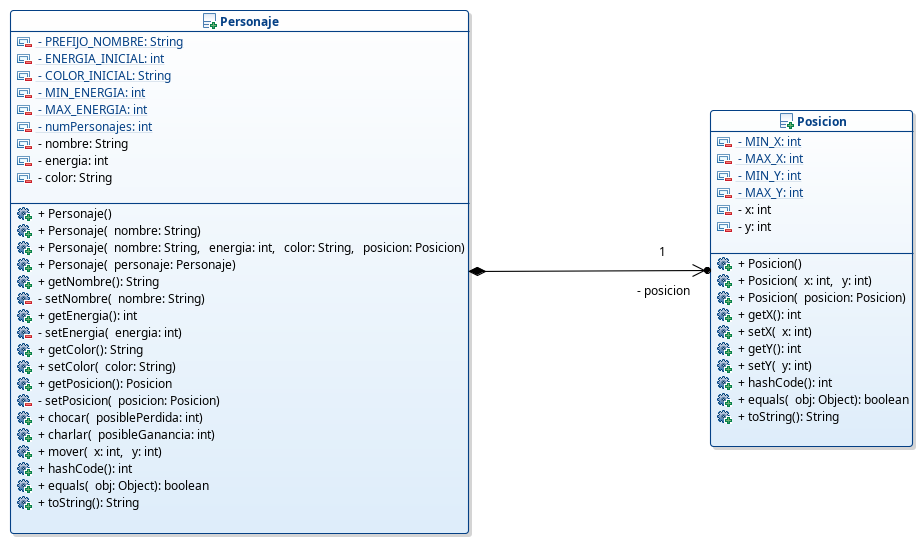
> 

###### Posicion.java
~~~java
import java.util.Objects;

public class Posicion {

	private static final int MIN_X = 0;
	private static final int MAX_X = 100;
	private static final int MIN_Y = 0;
	private static final int MAX_Y = 100;

	private int x;
	private int y;

	public Posicion() {
		x = MIN_X;
		y = MIN_Y;
	}

	public Posicion(int x, int y) {
		setX(x);
		setY(y);
	}

	public Posicion(Posicion posicion) {
		Objects.requireNonNull(posicion, "No puedo copiar una posición nula.");
		x = posicion.x;
		y = posicion.y;
	}

	public int getX() {
		return x;
	}

	public void setX(int x) {
		if (x < MIN_X) {
			throw new IllegalArgumentException("El valor de la x es menor que el mínimo permitido.");
		} else if (x > MAX_X) {
			throw new IllegalArgumentException("El valor de la x es mayor que el máximo permitido.");
		}
		this.x = x;
	}

	public int getY() {
		return y;
	}

	public void setY(int y) {
		if (y < MIN_Y) {
			throw new IllegalArgumentException("El valor de la y es menor que el mínimo permitido.");
		} else if (y > MAX_Y) {
			throw new IllegalArgumentException("El valor de la y es mayor que el máximo permitido.");
		}
		this.y = y;
	}

	@Override
	public boolean equals(Object o) {
		if (this == o) return true;
		if (!(o instanceof Posicion posicion2)) return false;
		return x == posicion2.x && y == posicion2.y;
	}

	@Override
	public int hashCode() {
		return Objects.hash(x, y);
	}

	@Override
	public String toString() {
		return String.format("Posicion[x=%s, y=%s]", this.x, this.y);
	}

}
~~~

###### Personaje.java
~~~java
import java.util.Objects;

import javax.naming.OperationNotSupportedException;

public class Personaje {

	private static final String PREFIJO_NOMBRE = "Personaje ";
	private static final int ENERGIA_INICIAL = 100;
	private static final String COLOR_INICIAL = "Rojo";
	private static final int MIN_ENERGIA = 0;
	private static final int MAX_ENERGIA = 100;

	private static int numPersonajes = 0;

	private String nombre;
	private int energia;
	private String color;
	private Posicion posicion;

	public Personaje() {
		nombre = PREFIJO_NOMBRE + ++numPersonajes;
		energia = ENERGIA_INICIAL;
		color = COLOR_INICIAL;
		posicion = new Posicion();
	}

	public Personaje(String nombre) {
		this();
		setNombre(nombre);
	}

	public Personaje(String nombre, int energia, String color, Posicion posicion) {
		setNombre(nombre);
		setEnergia(energia);
		setColor(color);
		setPosicion(posicion);
		numPersonajes++;
	}

	public Personaje(Personaje personaje) {
		Objects.requireNonNull(personaje, "No puedo copiar un personaje nulo.");
		nombre = personaje.nombre;
		energia = personaje.energia;
		color = personaje.color;
		posicion = new Posicion(personaje.posicion);
		numPersonajes++;
	}

	public String getNombre() {
		return nombre;
	}

	private void setNombre(String nombre) {
		this.nombre = Objects.requireNonNull(nombre, "El nombre del personaje no puede ser nulo.");
	}

	public int getEnergia() {
		return energia;
	}

	private void setEnergia(int energia) {
		if (energia < MIN_ENERGIA) {
			throw new IllegalArgumentException("El valor de la energía no puede ser menor que el mínimo establecido.");
		} else if (energia > MAX_ENERGIA) {
			throw new IllegalArgumentException("El valor de la energía no puede ser mayor que el máximo establecido.");
		}
		this.energia = energia;
	}

	public String getColor() {
		return color;
	}

	public void setColor(String color) {
		this.color = Objects.requireNonNull(color, "El color del personaje no puede ser nulo.");
	}

	public Posicion getPosicion() {
		return new Posicion(posicion);
	}

	private void setPosicion(Posicion posicion) {
		this.posicion = new Posicion(Objects.requireNonNull(posicion, "La posición del personaje no puede ser nula."));
	}

	public void chocar(int posiblePerdida) {
		setEnergia(energia - posiblePerdida);
	}

	public void charlar(int posibleGanancia) {
		setEnergia(energia + posibleGanancia);
	}

	public void mover(int x, int y) throws OperationNotSupportedException{
		try {
			posicion.setX(posicion.getX() + x);
			posicion.setY(posicion.getY() + y);
		} catch (IllegalArgumentException e) {
			throw new OperationNotSupportedException("Movimiento no válido");
		}
	}

	@Override
	public boolean equals(Object o) {
		if (this == o) return true;
		if (!(o instanceof Personaje that)) return false;
		return energia == that.energia && Objects.equals(nombre, that.nombre) && Objects.equals(color, that.color) && Objects.equals(posicion, that.posicion);
	}

	@Override
	public int hashCode() {
		return Objects.hash(nombre, energia, color, posicion);
	}

	@Override
	public String toString() {
		return String.format("Personaje[nombre=%s, energía=%s, color=%s, posición=%s]", this.nombre, this.energia, this.color, this.posicion);
	}

}
~~~

##### Excepciones propias

En java nosotros podemos declarar nuestras propias excepciones. Para ello simplemente debemos heredar de `Exception` si queremos declarar una excepción comprobada o de `RunTimeException` si no queremos que sea comprobada. Generalmente, crearemos nuestras propias excepciones comprobadas. Además de heredar, es conveniente sobreescribir el constructor al que le pasamos el mensaje con el motivo de la excepción. El IDE permite generarla de una forma cómoda y sencilla, aunque la crea como no comprobada. Veamos un ejemplo, para nuestro videojuego:

###### VideojuegoExcepcion.java
~~~java
public class VideojuegoExcepcion extends Exception {
    public VideojuegoExcepcion(String message) {
        super(message);
    }
}
~~~

La forma en que lanzamos esta excepción sería igual que con cualquier otra: `throw new VideojuegoExcepcion("Se te ha acabado la energía.");`.

Repasa el código anterior y sustituye `OperationNotSupportedException` por `VideojuegoExcepcion`.

##### Aserciones
Las aserciones son sentencias que comprueban si se cumple una cierta condición y en caso contrario lanza una excepción del tipo `AssetionError`.

Se suelen utilizar para comprobar valores de variables cuando estamos desarrollando. Cuando ejecutamos código que contiene aserciones debemos ejecutar la máquina virtual con la opción `-enableassertions` o `-ea`.

El siguiente código asume que `personaje` es distinto de `null` y en caso contrario lanza `AssetionError` con el mensaje que le indicamos.

~~~java
	...
	assert (personaje != null) : "El personaje debería ser distinto de null";
	...
~~~

Si `personaje` fuese `null` y ejecutamos el código con las aserciones habilitados, nos mostraría la siguiente salida:
~~~java
Exception in thread "main" java.lang.AssertionError: El personaje debería ser distinto de null
	at org.iesalandalus.programacion.poo.videojuego.Prueba.main(Prueba.java:83)
~~~

## Registros

En java los registros (`record`) son un tipo especial de declaración de una clase que nos permite evitar el código repetitivo cuando queremos implementar clases de objetos inmutables. Su intención es utilizarlos en clases de dominio cuyo cometido es simplemente contener datos y transferirlos entre diferentes módulos (vease el patrón DTO). Los registros están disponibles a partir de **java 14**.

La sintaxis para declarar un registro es: `[modificadorAcceso] record Nombre([listaParametros]) {}`. Por ejemplo, vamos a declara un registro para nuestra clase `Posicion`:
~~~java
    public record Posicion(int x, int y) {}
~~~

Esta simple declaración nos creará una clase inmutable `Posicion`, con los atributos `x` e `y` privados y no modificables (`final`). Creará un constructor con los mismos parámetros que atributos. Creará los métodos de acceso, pero en vez de nombrarlos como `getX()` y `getY()`, los nombrará como `x()` e `y()`. También crea los métodos `equals`, `hashCode` y `toString`. Como se puede apreciar el trabajo que nos ahorra es indudable. Dentro del cuerpo podemos implementar (si fuese necesario) nuevos constructores, métodos para implementar nuestra lógica, etc.

Vamos a implementar nuestra clase `Posicion` utilizando un registro. Cabe la pena destacar que el constructor copia ya no tiene sentido, debido a que la clase es inmutable.
~~~java
public record Posicion(int x, int y) {

	private static final int MIN_X = 0;
	private static final int MAX_X = 100;
	private static final int MIN_Y = 0;
	private static final int MAX_Y = 100;

	public Posicion {
		validarX(x);
		validarY(y);
	}

	public Posicion() {
		this(MIN_X, MIN_Y);
	}

	private void validarX(int x) {
		if (x < MIN_X) {
			throw new IllegalArgumentException("El valor de la x es menor que el mínimo permitido.");
		} else if (x > MAX_X) {
			throw new IllegalArgumentException("El valor de la x es mayor que el máximo permitido.");
		}
	}

	private void validarY(int y) {
		if (y < MIN_Y) {
			throw new IllegalArgumentException("El valor de la y es menor que el mínimo permitido.");
		} else if (y > MAX_Y) {
			throw new IllegalArgumentException("El valor de la y es mayor que el máximo permitido.");
		}
	}

}
~~~

Su representación en un diagrama de clases (la representación que he elegido, ya que en UML no existe esta representación como tal) será la siguiente:

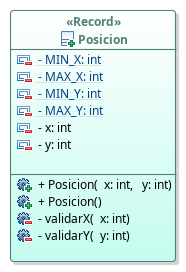

Podéis encontrar más información en la documentación de Oracle: [novedades en el jdk 14.](https://docs.oracle.com/en/java/javase/14/language/records.html#GUID-6699E26F-4A9B-4393-A08B-1E47D4B2D263){:target="_blank"}

## Paquetes

Hasta ahora, los programas que has realizado constaban de una sola clase o muy pocas. En este apartado hemos visto como poco a poco va creciendo el número de clases a utilizar por un programa. Por lo que se necesita una forma de estructurar nuestras clases.

Para ello existen los paquetes, que no son más que agrupaciones de clases relacionadas. Al fin y al cabo esto no es más que diferentes directorios con sus clases. Pero para que una clase pertenezca a un paquete no basta con colocarla en un determinado directorio, sino que la primera instrucción del fichero `.java` debe indicar el paquete al que pertenece.

Los paquetes se pueden anidar unos dentro de otros. Lo normal es que todos los paquetes empiecen con el nombre cualificado de nuestra organización en orden inverso. Todos los paquetes se escriben en minúsculas.

~~~java
package org.iesalandalus.programacion.poo.videojuego;
...
~~~

Para poder hacer referencia a una clase dentro de otra, debemos utilizar su nombre cualificado que es el nombre de la clase precedido por la ruta de los diferentes paquetes a los que pertenece (comenzamos en la raíz de la jerarquía y vamos descendiendo), separados por `.`.
~~~java
	...
	int i = org.iesalandalus.programacion.utilidades.Entrada.entero();
~~~

Pero esta nomenclatura es muy engorrosa. Además si tenemos muchos paquetes, unos dentro de otros y demás, como es el caso, por ejemplo, del API de java, esto es inviable. Para poder omitir esta ruta, se utiliza la sentencia `import` que irá justo después de la sentencia `package` y antes de la definición de la clase. Podemos utilizar tantas sentencias `import` como necesitemos (una debajo de otra). Además, podemos utilizar el comodín `*` para indicar que queremos importar todas las clases de un paquete. Con el uso del `*` importamos todas las clases de ese paquete, pero no las clases que hayan en sus subpaquetes, para ello deberíamos utilizar diferentes sentencias `import`. El uso del `*` no tiene ningún inconveniente y no hace que nuestra clase vaya a ocupar más o se ejecute más lenta, ni nada de eso. Es más, el uso del `*` está recomendado.
~~~java
	import org.iesalandalus.programacion.utilidades.*;
	...
	int i = Entrada.entero();
~~~

Pero para clases que contienen miembros estáticos, podemos utilizar la sentencia `import static` seguido por el nombre de los miembros que queremos importar o usando el `*` para importarlos todos y así evitar anteponer al miembro el nombre de la clase.
~~~java
	import static org.iesalandalus.programacion.utilidades.Entrada.*;
	import static java.lang.Math.*;
	...
	double radio = entero();
	double perimetro = 2 * PI * radio;
~~~

## Enumerados

Los enumerados son clases especiales cuyos objetos se definen en la definición del enumerado, es decir, son conocidos en tiempo de compilación. Para declararlos utilizamos la palabra reservada `enum` seguida del identifcador del enumerado y entre las llaves encerramos los objetos, separados por comas. En su forma más sencilla sería almacenar constantes relacionadas.

~~~java
	public enum Direccion {
		ARRIBA,
		ABAJO,
		DERECHA,
		IZQUIERDA;
	}
~~~

Su implementación utilizando una clase, podría ser como sigue (los enumerados existen a partir de la versión 5):
~~~java
	public class Direccion {
		public static final Direccion ARRIBA = new Direccion();
		public static final Direccion ABAJO = new Direccion();
		public static final Direccion DERECHA = new Direccion();
		public static final Direccion IZQUIERDA = new Direccion();

		private Direccion() {}
	}
~~~

Para cada valor del enumerado se le asigna una constante, llamada `ordinal` empezando en 0. También contiene métodos como: `values()` que devuelve todos los valores del enumerado, `valueOf(String)` que nos devuelve el valor del enumerado representado por dicha cadena y `toString` que nos devuelve la representación del valor. Los enumerados tamibén se pueden utilizar en sentencias `switch`.

Por ejemplo, el siguiente código recorrería los valores del enumerado y mostraría su ordinal y su representación como cadena. El bucle que hemos utilizado para recorrer los valores del ordinal es un bucle `for-each` que se utiliza para recorrer colecciones y en el que en cada iteración la variable toma un valor, pero que veremos más adelante cuando hablemos de colecciones.
~~~java
	...
	for (Direccion direccion : Direccion.values()) {
		System.out.println("Ordinal: " + direccion.ordinal() + ", nombre: " + direccion);
	}
	...
~~~

Su salida sería la que se muestra a continuación:
~~~
Ordinal: 0, nombre: ARRIBA
Ordinal: 1, nombre: ABAJO
Ordinal: 2, nombre: DERECHA
Ordinal: 3, nombre: IZQUIERDA
~~~

Los enumerados también pueden tener atributos, constructores que deben ser privados, métodos, etc.

Veamos un ejemplo de uso con su constructor y unos atributos.
~~~java
	public enum Mes {
		ENERO("Enero", 31),
		FEBRERO("Febrero", 28),
		MARZO("Marzo", 31),
		ABRIL("Abril", 30),
		MAYO("Mayo", 31),
		JUNIO("Junio", 30),
		JULIO("Julio", 31),
		AGOSTO("Agosto", 31),
		SEPTIEMBRE("Septiembre", 30),
		OCTUBRE("Octubre", 31),
		NOVIEMBRE("Noviembre", 30),
		DICIEMBRE("Diciembre", 31);

		private String cadenaAMostrar;
		private int numeroDias;

		private Mes(String cadenaAMostrar, int numeroDias) {
			this.cadenaAMostrar = cadenaAMostrar;
			this.numeroDias = numeroDias;
		}

		public int getNumeroDias() {
			return numeroDias;
		}

		@Override
		public String toString() {
			return cadenaAMostrar;
		}
	}
	...
	for (Mes mes : Mes.values()) {
		System.out.println(mes + " tiene " + mes.getNumeroDias() + " días.");
	}
~~~

Daría como salida:
~~~
Enero tiene 31 días.
Febrero tiene 28 días.
Marzo tiene 31 días.
Abril tiene 30 días.
Mayo tiene 31 días.
Junio tiene 30 días.
Julio tiene 31 días.
Agosto tiene 31 días.
Septiembre tiene 30 días.
Octubre tiene 31 días.
Noviembre tiene 30 días.
Diciembre tiene 31 días.
~~~

> Por último nos dicen que los personajes sólo aceptarán tres colores: rojo, verde y azul (queremos que su representación como cadena sea su nombre con la primera letra en mayúsculas y lo demás en minúsculas). Además nos comentan que quieren que nuestro personaje pueda moverse en una determinada dirección: arriba, abajo, derecha e izquierda, y un determinado número de pasos  (además de como se podía mover anteriormente). También nos comentan que quieren que metamos todo en un paquete llamado `org.iesalandalus.programacion.poo.videojuego`. Pues el resultado final de nuestro diagrama de clases y el código final de todas nuestras clases sería el siguiente (debemos tener en cuenta que el diagrama de clases no me permite mostrar sus atributos o métodos, por lo que para el enumerado `Color` lo anotado junto a su representación para que quede claro):
> 

> 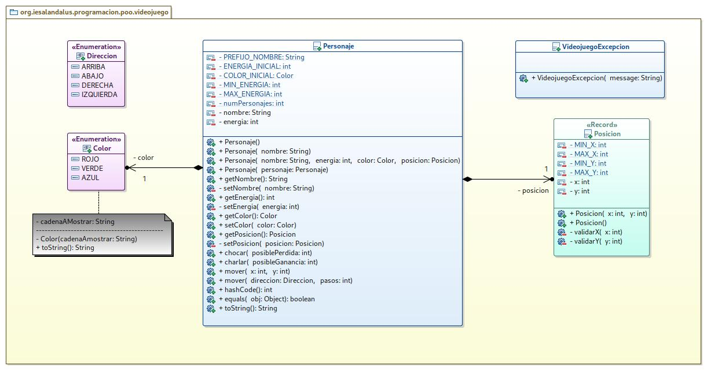
> 

###### VideojuegoExcepcion.java
~~~java
public class VideojuegoExcepcion extends Exception {
    public VideojuegoExcepcion(String message) {
        super(message);
    }
}
~~~
###### Direccion.java
~~~java
package org.iesalandalus.programacion.poo.videojuego;

public enum Direccion {
	ARRIBA, 
	ABAJO, 
	DERECHA, 
	IZQUIERDA;
}
~~~
###### Color.java
~~~java
package org.iesalandalus.programacion.poo.videojuego;

public enum Color {
	ROJO("Rojo"), 
	VERDE("Verde"), 
	AZUL("Azul");
	
	private String cadenaAMostrar;
	
	private Color(String cadenaAMostrar) {
		this.cadenaAMostrar = cadenaAMostrar;
	}
	
	@Override
	public String toString() {
		return cadenaAMostrar;
	}
}
~~~
###### Posicion.java
~~~java
package org.iesalandalus.programacion.poo.videojuego;

public record Posicion(int x, int y) {

	private static final int MIN_X = 0;
	private static final int MAX_X = 100;
	private static final int MIN_Y = 0;
	private static final int MAX_Y = 100;

	public Posicion {
		validarX(x);
		validarY(y);
	}

	public Posicion() {
		this(MIN_X, MIN_Y);
	}

	private void validarX(int x) {
		if (x < MIN_X) {
			throw new IllegalArgumentException("El valor de la x es menor que el mínimo permitido.");
		} else if (x > MAX_X) {
			throw new IllegalArgumentException("El valor de la x es mayor que el máximo permitido.");
		}
	}

	private void validarY(int y) {
		if (y < MIN_Y) {
			throw new IllegalArgumentException("El valor de la y es menor que el mínimo permitido.");
		} else if (y > MAX_Y) {
			throw new IllegalArgumentException("El valor de la y es mayor que el máximo permitido.");
		}
	}

}
~~~
###### Personaje.java
~~~java
package org.iesalandalus.programacion.poo.videojuego;

import java.util.Objects;

public class Personaje {

	private static final String PREFIJO_NOMBRE = "Personaje ";
	private static final int ENERGIA_INICIAL = 100;
	private static final Color COLOR_INICIAL = Color.ROJO;
	private static final int MIN_ENERGIA = 0;
	private static final int MAX_ENERGIA = 100;

	private static int numPersonajes = 0;

	private String nombre;
	private int energia;
	private Color color;
	private Posicion posicion;

	public Personaje() {
		nombre = PREFIJO_NOMBRE + ++numPersonajes;
		energia = ENERGIA_INICIAL;
		color = COLOR_INICIAL;
		posicion = new Posicion();
		numPersonajes++;
	}

	public Personaje(String nombre) {
		this();
		setNombre(nombre);
	}

	public Personaje(String nombre, int energia, Color color, Posicion posicion) {
		setNombre(nombre);
		setEnergia(energia);
		setColor(color);
		setPosicion(posicion);
		numPersonajes++;
	}

	public Personaje(Personaje personaje) {
		Objects.requireNonNull(personaje, "No puedo copiar un personaje nulo.");
		nombre = personaje.nombre;
		energia = personaje.energia;
		color = personaje.color;
		posicion = personaje.posicion;
		numPersonajes++;
	}

	public String getNombre() {
		return nombre;
	}

	private void setNombre(String nombre) {
		this.nombre = Objects.requireNonNull(nombre, "El nombre del personaje no puede ser nulo.");
	}

	public int getEnergia() {
		return energia;
	}

	private void setEnergia(int energia) {
		if (energia < MIN_ENERGIA) {
			throw new IllegalArgumentException("El valor de la energía no puede ser menor que el mínimo establecido.");
		} else if (energia > MAX_ENERGIA) {
			throw new IllegalArgumentException("El valor de la energía no puede ser mayor que el máximo establecido.");
		}
		this.energia = energia;
	}

	public Color getColor() {
		return color;
	}

	public void setColor(Color color) {
		this.color = Objects.requireNonNull(color, "El color del personaje no puede ser nulo.");
	}

	public Posicion getPosicion() {
		return posicion;
	}

	private void setPosicion(Posicion posicion) {
		this.posicion = Objects.requireNonNull(posicion, "La posición del personaje no puede ser nula.");
	}

	public void chocar(int posiblePerdida) {
		setEnergia(energia - posiblePerdida);
	}

	public void charlar(int posibleGanancia) {
		setEnergia(energia + posibleGanancia);
	}

	public void mover(int x, int y) throws VideojuegoExcepcion{
		try {
			posicion = new Posicion(posicion.x() + x, posicion.y() + y);
		} catch (IllegalArgumentException e) {
			throw new VideojuegoExcepcion("Movimiento no válido: " + e.getMessage());
		}
	}
	
	public void mover(Direccion direccion, int pasos) throws VideojuegoExcepcion {
		Objects.requireNonNull(direccion, "La dirección no puede ser nula.");
		if (pasos <= 0) {
			throw new IllegalArgumentException("El número de pasos debe ser mayor que cero.");
		}
		int nuevaX = posicion.x();
		int nuevaY = posicion.y();
		switch (direccion) {
			case ARRIBA -> nuevaY += pasos;
			case ABAJO -> nuevaY -= pasos;
			case DERECHA -> nuevaX += pasos;
			case IZQUIERDA -> nuevaX -= pasos;
		}
		try {
			posicion = new Posicion(nuevaX, nuevaY);
		} catch (IllegalArgumentException e) {
			throw new VideojuegoExcepcion("Movimiento no válido: " + e.getMessage());
		}
	}

	@Override
	public boolean equals(Object o) {
		if (this == o) return true;
		if (!(o instanceof Personaje that)) return false;
		return energia == that.energia && Objects.equals(nombre, that.nombre) && Objects.equals(color, that.color) && Objects.equals(posicion, that.posicion);
	}

	@Override
	public int hashCode() {
		return Objects.hash(nombre, energia, color, posicion);
	}

	@Override
	public String toString() {
		return String.format("Personaje[nombre=%s, energía=%s, color=%s, posición=%s]", this.nombre, this.energia, this.color, this.posicion);
	}

}
~~~

## Ejercicios

- **Persona**

  Debes implementar una clase `Persona`como muestra el diagrma de clases. Por simplificar considera todos los atributos como `String`. Controla las excepciones cuando se pasan valores nulos. Los métodos `setX`son públicos por motivos didácticos que veremos en el próximo ejercicio. Cuando la hayas implementado debes reflexionar sobre si crees que es un buen diseño o no (te puede servir de ayuda la advertencia que te muestra el plugins **Sonarlint**). Crea también una clase en la que puedas probar su creación con los diferentes constructores y su uso.

  

  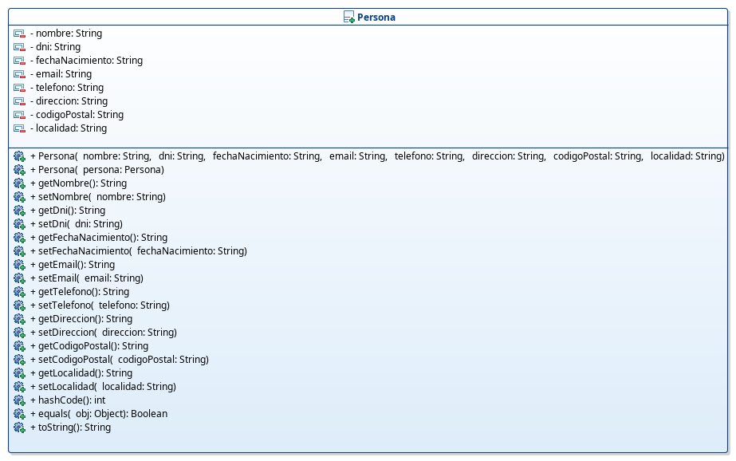
  

  - ###### Posible solución

    Una posible solución podría ser la siguiente:

    ###### Persona.java
    ~~~java
    package org.iesalandalus.programacion.poo.persona;

	import java.util.Objects;

	public class Persona {
		
		private String nombre;
		private String dni;
		private String fechaNacimiento;
		private String email;
		private String telefono;
		private String direccion;
		private String codigoPostal;
		private String localidad;
		
		public Persona(String nombre, String dni, String fechaNacimiento, String email, String telefono, String direccion, String codigoPostal, String localidad) {
			setNombre(nombre);
			setDni(dni);
			setFechaNacimiento(fechaNacimiento);
			setEmail(email);
			setTelefono(telefono);
			setDireccion(direccion);
			setCodigoPostal(codigoPostal);
			setLocalidad(localidad);
		}
		
		public Persona(Persona1 persona) {
			Objects.requireNonNull(persona, "La persona no puede ser nula.");
			setNombre(persona.nombre);
			setDni(persona.dni);
			setFechaNacimiento(persona.fechaNacimiento);
			setEmail(persona.email);
			setTelefono(persona.telefono);
			setDireccion(persona.direccion);
			setCodigoPostal(persona.codigoPostal);
			setLocalidad(persona.localidad);
		}

		public String getNombre() {
			return nombre;
		}
		
		public void setNombre(String nombre) {
			this.nombre = Objects.requireNonNull(nombre, "El nombre no puede ser nulo.");
		}
		
		public String getDni() {
			return dni;
		}
		
		public void setDni(String dni) {
			this.dni = Objects.requireNonNull(dni, "El DNI no puede ser nulo.");
		}
		
		public String getFechaNacimiento() {
			return fechaNacimiento;
		}
		
		public void setFechaNacimiento(String fechaNacimiento) {
			this.fechaNacimiento = Objects.requireNonNull(fechaNacimiento, "La fecha de nacimiento no puede ser nula.");
		}
		
		public String getEmail() {
			return email;
		}
		
		public void setEmail(String email) {
			this.email = Objects.requireNonNull(email, "El email no puede ser nulo.");
		}
		
		public String getTelefono() {
			return telefono;
		}
		
		public void setTelefono(String telefono) {
			this.telefono = Objects.requireNonNull(telefono, "El teléfono no puede ser nulo.");
		}
		
		public String getDireccion() {
			return direccion;
		}
		
		public void setDireccion(String direccion) {
			this.direccion = Objects.requireNonNull(direccion, "La dirección no puede ser nula.");
		}
		
		public String getCodigoPostal() {
			return codigoPostal;
		}
		
		public void setCodigoPostal(String codigoPostal) {
			this.codigoPostal = Objects.requireNonNull(codigoPostal, "El código postal no puede ser nulo.");
		}
		
		public String getLocalidad() {
			return localidad;
		}

		public void setLocalidad(String localidad) {
			this.localidad = Objects.requireNonNull(localidad, "La localidad no puede ser nula.");
		}

		@Override
		public boolean equals(Object o) {
			if (this == o) return true;
			if (!(o instanceof Persona1 persona1)) return false;
			return Objects.equals(dni, persona1.dni);
		}

		@Override
		public int hashCode() {
			return Objects.hash(dni);
		}

		@Override
		public String toString() {
			return String.format("Persona1[nombre=%s, dni=%s, fechaNacimiento=%s, email=%s, telefono=%s, direccion=%s, codigoPostal=%s, localidad=%s]", this.nombre, this.dni, this.fechaNacimiento, this.email, this.telefono, this.direccion, this.codigoPostal, this.localidad);
		}

	}

    ~~~

    ###### PruebaPersona.java
    ~~~java
	public class PruebaPersona {

		public static void main(String[] args) {
			Persona persona;
			persona = new Persona("José Ramón", "11X",  "01/01/2000", "950112233", "jr@gmail.com", "C/JR 1", "04004", "Almería");
			System.out.println(persona);
		}

	}
    ~~~

- **Persona refactorizado**

  Después de analizar los problemas del diseño anteriorte sugiero que implementes la clase `Persona` de la siguiente manera. Al igual que en el ejemplo anterior he dejado todos los métodos `setX` públicos para hacer que las clase sean mutables (aunque en la realidad eso no sería lo más adecuado) y te propongo que en la implementación evites el problema del aliasing que pudiese surgir. Crea también una clase en la que puedas probar su creación con los diferentes constructores y su uso, y analiza las diferencias con la solución anterior.

  

  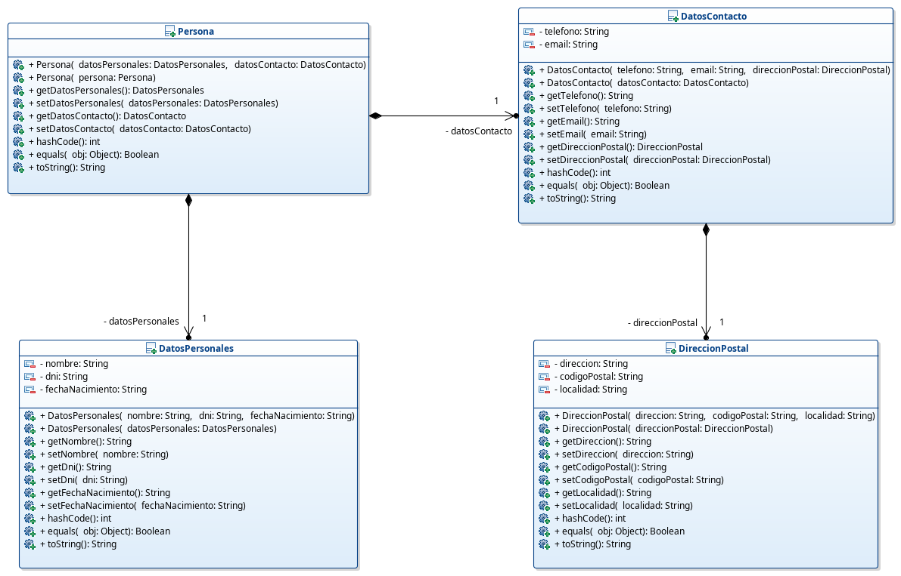
  

  - ###### Posible solución

    Una posible solución podría ser la siguiente:

    ###### DireccionPostal.java
    ~~~java
	package org.iesalandalus.programacion.poo.persona;

	import java.util.Objects;

	public class DireccionPostal {
		
		private String direccion;
		private String codigoPostal;
		private String localidad;

		public DireccionPostal(String direccion, String codigoPostal, String localidad) {
			setDireccion(direccion);
			setCodigoPostal(codigoPostal);
			setLocalidad(localidad);
		}
		
		public DireccionPostal(DireccionPostal direccionPostal) {
			Objects.requireNonNull(direccionPostal, "La dirección postal no puede ser nula.");
			setDireccion(direccionPostal.direccion);
			setCodigoPostal(direccionPostal.codigoPostal);
			setLocalidad(direccionPostal.localidad);
		}

		public String getDireccion() {
			return direccion;
		}

		public void setDireccion(String direccion) {
			this.direccion = Objects.requireNonNull(direccion, "La dirección no puede ser nula.");
		}

		public String getCodigoPostal() {
			return codigoPostal;
		}

		public void setCodigoPostal(String codigoPostal) {
			this.codigoPostal = Objects.requireNonNull(codigoPostal, "El código postal no puede ser nulo.");
		}

		public String getLocalidad() {
			return localidad;
		}

		public void setLocalidad(String localidad) {
			this.localidad = Objects.requireNonNull(localidad, "La localidad no puede ser nula.");
		}

		@Override
		public boolean equals(Object o) {
			if (this == o) return true;
			if (!(o instanceof DireccionPostal that)) return false;
			return Objects.equals(direccion, that.direccion) && Objects.equals(codigoPostal, that.codigoPostal) && Objects.equals(localidad, that.localidad);
		}

		@Override
		public int hashCode() {
			return Objects.hash(direccion, codigoPostal, localidad);
		}

		@Override
		public String toString() {
			return String.format("DireccionPostal[direccion=%s, codigoPostal=%s, localidad=%s]", this.direccion, this.codigoPostal, this.localidad);
		}

	}
    ~~~

    ###### DatosContaco.java
    ~~~java
    package org.iesalandalus.programacion.poo.persona;

	import java.util.Objects;

	public class DatosContacto {
		private String telefono;
		private String email;
		private DireccionPostal direccionPostal;

		public DatosContacto(String telefono, String email, DireccionPostal direccionPostal) {
			setTelefono(telefono);
			setEmail(email);
			setDireccionPostal(direccionPostal);
		}
		
		public DatosContacto(DatosContacto datosContacto) {
			Objects.requireNonNull(datosContacto, "Los datos de contacto no pueden ser nulos.");
			setTelefono(datosContacto.telefono);
			setEmail(datosContacto.email);
			setDireccionPostal(datosContacto.direccionPostal);
		}

		public String getTelefono() {
			return telefono;
		}

		public void setTelefono(String telefono) {
			this.telefono = Objects.requireNonNull(telefono, "El teléfono no puede ser nulo.");
		}

		public String getEmail() {
			return email;
		}

		public void setEmail(String email) {
			this.email = Objects.requireNonNull(email, "El email no puede ser nulo.");
		}

		public DireccionPostal getDireccionPostal() {
			return new DireccionPostal(direccionPostal);
		}

		public void setDireccionPostal(DireccionPostal direccionPostal) {
			this.direccionPostal = new DireccionPostal(Objects.requireNonNull(direccionPostal, "La dirección postal no puede ser nula."));
		}

		@Override
		public boolean equals(Object o) {
			if (this == o) return true;
			if (!(o instanceof DatosContacto that)) return false;
			return Objects.equals(telefono, that.telefono) && Objects.equals(email, that.email) && Objects.equals(direccionPostal, that.direccionPostal);
		}

		@Override
		public int hashCode() {
			return Objects.hash(telefono, email, direccionPostal);
		}

		@Override
		public String toString() {
			return String.format("DatosContacto[telefono=%s, email=%s, direccionPostal=%s]", this.telefono, this.email, this.direccionPostal);
		}

	}
    ~~~

    ###### DatosPersonales.java
    ~~~java
    package org.iesalandalus.programacion.poo.persona;

	import java.util.Objects;

	public class DatosPersonales {
		private String nombre;
		private String dni;
		private String fechaNacimiento;
		
		public DatosPersonales(String nombre, String dni, String fechaNacimiento) {
			setNombre(nombre);
			setDni(dni);
			setFechaNacimiento(fechaNacimiento);
		}
		
		public DatosPersonales(DatosPersonales datosPersonales) {
			Objects.requireNonNull(datosPersonales,"Los datos personales no pueden ser nulos.");
			setNombre(datosPersonales.nombre);
			setDni(datosPersonales.dni);
			setFechaNacimiento(datosPersonales.fechaNacimiento);
		}

		public String getNombre() {
			return nombre;
		}

		public void setNombre(String nombre) {
			this.nombre = Objects.requireNonNull(nombre, "El nombre no puede ser nulo.");
		}

		public String getDni() {
			return dni;
		}

		public void setDni(String dni) {
			this.dni = Objects.requireNonNull(dni, "El DNI no puede ser nulo.");
		}

		public String getFechaNacimiento() {
			return fechaNacimiento;
		}

		public void setFechaNacimiento(String fechaNacimiento) {
			this.fechaNacimiento = Objects.requireNonNull(fechaNacimiento, "La fecha de nacimiento no puede ser nula.");
		}

		@Override
		public boolean equals(Object o) {
			if (this == o) return true;
			if (!(o instanceof DatosPersonales that)) return false;
			return Objects.equals(dni, that.dni);
		}

		@Override
		public int hashCode() {
			return Objects.hash(dni);
		}

		@Override
		public String toString() {
			return String.format("DatosPersonales[nombre=%s, dni=%s, fechaNacimiento=%s]", this.nombre, this.dni, this.fechaNacimiento);
		}

	}
    ~~~

    ###### Persona.java
    ~~~java
    package org.iesalandalus.programacion.poo.persona;

	import java.util.Objects;

	public class Persona2 {
		
		private DatosPersonales datosPersonales;
		private DatosContacto datosContacto;

		public Persona2(DatosPersonales datosPersonales, DatosContacto datosContacto) {
			setDatosPersonales(datosPersonales);
			setDatosContacto(datosContacto);
		}

		public DatosPersonales getDatosPersonales() {
			return datosPersonales;
		}

		private void setDatosPersonales(DatosPersonales datosPersonales) {
			this.datosPersonales = Objects.requireNonNull(datosPersonales, "Los datos personales no pueden ser nulos.");
		}
		public DatosContacto getDatosContacto() {
			return datosContacto;
		}

		private void setDatosContacto(DatosContacto datosContacto) {
			this.datosContacto = Objects.requireNonNull(datosContacto, "Los datos de contacto no pueden ser nulos.");
		}

		@Override
		public boolean equals(Object o) {
			if (this == o) return true;
			if (!(o instanceof Persona2 persona2)) return false;
			return Objects.equals(datosPersonales, persona2.datosPersonales);
		}

		@Override
		public int hashCode() {
			return Objects.hash(datosPersonales);
		}

		@Override
		public String toString() {
			return String.format("Persona2[datosPersonales=%s, datosContacto=%s]", this.datosPersonales, this.datosContacto);
		}
	}

    ~~~

    ###### PruebaPersona.java
    ~~~java
    public class PruebaPersona {

		public static void main(String[] args) {
			Persona persona;
			DireccionPostal direccionPostal = new DireccionPostal("C/JR 1", "04004", "Almería");
			DatosContacto datosContacto = new DatosContacto("950112233", "jr@gmail.com", direccionPostal);
			DatosPersonales datosPersonales = new DatosPersonales("José Ramón", "11X",  "01/01/2000");
			persona = new Persona(datosPersonales, datosContacto);
			System.out.println(persona);
		}

	}
    ~~~

- **PenDrive**

  Se trata de simular el funcionamiento de un pendrive en el que podemos escribir, se puede leer (simplemente devuelve la cantidad de información leída) y se puede borrar una determinada cantidad de información. Se deben tratar las posibles excepciones: si la cantidad de información pasada a los métodos es menor que cero se lanzará `IllegalArgumentException`, pero si se sobrepasa la capacidad, se quiere leer más información de la ocupada o se quiere borrar más información de la ocupada, la excepción propia comprobada a lanzar será `PenDriveExcepcion` . También debe tener métodos para consultar si el pendrive está vació y si está lleno. Dos pendrives los consideramos iguales si son del mismo fabricante y tienen la misma capacidad. El diagrama de clases es el que te muestro a continuación. Por supuesto debes hacer pruebas creando varios pendrives utilizando los diferentes constructores y realizar diferentes operaciones sobre los mismos.

  

  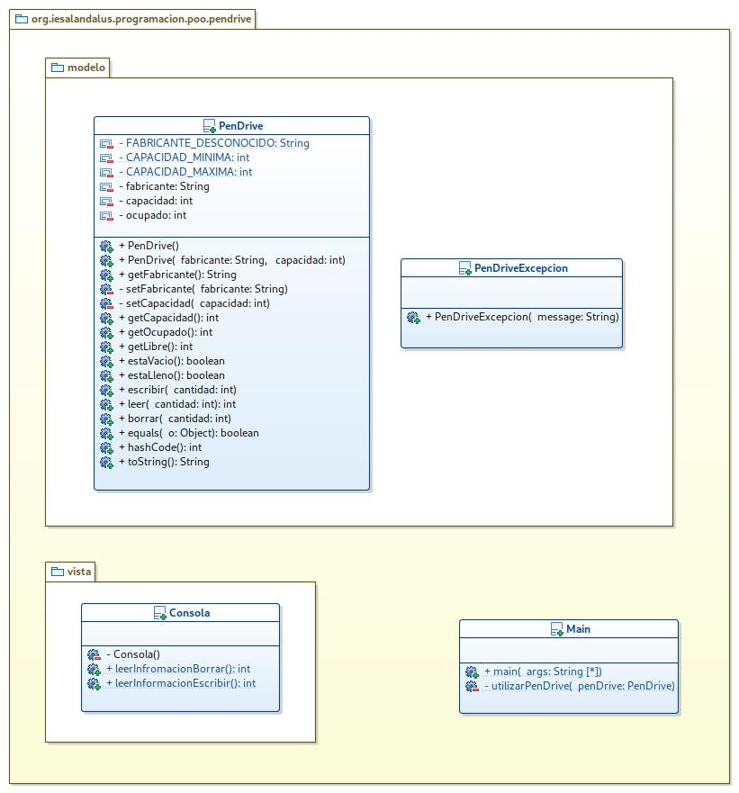
  

  - ###### Posible solución

    Una posible solución podría ser la siguiente:

	###### PenDriveExcepcion.java
	~~~java
	package org.iesalandalus.programacion.poo.pendrive.modelo;

	public class PenDriveExcepcion extends Exception {
		public PenDriveExcepcion(String message) {
			super(message);
		}
	}
	~~~

	###### PenDrive.java
	~~~java
	package org.iesalandalus.programacion.poo.pendrive.modelo;

	import java.util.Objects;

	public class PenDrive {
		private static final String FABRICANTE_DESCONOCIDO = "Desconocido";
		private static final int CAPACIDAD_MINIMA = 64;
		private static final int CAPACIDAD_MAXIMA = 1024;
		private String fabricante;
		private int capacidad;
		private int ocupado;
		
		public PenDrive() {
			fabricante = FABRICANTE_DESCONOCIDO;
			capacidad = 64;
			ocupado = 0;
		}
		
		public PenDrive(String fabricante, int capacidad) {
			setFabricante(fabricante);
			setCapacidad(capacidad);
			ocupado = 0;
		}

		public String getFabricante() {
			return fabricante;
		}

		private void setFabricante(String fabricante) {
			this.fabricante = Objects.requireNonNull(fabricante, "El fabricante no puede ser nulo.");
		}

		private void setCapacidad(int capacidad) {
			if (capacidad < CAPACIDAD_MINIMA || capacidad > CAPACIDAD_MAXIMA) {
				throw new IllegalArgumentException("La capacidad no es correcta.");
			}
			this.capacidad = capacidad;
		}

		public int getCapacidad() {
			return capacidad;
		}

		public int getOcupado() {
			return ocupado;
		}

		public int getLibre() {
			return capacidad - ocupado;
		}

		public boolean estaVacio() {
			return (ocupado == 0);
		}

		public boolean estaLleno() {
			return (ocupado == capacidad);
		}

		public void escribir(int cantidad) throws PenDriveExcepcion {
			if (cantidad <= 0) {
				throw new IllegalArgumentException("Debes escribir algo.");
			}
			if (cantidad > getLibre()) {
				throw new PenDriveExcepcion("No se puede escribir más información del espacio restante.");
			}
			ocupado += cantidad;
		}

		public int leer(int cantidad) throws PenDriveExcepcion {
			if (cantidad <= 0) {
				throw new IllegalArgumentException("Debes leer algo.");
			}
			if (cantidad > ocupado) {
				throw new PenDriveExcepcion("No puedes leer más información de la que hay ocupada.");
			}
			return cantidad;
		}

		public void borrar(int cantidad) throws PenDriveExcepcion {
			if (cantidad <= 0) {
				throw new IllegalArgumentException("Debes borrar algo.");
			}
			if (cantidad > ocupado) {
				throw new PenDriveExcepcion("No puedes borrar más información de la que hay ocupada.");
			}
			ocupado -= cantidad;
		}

		@Override
		public boolean equals(Object o) {
			if (this == o) return true;
			if (!(o instanceof PenDrive penDrive)) return false;
			return capacidad == penDrive.capacidad && Objects.equals(fabricante, penDrive.fabricante);
		}

		@Override
		public int hashCode() {
			return Objects.hash(fabricante, capacidad);
		}

		@Override
		public String toString() {
			return String.format("PenDrive[fabricante=%s, capacidad=%s, ocupado=%s]", this.fabricante, this.capacidad, this.ocupado);
		}
	}
	~~~

	###### Consola.java
	~~~java
	package org.iesalandalus.programacion.poo.pendrive.vista;

	import org.iesalandalus.programacion.utilidades.Entrada;

	public class Consola {

		private Consola() {}

		public static int leerInfromacionBorrar() {
			System.out.print("Dima la cantidad de información que quieres borrar: ");
			return Entrada.entero();
		}

		public static int leerInformacionEscribir() {
			System.out.print("Dima la cantidad de información que quieres escribir: ");
			return Entrada.entero();
		}
	}
	~~~

	###### Main.java
	~~~java
	package org.iesalandalus.programacion.poo.pendrive;

	import org.iesalandalus.programacion.poo.pendrive.modelo.PenDrive;
	import org.iesalandalus.programacion.poo.pendrive.modelo.PenDriveExcepcion;
	import org.iesalandalus.programacion.poo.pendrive.vista.Consola;

	public class Main {
		public static void main(String[] args) {
			System.out.println("******** Pen Drive 1 ********");
			PenDrive penDrive1 = new PenDrive();
			System.out.println("Pen Drive 1 creado: " + penDrive1);
			utilizaPenDrive(penDrive1);

			System.out.println("******** Pen Drive 2 ********");
			PenDrive penDrive2 = new PenDrive("Kingston", 128);
			System.out.println("Pen Drive 2 creado: " + penDrive2);
			utilizaPenDrive(penDrive2);
		}

		private static void utilizaPenDrive(PenDrive penDrive) {
			try {
				penDrive.escribir(Consola.leerInformacionEscribir());
				System.out.println("Escritura correcta: " + penDrive);
			} catch (IllegalArgumentException | PenDriveExcepcion e) {
				System.out.println("Error al escribir: " + e.getMessage());
			}
			try {
				penDrive.borrar(Consola.leerInfromacionBorrar());
				System.out.println("Borrado correcto: " + penDrive);
			} catch (IllegalArgumentException | PenDriveExcepcion e) {
				System.out.println("Error al borrar: " + e.getMessage());
			}
		}

	}
	~~~

- **Vehiculo**

  Se trata de simular el funcionamiento de un vehículo que consta de su cuenta kilómetros y su depósito de combustible. El cuentakilómetros sólo puede avanzar en un kilómetro y puede dovolver la cuenta de los kilómetros e inicialmente dicha cuenta siempre es 0. El depósito tendrá una capacidad dada (que por defecto será 100) medida en litros, un contenido que es la cantidad de combustible que contiene actualmente. Un depósito se puede crear con una capacidad por defecto o con una capacidad dada y es posible llenar una cantidad entera de litros, es posible gastar una cantidad de litros expresada como un `double` y se puede consultar si está vacío y si está lleno. Por último tendremos un vehículo que posee un cuentakilómetros, un depósito, es de una determinada marca y modelo y tiene un consumo expresado como litros a los 100 km (que por defecto será 10). El vehículo puede avanzar una cantidad de kilómetros y repostar un determinado número de litros de combustible. La operación de avanzar debe ir avanzando el cuentakilómetros y gastando el combustible adecuado y avanzará mientras tenga combustible. Podemos crear un vehículo expresando su marca y modelo, o expresando marca, modelo, capacidad del depósito y consumo. También queremos poder representar un vehículo mediante su marca, modelo, consumo, kilómetros de su cuentakilómetros y combustible restante de su depósito. Se deben tratar las posibles excepciones analizando cuándo se lanzará `NullPointerException`, `IllegalArgumentException` o `VehiculoExcepcion`. El diagrama de clases es el que te muestro a continuación. Por supuesto debes hacer pruebas creando varios vehículos utilizando los diferentes constructores y realizar diferentes operaciones sobre los mismos.

  

  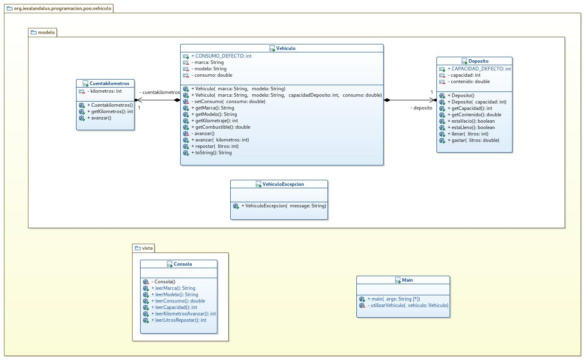
  

  - ###### Posible solución

    Una posible solución podría ser la siguiente:

	###### VehiculoExcepcion.java
	~~~java
	package org.iesalandalus.programacion.poo.vehiculo.modelo;

	public class VehiculoExcepcion extends Exception {
		public VehiculoExcepcion(String message) {
			super(message);
		}
	}
	~~~

	###### Cuentakilometros.java
	~~~java
	package org.iesalandalus.programacion.poo.vehiculo.modelo;

	public class Cuentakilometros {

		private int kilometros;

		public Cuentakilometros() {
			kilometros = 0;
		}

		public int getKilometros() {
			return kilometros;
		}

		public void avanzar() {
			kilometros++;
		}

	}
	~~~

	###### Deposito.java
	~~~java
	package org.iesalandalus.programacion.poo.vehiculo.modelo;

	public class Deposito {

		public static final int CAPACIDAD_DEFECTO = 100;
		private final int capacidad;
		private double contenido;

		public Deposito() {
			capacidad = CAPACIDAD_DEFECTO;
			contenido = 0;
		}

		public Deposito(int capacidad) {
			if (capacidad <= 0) {
				throw new IllegalArgumentException("La capacidad debe ser mayor que cero.");
			}
			this.capacidad = capacidad;
			contenido = 0;
		}

		public int getCapacidad() {
			return capacidad;
		}

		public double getContenido() {
			return contenido;
		}

		public boolean estaVacio() {
			return (contenido == 0);
		}

		public boolean estaLleno() {
			return (contenido == capacidad);
		}

		public void llenar(int litros) throws VehiculoExcepcion {
			if (litros <= 0) {
				throw new IllegalArgumentException("Debes llenar con alguna cantidad.");
			}
			if (estaLleno()) {
				throw new VehiculoExcepcion("No se puede repostar ya que el depósito está lleno.");
			}
			if (contenido + litros > capacidad) {
				throw new VehiculoExcepcion("Si se añade esa cantidad se excede la capacidad del depósito.");
			}
			contenido += litros;
		}

		public void gastar(double litros) throws VehiculoExcepcion {
			if (litros <= 0) {
				throw new IllegalArgumentException("Debes gastar alguna cantidad.");
			}
			if (estaVacio()) {
				throw new VehiculoExcepcion("No se puede gastar combustible ya que el depósito está vacío.");
			}
			if (contenido - litros < 0) {
				throw new VehiculoExcepcion("Si se gasta esa cantidad el depósito se queda vacío.");
			}
			contenido -= litros;
		}
	}
	~~~

	###### Vehiculo.java
	~~~java
	package org.iesalandalus.programacion.poo.vehiculo.modelo;

	import java.util.Objects;

	public class Vehiculo {
		public static final int CONSUMO_DEFECTO = 10;
		private final String marca;
		private final String modelo;
		private double consumo;
		private final Cuentakilometros cuentakilometros;
		private Deposito deposito;

		public Vehiculo(String marca, String modelo) {
			this.marca = Objects.requireNonNull(marca, "La marca no puede ser nula.");
			this.modelo = Objects.requireNonNull(modelo, "El modelo no puede ser nulo.");
			consumo = CONSUMO_DEFECTO;
			cuentakilometros = new Cuentakilometros();
			deposito = new Deposito();
		}

		public Vehiculo(String marca, String modelo, int capacidadDeposito, double consumo) {
			this(marca, modelo);
			deposito = new Deposito(capacidadDeposito);
			setConsumo(consumo);
		}

		private void setConsumo(double consumo) {
			if (consumo < 0) {
				throw new IllegalArgumentException("El consumo no puede ser menor que cero.");
			}
			this.consumo = consumo;
		}

		public String getMarca() {
			return marca;
		}

		public String getModelo() {
			return modelo;
		}

		public int getKilometraje() {
			return cuentakilometros.getKilometros();
		}

		public double getCombustible() {
			return deposito.getContenido();
		}

		private void avanzar() throws VehiculoExcepcion {
			try {
				deposito.gastar(consumo / 100d );
				cuentakilometros.avanzar();
			} catch (IllegalArgumentException | VehiculoExcepcion e) {
				throw new VehiculoExcepcion("Error al avanzar: " + e.getMessage());
			}
		}
		public void avanzar(int kilometros) throws VehiculoExcepcion {
			if (kilometros <= 0) {
				throw new IllegalArgumentException("Se debe avanzar al menos un kilómetro.");
			}
			for (int i = 0; i < kilometros; i++) {
				avanzar();
			}
		}

		public void repostar(int litros) throws VehiculoExcepcion {
			try {
				deposito.llenar(litros);
			} catch (IllegalArgumentException | VehiculoExcepcion e) {
				throw new VehiculoExcepcion("Error al repostar: " + e.getMessage());
			}
		}

		@Override
		public String toString() {
			return String.format("Vehiculo[marca=%s, modelo=%s, consumo=%s, kilómetros=%s, combustible=%.2f]", marca, modelo, consumo, cuentakilometros.getKilometros(), deposito.getContenido());
		}
	}
	~~~

	###### Consola.java
	~~~java
	package org.iesalandalus.programacion.poo.vehiculo.vista;

	import org.iesalandalus.programacion.utilidades.Entrada;

	public class Consola {

		private Consola() {}

		public static String leerMarca() {
			System.out.println("Dime la marca del vehículo: ");
			return Entrada.cadena();
		}

		public static String leerModelo() {
			System.out.println("Dime el modelo del vehículo: ");
			return Entrada.cadena();
		}

		public static double leerConsumo() {
			double consumo;
			do {
				System.out.print("Dime el consumo del segundo vehículo: ");
				consumo = Entrada.realDoble();
			} while (consumo <= 0);
			return consumo;
		}

		public static int leerCapacidad() {
			int capacidad;
			do {
				System.out.print("Dime la capacidad del segundo vehículo: ");
				capacidad = Entrada.entero();
			} while (capacidad <= 0);
			return capacidad;
		}

		public static int leerKilometrosAvanzar() {
			int kilometros;
			do {
				System.out.print("Dime los kilómetros a avanzar: ");
				kilometros = Entrada.entero();
			} while (kilometros <= 0);
			return kilometros;
		}

		public static int leerLitrosRepostar() {
			int litros;
			do {
				System.out.print("Dime los litros a repostar: ");
				litros = Entrada.entero();
			} while (litros <= 0);
			return litros;
		}
	}
	~~~

	###### Main.java
	~~~java
	package org.iesalandalus.programacion.poo.vehiculo;

	import org.iesalandalus.programacion.poo.vehiculo.modelo.Vehiculo;
	import org.iesalandalus.programacion.poo.vehiculo.modelo.VehiculoExcepcion;
	import org.iesalandalus.programacion.poo.vehiculo.vista.Consola;

	public class Main {

		public static void main(String[] args) {
			System.out.println("********* Vehículo 1 *********");
			Vehiculo vehiculo1 = new Vehiculo(Consola.leerMarca(), Consola.leerModelo());
			System.out.println(vehiculo1);
			utilizarVehiculo(vehiculo1);
			System.out.println("********* Vehículo 2 *********");
			Vehiculo vehiculo2 = new Vehiculo(Consola.leerMarca(), Consola.leerModelo(), Consola.leerCapacidad(), Consola.leerConsumo());
			utilizarVehiculo(vehiculo2);
		}

		private static void utilizarVehiculo(Vehiculo vehiculo) {
			try {
				int litros = Consola.leerLitrosRepostar();
				vehiculo.repostar(litros);
				System.out.println(vehiculo);
				int kilometros = Consola.leerKilometrosAvanzar();
				vehiculo.avanzar(kilometros);
				System.out.println(vehiculo);
			} catch (VehiculoExcepcion e) {
				System.out.println("ERROR: " + e.getMessage());
				System.out.println(vehiculo);
			}
		}

	}
	~~~
